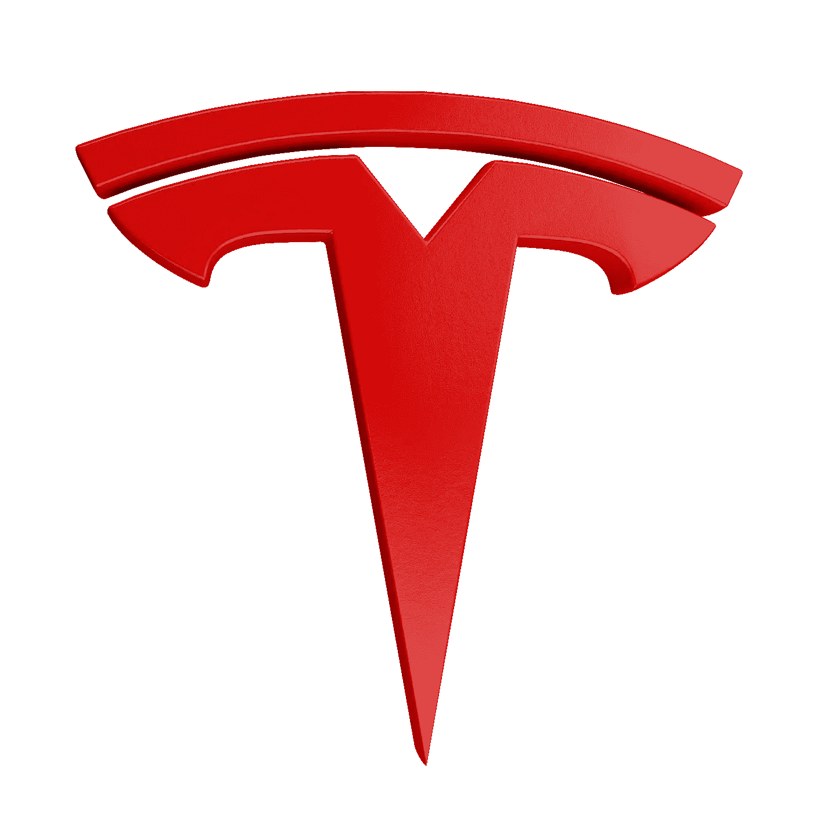

# 上周下跌了 18%。现在买特斯拉(TSLA)股票划算吗？

> 原文：<https://medium.com/coinmonks/after-decrease-with-18-in-the-last-week-is-tesla-tsla-a-good-buy-right-now-bace27d3232d?source=collection_archive---------30----------------------->

Source photo [Sigla Tesla Pictogramă — Imagine gratuită pe Pixabay](https://pixabay.com/ro/illustrations/sigla-tesla-tesla-pictogram%c4%83-7408969/)

现在，特斯拉出现在几乎每一篇关于股票市场(纳斯达克:TSLA)的文章中。一些人猜测，特斯拉股价的急剧下跌可以追溯到该公司首席执行官埃隆·马斯克(Elon Musk)接管了该公司的 Twitter 账户，并担任其代理首席执行官。根据他们的批评，熊市的简单机制是…