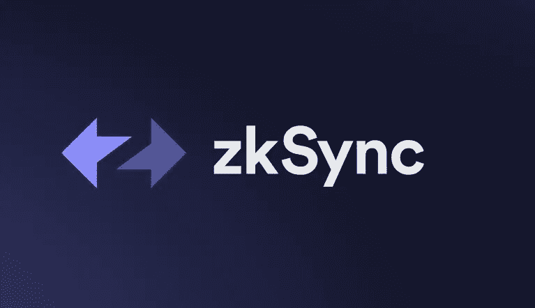
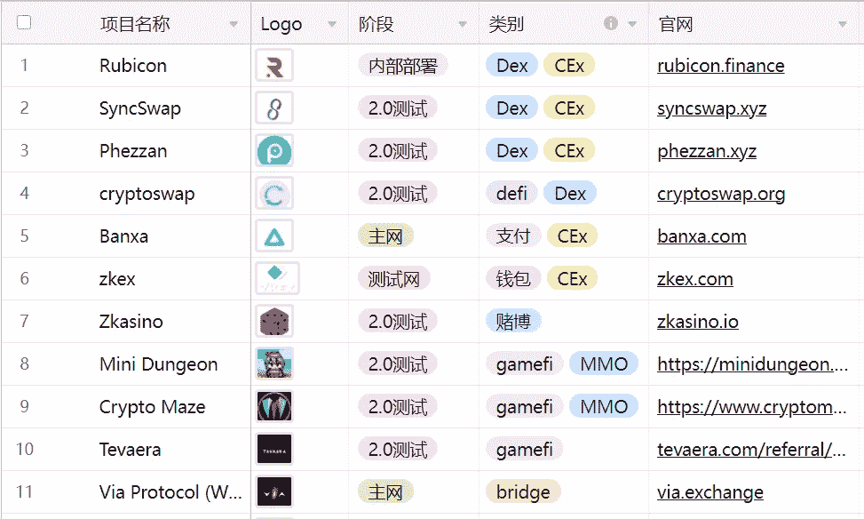
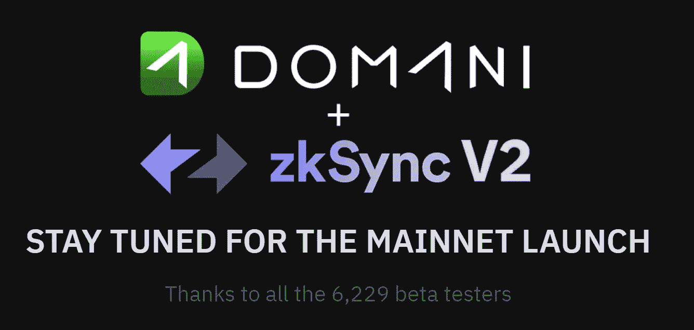
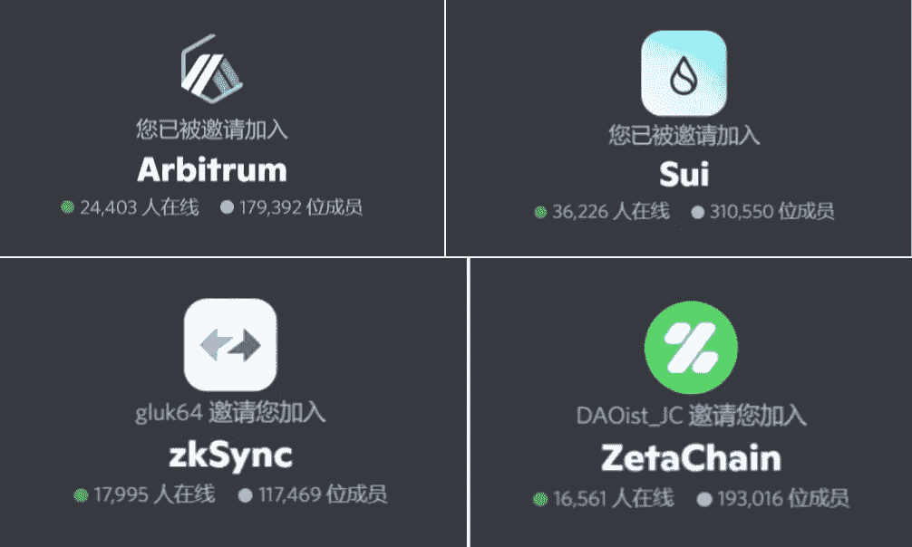
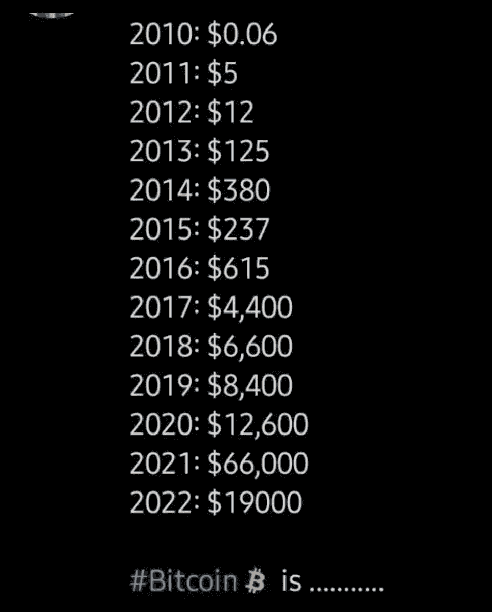

# 做了 zkSync 交互测试，空投真的能赚到 10 倍的营收吗？

> 原文：<https://medium.com/coinmonks/after-doing-the-zksync-interactive-test-can-the-airdrop-really-earn-10-times-the-revenue-56bd83f491b7?source=collection_archive---------1----------------------->

这两天操作了 zkSync 互动教程，比隋互动复杂一点。最近空投的 fomo 太情绪化，没做几次互动就不好意思在圈子里交流了。

zkSync 是以太坊的扩展和隐私引擎。这是 L2 扩展解决方案。通俗的理解就是 zkSync 运营气费更低，部分优化了以太坊链条上的交易拥堵和昂贵问题。

从空投的需求和目的出发，zkSync 可以理解为另一个链条，有自己的技术和气费优势，也有可能打造自己的生态。

除了 zkSync 本身的转让交易优势，其链条上的生态发展决定了项目的最终发展。

zkSync is a L2 scaling solution

从多个 zkSync airdrop 教程来看，主要的交互方式是注册创建一个 zkSync 钱包，进行转账、铸币 NFT 等基本操作。

zkSync 生态系统中也有不同项目的交互测试，但目前还不知道哪个项目可以发送空投，或者 zkSync 是否会在其链上为测试用户进行空投。

网上有针对不同项目的交互教程，有的交互测试已经完成，有的还可以继续。

Different project information on the zkSync chain

在这段时间里，空投是非常热的。Sui、zkSync、Arbitrum、Layerzero、Starkware、Aleo、Zetachain 等几个交互测试。，空投期望特别高。

这些互动已经开始了几个月，有些已经完成了测试和互动账户信息的快照。当然，如果赶不上这批交互测试，后期可以继续关注新项目。

DOMANI has been closed for testing in the zkSync ecosystem

Airdrop 是指项目方将 Token 或 NFT 放在玩家的钱包上；哪些玩家可以空投，取决于他们是否在前期对项目进行了交互测试，是否为项目做出了贡献或者提供了运营数据。

前段时间 Aptos 的 mainnet 上线，以前在 APT 链上互动的钱包每个收到 150 个 APT，还有人用 500 个钱包申请 100 个钱包账号，获利丰厚。

在 APT 空投财富的刺激下，越来越多的人投入到空投大军中。

但在可预见的情况下，有些人在互动了几个项目后就会放弃，因为操作费时费力，有壁垒，有的还有燃气费；更痛苦的是，完成交互测试后，可能 3–5 个月才有结果，甚至没有结果。

所以，要做好空投的长期准备，你也需要足够努力。

many people in every popular airdrop project community

今天看到一张图，很感慨。

2010 年，比特币的价格是 0.06 美元，今天是 20k 美元，增长了 33 万倍。

当然，几乎没有人会得到这样的涨幅。即使他们以 100 美元买入 BTC，他们也会以 1000 美元卖出；或者他们 1w 入市，也可能 2w 卖出。更郁闷的是，去年 6w 买入的玩家可能已经不再相信比特币了，缩水了 70%。

很多朋友都是在 2017 年上一次牛市的时候接触到比特币的，当时还不到 5k 美元。94 暴跌之后，很多人再也不敢入市了；更多的人见识有限，无法想象会从 4400 美元涨到 66000 美元，4 年涨了 15 倍。

当然，这些都是过去的数据，谁也不可能更早知道；更重要的是，未来从现在开始会看涨多少倍？还是看空到零？现在是抓住未来机遇的时候了。

Bitcoin’s 12 Years of Price Volatility

很难说空投的收益会是多少倍，或者哪个项目会发空投，一切都不确定。就像当时一样，没有人能够想象简单地购买 BTC 而什么都不做会产生如此多倍的收益。

市场和大环境都充满了不确定性，人生也是如此，机会和风险都在其中。

以上只是我个人观点，没有投资建议。我是楚小莲，我正在关注元宇宙和 web3。

> 交易新手？试试[加密交易机器人](/coinmonks/crypto-trading-bot-c2ffce8acb2a)或者[复制交易](/coinmonks/top-10-crypto-copy-trading-platforms-for-beginners-d0c37c7d698c)