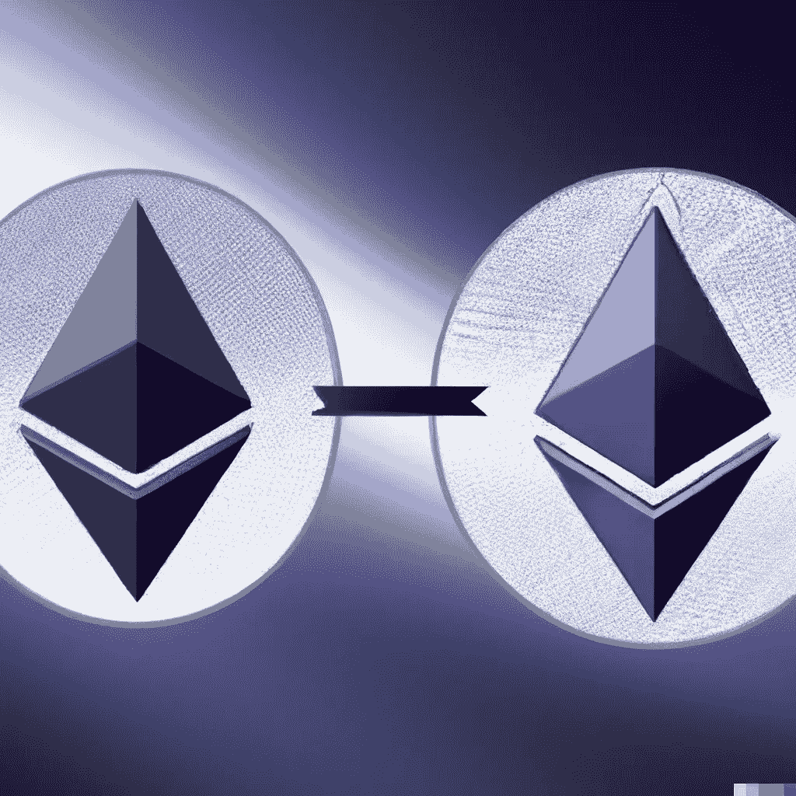
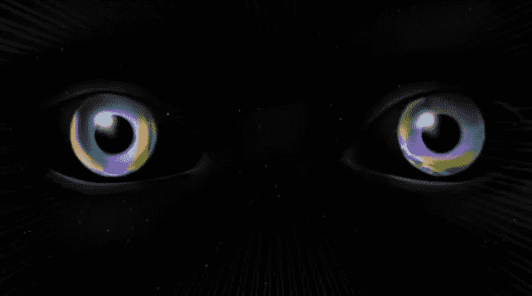
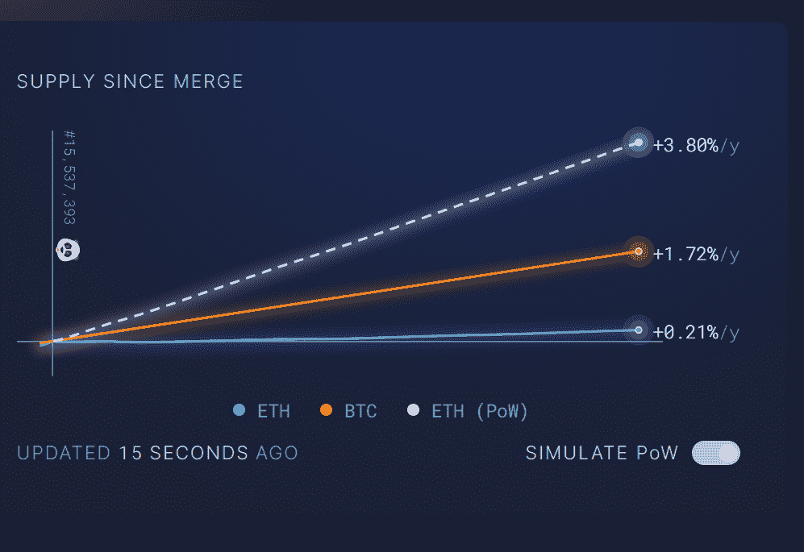
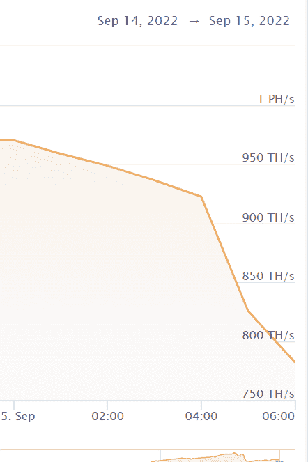
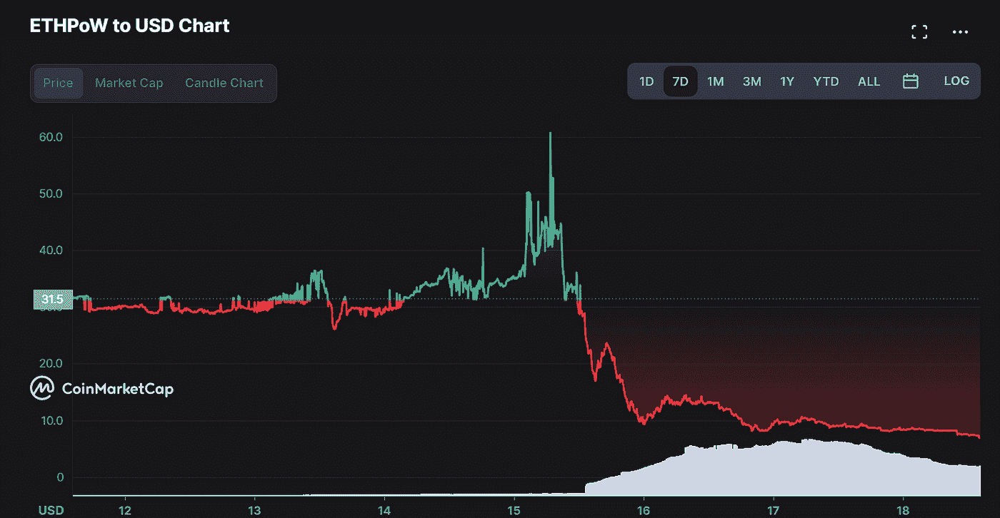

# 以太坊合并后:手术后

> 原文：<https://medium.com/coinmonks/after-the-ethereum-merge-a-post-op-2e158387eb74?source=collection_archive---------5----------------------->

Ethereum logos merging

2022 年 9 月 15 日，以太坊过渡到 PoS。

经过多年的规划和发展，“合并”是成功的。不可能的事情已经完成了。

在本文中，我们将作为合并“后操作”来检查一些重要的细节。

*-能源使用量*

*- GPU 和游戏*

*-排放变化*

*-动力叉*

*-后续步骤*

# **介绍**

____________________________________

我们的生态系统从来没有沉闷的时刻。在其发展的重要时刻尤其如此。

这一点在本周再次得到了证明。

有人支付了大约 5 万美元(30 ETH)的汽油来确保最后一个以太坊战俘区是一个虚空区 NFT。永远在战俘链的末端，旁观者现在会看到下面的图片和文字。

multi-color cartoon eyes over a black background

你做出承诺，自然会通过消除不可能的障碍来回应你的承诺。做一个不可能的梦，这个世界不会把你压垮，它会把你提升起来。这就是诀窍，”

像这样的时刻和展示是我如此热爱这个空间的原因。

# **能源使用量**

____________________________________

升级后，以太坊的能耗下降了约 99.5%。

Vitalik 估计，PoS 的变化使全球能源使用量减少了 0.2%。这使得它成为有史以来最重要的去碳化事件之一。

你可以想象如果比特币关闭并以某种方式远离 PoW 会有什么影响。我认为这不应该也永远不会发生。

比特币网络的安全模式对其价值主张至关重要。比特币能量净碳影响是复杂的，很难完全量化。

例如，比特币采矿有助于抵消碳排放，并促进清洁能源的生产和再利用。

# **GPU 和游戏**

____________________________________

降低功耗还有另一个积极的副作用——更便宜的 GPU！

PoW 依靠硬件开采，矿商已经无利可图。矿工们正在大量出售他们的采矿设备。因此，GPU 的价格正在下降。

二手卡在卖，新显卡价格也在降低。

再次成为游戏玩家的好时光(笑脸)。

# **排放变化**

____________________________________

自合并以来，ETH 排放率下降了约 15 倍。

自从 PoW 改变以来，进入供应的 ETH 减少了 15 倍。排放量将减少约 10，000 ETH/天，但会有一些变化。

这是一张来自 [ultrasound.money](https://ultrasound.money/) 的图表，显示了当前的排放率以及与 PoW 模拟的比较。

# 动力叉

____________________________________

谁能想到复制以太坊状态会这么复杂？

ETH 动力叉正面临重大技术故障。因此，我们可以断定它们目前是失败的。

在合并之前，采矿业的发展速度很快。

ETHPOW 和 ETHW(Poloniex 的替代分叉)的价格在合并后不久暴跌，因为交易者在他们的分叉硬币上兑现了现金。

ETHPOW

采矿动力分叉也没有提供多少有意义财务激励。

# **接下来的步骤**

____________________________________

根据 Vitalik 的说法，即使在这个历史事件之后，以太坊现在也只完成了 55%。仍然需要进行以下转换:

-激增

-边缘

-清洗

-挥霍

之后以太坊应该能处理 100k tx/秒。这些未来的发展将需要几年才能完成。

# **结论**

____________________________________

自从 2013 年我第一次涉足比特币以来，加密货币 Web3 生态系统已经走过了漫长的道路。

此次合并是计算和工程史上最令人印象深刻的实时升级之一。

祝贺所有核心开发者和整个社区。

随着越来越多方面的进步，这仍然只是我们热爱的行业的开始。

很高兴能够一起分享这个旅程。感谢您的阅读。

____________________________________

**时事通讯独家内容！**

这篇文章是我的免费每周时事通讯的专题文章！

我在这里分享它，因为这是第一周。

本周版还有独家阿尔法滴！

在这里注册，确保你不会错过！

____________________________________

在 Twitter 上关注我的所有更新！

[https://twitter.com/TheCryptoClimax](https://twitter.com/TheCryptoClimax)

下一集见。

> 交易新手？尝试[加密交易机器人](/coinmonks/crypto-trading-bot-c2ffce8acb2a)或[复制交易](/coinmonks/top-10-crypto-copy-trading-platforms-for-beginners-d0c37c7d698c)