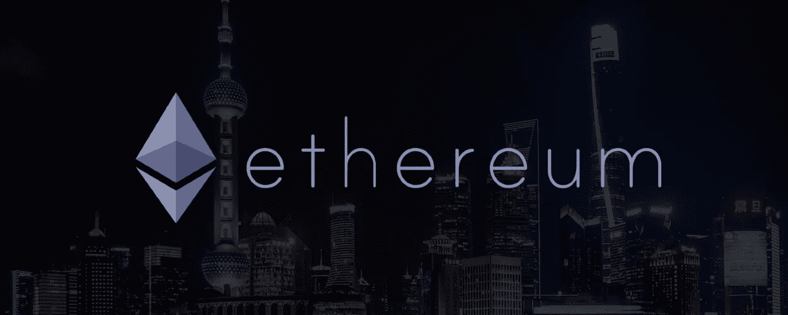

# 合并后:我们可以期待上海的升级？

> 原文：<https://medium.com/coinmonks/after-the-merge-what-can-we-expect-for-the-shanghai-upgrade-8421ee7abcdc?source=collection_archive---------1----------------------->

随着合并的完成，crypto 社区现在将注意力转向上海的升级。我们能从中期待什么？

倒计时正式结束，合并完成。以太坊已经顺利地从工作验证转变为利益验证共识，网络也朝着可持续发展的未来前进，并在路线图上增加了可扩展性。

虽然合并可能是以太坊路线图上的一个重要里程碑，但即将到来的升级——上海升级——是另一个备受期待的事件，因为它承诺对合并前存放的托管以太坊实施提取。

# 什么是上海升级？

上海升级是以太坊网络的下一次增强，将引入一系列重大改进和其他小升级。以太坊开发者蒂姆·贝科之前在他的博客上重申[升级将引入三个关键的以太坊改进提案(EIP ),分别是 EIP-3540、EIP- 3074 和 EIP-3670。](https://tim.mirror.xyz/M_3JZXBkvXnr3W1222WIDo1ipMuFymszjH-FP40CO5c)

第一个提议旨在通过创建以太坊虚拟机(EVM)对象格式(EOF)来分离代码和数据，第二个提议旨在实现两个 EVM 指令来将账户控制委托给智能合约，第三个提议将启用 EOF 合约的代码验证。

上海升级的其他核心细节还旨在解决信标链上 staked Ethereum 的撤销问题，降低第二层区块链交易费用，并引入“分片 Blob 交易”,为未来的完整分片功能奠定基础。

但是[已确认的提案名单](https://github.com/ethereum/execution-specs/blob/master/network-upgrades/mainnet-upgrades/shanghai.md#eips-considered-for-inclusion)仍未确定。虽然在 9 月 15 日举行的最新以太坊核心开发者会议上对上海升级进行了简要讨论，但下一阶段的实际讨论将在下个月在哥伦比亚举行的敌无双波哥大会议之后进行。

目前有哪些以太坊的提议需要审查？我们浏览了下面的列表。

# [EIP-3540:EVM 对象格式(EOF)的实现](https://eips.ethereum.org/EIPS/eip-3540)

蒂姆·贝科(Tim Beiko，EIP-3540)强调的一个重要建议是将代码和数据分离，这有利于网络上的代码验证，同时允许在未来轻松引入更改。

目前，像 Polygon 这样的第二层扩展解决方案中的代码验证器遵循一个冗长的流程来处理事务。它们要么需要在部署合同之前进行修改，要么实施脆弱的方法，要么利用昂贵且限制性强的跳转分析方法。

拟议的分离将使智能合同的编码更容易使用，同时降低交易费用，也称为汽油费。

# [EIP-3670:EOF 的代码验证](https://eips.ethereum.org/EIPS/eip-3670)

EIP-3670 被称为 Tim 早期提案的同伴 EIP，旨在为 EOF 智能合约引入代码验证。网络中的智能合约目前不需要严格的正确性验证，也没有处理未定义指令的简化流程。

该提议旨在简化代码有效性，以便更容易用字节码(EVM 机器语言)实现推理。要为智能合约创建明确的开始和停止持续时间，EOF 合约必须具有有效的 initcode 和明确的终止指令，才能创建合约。这个提议依赖于 EIP-3540 设定的符号，因此被称为“同伴 EIP”。

# [EIP-4895:烽火连锁推撤为运营](https://eips.ethereum.org/EIPS/eip-4895)

对于持有以太坊股票的投资者来说，EIP 4895 点或许是上证综指上涨的主要关注点。该提案旨在引入一个系统操作支持来支持撤销，并允许从信标链中撤销资产。

深入到该过程的细节，被撤回的令牌被表示为块中的一个新对象，也称为“操作”。由于取款是由系统而不是最终用户发起的，因此该流程与标准交易相隔离，并单独执行。

提款的执行也有所不同，因为资产解冻不收取汽油费。这是由于在任何给定时间对最大取款交易数量的限制；这保持了较低的运营成本，并导致可忽略不计的天然气费用。

# [EIP-3860:极限和仪表初始代码](https://eips.ethereum.org/EIPS/eip-3860)

蒂姆提到的一个较小的升级，EIP-3860 旨在限制 initcode 符号的大小，并引入了气体计量。对于上下文， *initcode* 通过字节码启动创建智能契约的过程。

目前，启动和执行智能合同的天然气费用并未简化。根据字节数的不同，初始化 initcode 会花费 4 或 16 个 gas，部署代码的成本是每字节 200 个 gas，24，576 个字节是智能合约的最大大小。关于文件大小的快速提醒——一个字节由 8 位组成；一千字节是 210 或 1，024 字节；一兆字节是 220 或 1，048，576 字节。

没有天然气费适用于 CREATE2 符号，这是一种确定性合同。看待 CREATE2 的另一种方式是发展中的说法“我将在将来的某个特定地址部署这个契约。”

为了以公平的方式简化收费，智能合约的最大大小将增加到 49，152 字节，每使用 32 字节将收取 2 气费。这适用于 *initcode* 和 CREATE2 符号，以创建一个更公平的汽油费收费，如果超过最大限制，交易将被取消。

# [EIP-3855:推 0 指令](https://eips.ethereum.org/EIPS/eip-3855#abstract)

这个改进建议旨在添加新的代码指令，将零值压入堆栈。许多智能合约指令使用数字零作为输入，编码为 **PUSH1 0** 。

指令执行花费 3 gas，并且在部署成本中招致另外 200 gas。总体成本并不理想，这导致开发人员尝试各种其他指令来达到相同的结果。这不可避免地导致更大的智能合约，如果指令在未来发生变化，则可能出现故障。

为了补救这一点，EIP-3855 旨在将指令 **PUSH0** 引入代码。这将一个值为 0 的项目放置到堆栈上，并且仅花费 2 gas 的费用，而不会导致进一步的部署成本。好处是它减少了契约代码的大小，并且不需要复制零来用作输入。

# [EIP-3651:暖币底座](https://eips.ethereum.org/EIPS/eip-3651)

一项针对比特币基地地址 EIP-3651 的提案旨在将来自这些地址的事务作为“热”执行来执行。以太坊网络见证了越来越多的比特币基地交易。其中一个原因可能要归功于比特币基地支付功能，该功能允许用户直接从非托管钱包中购买或转移加密货币。

由于比特币基地的地址被贴上了“冷”标签，网络接入这些地址需要支付更多的燃气费。开发人员注意到，大多数区块至少有一笔交易来自比特币基地地址，如果不是更多的话。例如，每 12 到 14 秒就会产生一个以太坊块，显示来自比特币基地地址的交易量。

通过将地址标记为“热”地址，网络验证者可以在验证块时收到块奖励和交易费。这项提议还有一个额外的好处，那就是允许用户避免为也会跳票的交易付费。

# 可能被忽略的以太坊提案

Tim Beiko 的博客中提到的以太坊改进建议是 [EIP-3074](https://eips.ethereum.org/EIPS/eip-3074) ，它旨在实现两个 EVM 指令，将账户控制权委托给智能合同。

名单中另一个遗漏的提案是 [EIP-4488](https://eips.ethereum.org/EIPS/eip-4488) ，该提案旨在通过降低在 L1 存储数据的成本来降低 L2s 的交易费用。这可以通过降低事务调用数据开销来实现，同时增加一个块中可以有多少事务调用数据的限制。

[EIP-4844](https://eips.ethereum.org/EIPS/eip-4844) ，本应引入碎片 blob 交易，也被从正在进行的确认提案列表中删除。该提案将在代码中引入分片 blob 参数和类型别名，允许 blob 事务模仿完全实现分片时的格式。这是为了在不增加额外开发负担的情况下提供暂时的规模缓解。

上海升级之路仍有一段路要走，预计将于 2023 年实施。当我们等待波哥大会议后继续这个话题时，以太坊魔术师协会是一个了解以太坊网络改进建议的良好开端。

喜欢我们的内容吗？查看我们的主网站 https://coinpasar.sg ，或者关注我们的 Twitter！

> 交易新手？尝试[加密交易机器人](/coinmonks/crypto-trading-bot-c2ffce8acb2a)或[复制交易](/coinmonks/top-10-crypto-copy-trading-platforms-for-beginners-d0c37c7d698c)