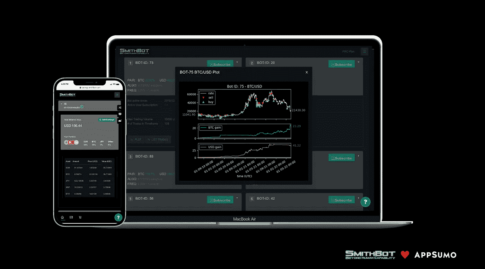

# 人工智能加密交易机器人——史密斯机器人在 AppSumo 上发布

> 原文：<https://medium.com/coinmonks/ai-crypto-trading-bots-smithbot-launches-on-appsumo-e8a34cffa163?source=collection_archive---------20----------------------->

多年来，即使是最知名的加密货币业务也局限在互联网上难以找到的角落。好消息是，主流平台正在向高质量的加密应用程序开放，使互联网上的所有用户都可以轻松获得最新的工具。最好的例子就是知名科技交易网站 AppSumo 最新推出的创新型[人工智能加密机器人交易平台 SmithBot](/coinmonks/appsumo.8odi.net/jWYrQP) 。

# SmithBot 在 AppSumo 上交易

AppSumo 以极低的折扣价限时供应而闻名。它们还以许多终身交易而闻名，在这些交易中，你只需支付一次费用，就可以永远使用所购买的服务。

SmithBot 用**两个特别优惠**庆祝他们的人工智能机器人交易服务的推出:

*   1 年期基本订阅仅需 89 美元(**比正常价格低 60%**)
*   终身基本订阅仅售 178 美元

这两笔交易都在 AppSumo 上独家出售，而且时间有限。购买是无风险的，因为有 60 天的退款保证。

# SmithBot 是领先的人工智能交易机器人平台

[SmithBot](https://smithbot.com/) 为加密货币的自动交易提供了一个基于云的平台。它的机器人引擎全天候运行复杂的人工智能算法来寻找最佳交易。

*   **人工智能优化的**，预配置的交易机器人
*   **透明**机器人的排名和比较
*   **轻松**选择和订阅机器人
*   **安全**和非安全
*   **全自动**交易体验

史密博特列出了 13 个不同交易对的 100 多个高级人工智能加密交易机器人，而且他们还在不断增加新的机器人。幸运的是，由于各种排名和过滤选项，很容易比较和选择适合您需求的机器人。

SmithBot 团队于 2017 年开始开发，由金融、人工智能和数据分析领域的经验丰富的专家组成。

# AppSumo 是最热门的科技交易网站

超过 125 万名企业家信任 AppSumo，为他们提供业务所需的一切。他们提供各种数字分销产品和服务，从软件到在线学习课程和其他创意资源。它由诺亚·卡根于 2010 年创立，现已发展成为一家拥有 150 多名员工的大型企业。

# 结论

随着用户友好的人工智能交易机器人平台 SmithBot 在知名科技交易网站 AppSumo 上推出，现在开始交易并从加密货币市场中受益比以往任何时候都更容易。此外，有抱负的交易者在有限的时间内享受特别优惠，并以独特的价格获得专业的解决方案。

**亦读，**

*   [加密货币交易机器人的趋势:人工智能算法](/coinmonks/trends-in-cryptocurrency-trading-bots-ai-algorithms-38c4b24edcd9)
*   [密码交易机器人——2022 年度最佳人工智能密码交易机器人](/coinmonks/crypto-trading-bot-best-ai-crypto-trading-bots-2022-97328dc1d2cd)
*   [密码交易机器人——18 款最佳免费密码交易机器人【2022】](/coinmonks/crypto-trading-bot-c2ffce8acb2a)
*   [SmithBot AI 加密交易机器人——现场交易测试](https://blog.coincodecap.com/smithbot-ai-crypto-trading-bots)

> 交易新手？尝试[加密交易机器人](/coinmonks/crypto-trading-bot-c2ffce8acb2a)或[复制交易](/coinmonks/top-10-crypto-copy-trading-platforms-for-beginners-d0c37c7d698c)