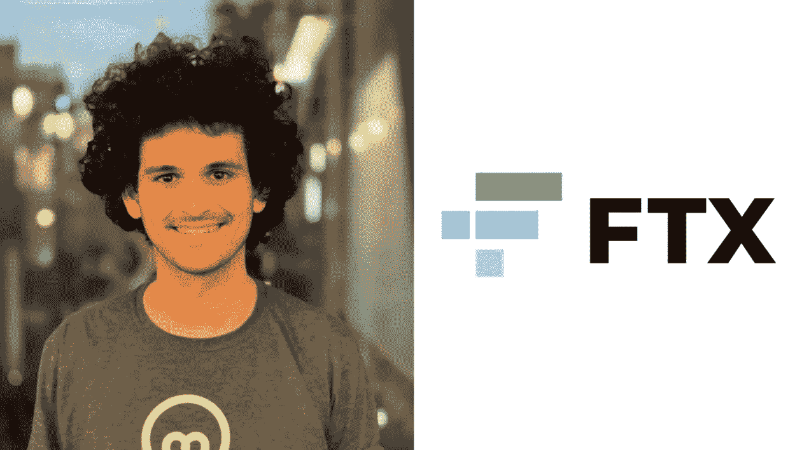

# 阿拉米达钱包显示不健康的活动

> 原文：<https://medium.com/coinmonks/alameda-wallets-show-unhealthy-activity-64b37fcb965c?source=collection_archive---------21----------------------->

在前首席执行官 Sam Bankman Freed 以 2.5 亿美元保释出狱几天后，与破产的交易公司 Alameda Research(FTX 的子公司)相关的加密货币钱包被发现转移资金。

阿拉米达钱包的资金转移可能只是引起了社区的好奇，但这些资金转移的方式引起了关注。人们发现阿拉米达钱包正在用 ERC-20 比特交换以太(ETH)/系绳(USDT)，然后以太和 USDT 通过即时交换和混合器被引导。

> 交易新手？在[最佳密码交易所](/coinmonks/crypto-exchange-dd2f9d6f3769)上尝试[密码交易机器人](/coinmonks/crypto-trading-bot-c2ffce8acb2a)或[复制交易](/coinmonks/top-10-crypto-copy-trading-platforms-for-beginners-d0c37c7d698c)

例如，一个以 0x64e9 开头的钱包地址从阿拉米达拥有的钱包中收到了 600 多个 ETH，其中一部分被交换给了 USDT，另一部分交易被发送给了 ChangeNow。

网络分析师 ZachXBT 指出，阿拉米达钱包最终使用 FixedFloat 和 ChangeNow 等分散式交易所将资金兑换为比特币(BTC)。这些平台经常被黑客和攻击者用来隐藏交易路线。

> “资金是用来交换 BTC 的
> 
> BC 1 q 67 r 2 DC 46 ve 66 PE 2 QR 9 smaz 5 ktzefehugky 5 SV 6
> BC 1 qk 4 mnz 4 qkh 9 vfcm 95 z 6 ww9 czhzjsknjr 8s 457mg
> BC 1 qwx 3 herf 245 w6 k 9 ljfgdsngtv JSP 3 QS 6 Zn P8 DD
> BC 1 q 7p 22k 0 ly 0 pmy 04 erm zu 76 uyylveehu 9 cusrcnp 写道( [@zachxbt](http://twitter.com/zachxbt)

在 FTX 漫长的历史中，每天都有新的转折，而提取这些加密货币钱包中剩余内容的最新资金转移是社区非常关注的问题。

鉴于班克曼-弗利德臭名昭著的犯罪记录，许多人猜测推断这些钱包里剩下的东西可能是内部人员所为。

其他人质疑保释的条款，并质疑为什么班克曼-弗里德可以上网。一位用户写道，这位前 CEO“急于套现”，并补充道:

> "为什么他的保释条件不包括不能使用电脑/互联网？"

目前阿拉米达钱包的资金流动与班克曼-弗里德的保释同时发生，这并不是第一次可疑的巧合。在 FTX 于 11 月 11 日申请破产后，该交易所的钱包立即被黑客侵入数百万美元。
美国司法部目前也在调查 FTX 在申请破产后立即利用的 3.52 亿美元。

📰 ***订阅*** [***斐波那契***](/@unclefibonacci) ***我来保持最新***

> 加入 Coinmonks [电报频道](https://t.me/coincodecap)和 [Youtube 频道](https://www.youtube.com/c/coinmonks/videos)了解加密交易和投资

# 另外，阅读

*   [Pionex 双投](https://coincodecap.com/pionex-dual-investment) | [AdvCash 审核](https://coincodecap.com/advcash-review)
*   [面向开发者的 8 个最佳加密货币 APIs】](https://coincodecap.com/best-cryptocurrency-apis)
*   [加密交易机器人](/coinmonks/crypto-trading-bot-c2ffce8acb2a) | [维护审查](https://coincodecap.com/uphold-review)
*   [十大最佳加密货币博客](https://coincodecap.com/best-cryptocurrency-blogs) | [YouHodler 评论](https://coincodecap.com/youhodler-review)
*   [my constant Review](https://coincodecap.com/myconstant-review)|[8 款最佳摇摆交易机器人](https://coincodecap.com/best-swing-trading-bots)