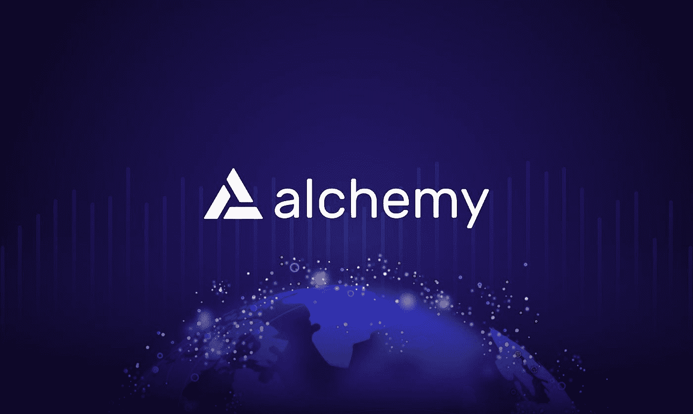

# 炼金术:Web3 开发平台

> 原文：<https://medium.com/coinmonks/alchemy-the-web3-development-platform-197de2b6931a?source=collection_archive---------1----------------------->

web3 dApps(去中心化应用程序)的世界正在迅速发展。dApps 与为 web2 创建的常规应用程序的区别在于它们与区块链的连接。即使对于经验丰富的开发人员来说，必须弄清楚如何将自己的项目连接到区块链也是一件令人畏惧的事情。炼金术就是要改变这一点！