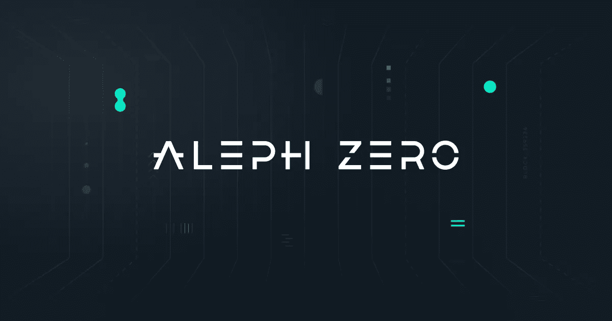

# Aleph Zero，用于基础设施的区块链

> 原文：<https://medium.com/coinmonks/aleph-zero-a-blockchain-for-infrastructures-1e70674451de?source=collection_archive---------19----------------------->

非常好的加密读者，在本文中，我们将分析一个区块链，它专注于商业和基础设施领域的应用程序开发，这似乎非常有趣。如果你经常阅读我的文章，你会注意到我喜欢总结文章，这是因为我认为时间是非常宝贵的，因此我喜欢强调主要的关键点。嗯…