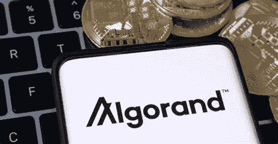

# 阿尔格兰德(ALGO)价格预测

> 原文：<https://medium.com/coinmonks/algorand-algo-price-prediction-e69c65529159?source=collection_archive---------33----------------------->

Source photo [algorand — Bing images](https://www.bing.com/images/search?view=detailV2&ccid=V0oWoJgL&id=E4746E699D251C86E825A8BD31FD21035596D284&thid=OIP.V0oWoJgLuh-7takhr5_p_wHaD1&mediaurl=https%3a%2f%2ffintechinsiders.org%2fwp-content%2fuploads%2f2021%2f07%2f03-Algorand.png&cdnurl=https%3a%2f%2fth.bing.com%2fth%2fid%2fR.574a16a0980bba1fbbb5a921af9fe9ff%3frik%3dhNKWVQMh%252fTG9qA%26pid%3dImgRaw%26r%3d0&exph=388&expw=750&q=algorand&simid=608042471862575597&FORM=IRPRST&ck=83361B1B69233400E6CD02F9F1EBBEF5&selectedIndex=62&ajaxhist=0&ajaxserp=0)

## 什么是阿尔格兰德？

由希尔维奥·米卡利创立的阿尔格兰德公司的 mainnet 于今年 6 月上线。据估计，Algorand 平台每天可以处理大约 100 万笔交易。就区块链的公开加密货币而言，它是最知名的之一。该协议旨在为参与者提供分散化和安全性。