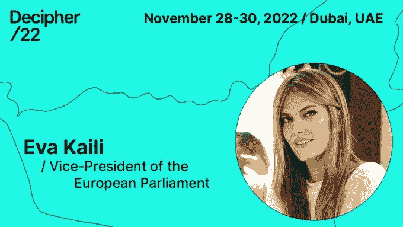
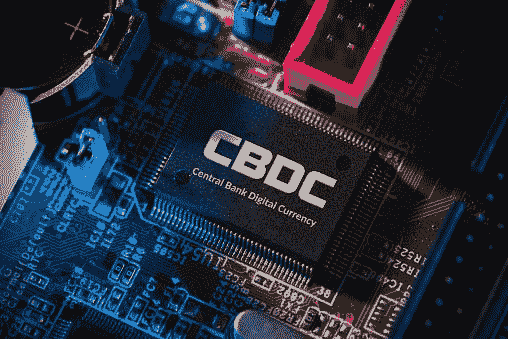

# Algorand、Eva Kaili 和 CBD cs——可以对区块链实施什么监管？

> 原文：<https://medium.com/coinmonks/algorand-eva-kaili-and-cbdcs-what-regulation-could-be-imposed-on-blockchain-84048bc9da76?source=collection_archive---------36----------------------->

这个博客是阿尔格兰德区块链的数字收藏品。如果你想买这篇文章的出版权，去[*token blogs . app*](https://tokenblogs.app/listing/buynow/972503354)

# 阿尔格兰德和欧盟

上周，我有幸被邀请到迪拜参加阿尔格兰德会议，度过了一段美妙的时光，不仅推销了我的初创公司 [Tokenblogs](https://tokenblogs.app/) ，还见到了一群超级天才的创始人，并把他们的想法付诸实践。algo 命名为 Algorand 社区的名称。

然而，对于我来说，坐 6 个小时的飞机去中东还有一个也许是最重要的动机，那就是去看欧洲议会的副主席在会上讲话。作为一个欧洲政治尤其是英国退出欧盟的狂热追随者，审查制度和新的[数字服务法案](https://commission.europa.eu/strategy-and-policy/priorities-2019-2024/europe-fit-digital-age/digital-services-act-ensuring-safe-and-accountable-online-environment_en)——看到一位欧盟高级代表在区块链会议上的所作所为，特别是我心爱的*阿尔格兰德——让我深感怀疑。*

然而，结果是伊娃·凯丽退出了，而**没有**参加活动…

# 那么伊娃·凯丽是谁呢？

伊娃·凯利是欧洲议会的副主席，任期到 2024 年，她的简历令人印象深刻。凯丽女士来自希腊雅典——这是我最喜欢的地方。

她反对英国退出欧盟，认为希腊留在欧盟更好——这是一个奇特的观点，因为看到她所在的政党十多年前同意的长达十年的紧缩措施，人们会认为她持有不同的观点？。但正如俗话所说:“如果你打不过他们，就加入他们”，因此，很高兴看到一个希腊人在欧盟的高层如此之高。*桥下必有水。*

在更深入的研究和几个小时的采访后，发现伊娃是一个非常专业的加密专家。

# Eva 是安全的手吗 Algorand 想要的好组合吗？

众所周知，Algorand 将自己定位为金融的未来，为政府和机构提供区块链解决方案，因此，让来自欧盟的高级代表参与解密是有意义的。欧盟喜欢监管和约束科技公司，因此毫不奇怪，随着波士顿出现令人敬畏的科技产品，阿尔格兰德也在他们的关注范围之内。

最近，数字服务法案通过了加强反虚假信息行为准则，旨在防止在私人信息中分享欧盟认为的假新闻。该法案还有配额和 KPI 来衡量 big tech 删除内容的速度和数量，以避免被欧盟罚款全球营业额的 6%。

所以你可以看到，我们有欧盟对国际市场和欧洲以外的全球公司进行立法。因此，在无国界经济下运作的区块链的想法是欧盟**需要**赶在他们的公民获得太多自由之前加以控制的。*对吧？*💀

现在，伊娃在区块链监管中的角色一点也不专制，她显然是一个倡导者，并且正确理解区块链如何创新一些领域，比如打击银行赚取的支付中的隐性费用。

凯里还希望在推动监管之前让创新萌芽。*很高兴听到*。

就在几天前，凯利和阿尔格兰德公司的创始人希尔维奥·米卡利在 ACE BRAIN 活动上发表了讲话，阿尔格兰德公司卓越中心大学项目的一些区块链参加了这次活动。

> *启动*[*ACE BRAIN*](https://www.algorand.foundation/ace-university/universita-roma-tre)*，这是一个新的研究中心，致力于分析区块链技术与欧盟立法之间的兼容性，促进(可持续)区块链技术成为未来欧盟单一市场的支柱，并成为更民主、更有弹性和更可持续的社会的基础。*

# 欧盟想对区块链进行什么监管？

# GDPR 会扼杀区块链吗？

个人数据是任何可以追溯到真实个人的东西。钱包地址当然可以追溯到人类。

在讨论数据保护时，需要了解一些关键条款，例如第 17 条“被遗忘的权利”和第 18 条关于限制对您数据的访问。现在，在阅读这些陈述时，你可能和我一样，会想——这难道不是区块链人力资源部最糟糕的噩梦吗，因为这是有史以来最不合规的事情！*是*。

# 第十七条

这被打破了，因为块是不可变的，这意味着数据不能被改变，因此信息是永久的。

# 第十八条

不可能限制对您的数据的访问，因为它位于分布式公共账本上。

在 GDPR 有两个关键的参与方:

1.  **数据控制者** —数据控制者决定处理个人数据的目的和方式。
2.  **数据处理器** —数据处理器仅代表控制者处理个人数据。数据处理器通常是公司外部的第三方。

# “那么我们监管谁？”

1.  创造这些工具并不是 T2 协议开发商阿尔格兰德公司的错。
2.  你不能责怪**允许的节点**允许 txn 通过？
3.  或者，我们应该责怪兰德实验室开发了一款 [Algo Explorer](https://algoexplorer.io/) 来让消费者更容易阅读区块？

# 能做些什么？

有两个明显的选择:

# 私人连锁店

老实说，私人连锁店毫无意义。大多数公司拥有超快的内部流程和计算机能力，可能比区块链还快。区块链的主要好处是它的去中心化。所以一旦过去，就没有意义了。

# 零知识证明

零知识证明无需向区块链揭示实际数据就能证明某事为真，它本质上揭示了所需的绝对**最小**数据。太棒了。zCash 和 Monero 运行在这些上面，是我最喜欢的加密货币之一。

但最终，为什么欧盟、监管机构或央行会积极支持零知识证明？一些人会认为，政府和央行介入区块链的全部意义在于加强对公民的监控。

# 阿尔格兰德在政府计划中的作用

数字身份证和 CBDCs 是政府与任何区块链公司打交道时想到的主要产品。

> 仅仅因为它在 Algorand 上并不意味着它是一件好事。

当一个人是技术的倡导者时，他必须非常谨慎。技术的发展导致孤立主义的增加，我认为“元宇宙”这个词实际上是我们已经生活在其中的东西——它只是强调了人类是如何数字化连接的，以及现实世界互动的消亡。

# CBDCs💀

让我朝山上跑的一项技术是央行数字货币(CBDCs)。

> *“各国央行对加密货币不感兴趣，主要是因为它们没有中央政府的支持，这意味着它们不受与传统货币相同的监管和监督。加密货币是分散的，它们的价值由供求关系决定，它们的价值可能会波动——这使得它们与传统货币相比，是一种不太稳定的货币形式。此外，一些央行可能担心加密技术可能会扰乱传统金融体系，这可能会对经济产生负面影响。”* ***ChatGPT***

我认为，密码扰乱 TradFi 的潜力正是民众获得更大金融自由所需要的。但是引入一个直接向消费者发行货币的中央银行会带来更大的威胁——它不仅会摧毁商业银行，因为它们不再有客户存款来为贷款融资，而且还会产生可编程货币。

# CBDCs 的严重后果

> *“数字现金可以被编程，以确保它只花在雇主或政府认为合理的必需品或商品上——”****每日电讯报***

我深情地记得 Rishi Sunak(英国首相)的“外出就餐帮助(T9)”计划，该计划旨在刺激食品和饮料领域的支出。这个简短的项目给每个人一张 10 英镑的优惠券，让他们去餐馆吃饭时可以打折——这可能是 Rishi 打算引入的可编程资金的前兆吗？

# 两层

CBD 可不是闹着玩的。我预测一个两层的阶级系统:

1.  工人阶级将根据他们的健康状况和消费历史拥有量身定制的可编程货币，并由中央银行直接发行。这将是他们的 UBI(普遍基本收入),并根据他们遵守绿色议程的情况发放给大众；比如循环利用，电动汽车，正确的免疫接种。这笔钱也将有一个到期日，以消除储蓄。
2.  **精英** —上层阶级或精英阶层对他们的支付没有任何限制，他们可以随心所欲地消费，不受任何限制——财产、企业、汽车、农田和公用设施都将归他们所有，只在他们同意/支付租金的情况下才给予其他公民。

现在我知道了，克里基，这有点反乌托邦，我希望我是错的！

但这就是 web3 如此伟大的原因，无论是它为没有银行账户的人带来稳定的美元收入，还是为发展中国家的社区提供更多收入机会的“赚钱”加密模式——区块链是一项赋权的技术，绝不能被政府利用。

> *区块链是给人民的，不是给政府的。*

# 这对加密货币意味着什么？

在我看来，$BTC，$XMR 等是针对 CBDCs 的明显对冲。我预测在 KYC 周围会有一个巨大的黑市漏洞，允许将来接受现金加密和 CBDCs 加密的商家轻松加密。

# 结论

我只想说，小心你对区块链的期望，它所拥有的力量是疯狂的。总体而言，不断增长的技术将进一步破坏人类交流的社会结构，导致人类心理的系统性变化，在我看来，这可能是最糟糕的。

如果有任何欧盟政治家要监管加密，伊娃·凯莉是一个很好的选择——现在她计划如何解决 GDPR 问题是我着迷的事情，以及他们监管分散金融(DeFi)的方法。我预计欧元 CBDC 将会推出，但我担心这种采用将是强制性的。她来自希腊，那里的人喜欢现金——我每年在那里呆三个月，我知道商人非常喜欢现金而不是信用卡。因此，尽管引入 CBDCs 将增加地中海地区的税收，但它无疑会摧毁那些仍然只能靠现金勉强度日的家庭；意思只有一件事…国家分发可编程货币。

algrand 是一个伟大的区块链——具有气候意识、可伸缩性和可忽略的 txn 费用——正是 Eva 一直在寻找的协议，但 algrand 或其技术会用于 CBDCs 吗？

这个博客是阿尔格兰德区块链的数字收藏品。如果你想买这篇文章的出版权，去[*token blogs . app*](https://tokenblogs.app/listing/buynow/972503354)

*这篇文章是一个数字收藏品，可以在* [*tokenblogs*](https://tokenblogs.app/) 拥有

> 交易新手？在[最佳加密交易](/coinmonks/crypto-exchange-dd2f9d6f3769)上尝试[加密交易机器人](/coinmonks/crypto-trading-bot-c2ffce8acb2a)或[复制交易](/coinmonks/top-10-crypto-copy-trading-platforms-for-beginners-d0c37c7d698c)