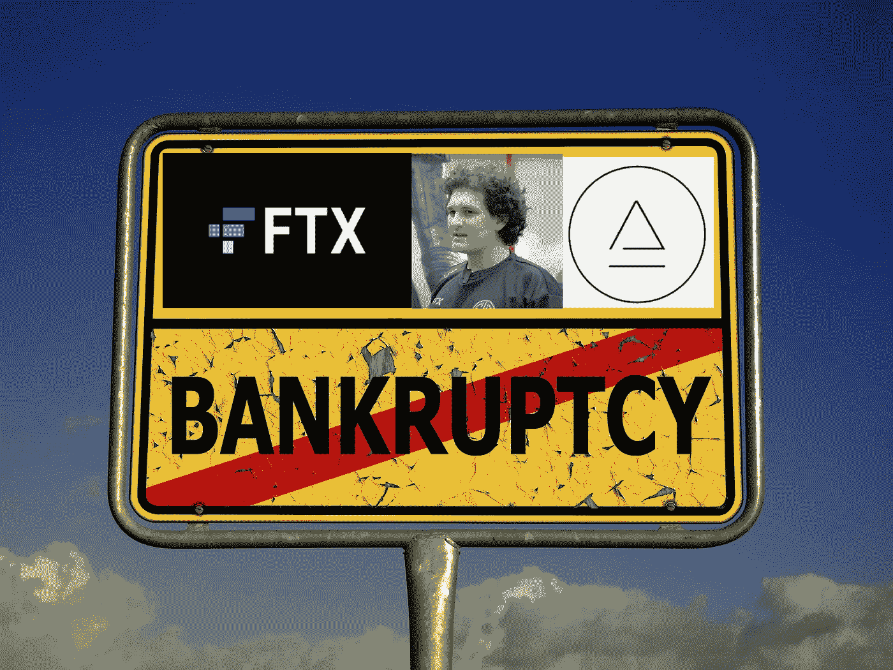

# 全部加密-2022 年 11 月 11 日第 11 周

> 原文：<https://medium.com/coinmonks/all-been-crypto-week-11-nov-2022-31e7aff1de8?source=collection_archive---------37----------------------->

哦，天哪，一个星期——第二大交易所爆炸了，我们的市场进入了全面清算模式。过去一周发生的事件震惊了许多人，在监管机构看来，肯定不会对我们的行业有任何好处。考虑到 FTX/阿拉米达的故事有多少方面和天使，以及时间是如何改变的，我会在本周试着关注更广阔的图景，以及这对密码意味着什么。本周的这封信将会有所不同，因为考虑到它的重要性，它将只关注 FTX 的故事。价格走势显示，美国融化至 1 万亿美元以下，BTC 和联邦医疗保险下跌-15/-18%。尽管在过去 24 小时里，由于 CPI 数据走软，价格出现了强劲反弹。当然，表现最差的是 FTT -89%，SOL -45%，Aptos -33%，因为 Alamedas 对这些代币的敞口是众所周知的。注意安全！

蝙蝠太极—[btc21@mail.com](mailto:btc21@mail.com)

## **SBF 帝国崩溃——FTX 的灭亡&阿拉米达**

萨姆·班克曼·弗雷德被广泛认为是密码界的天才少年。我们本周发现，他的交易所 FTX 有一个庞大的整体，不得不暂停客户提款。到底发生了什么还不是 100%清楚，但目前看来，FTX 和阿拉米达之间有一个 80 亿至 100 亿英镑的缺口，资产已经混合在一起。虽然还不清楚他们是如何损失这么多钱的，但猜测是阿拉米达已经有一段时间秘密拥有一些团队，但通过从 FTX 用户基金注入流动性，他们能够掩盖这一点。我们可能会发现更多关于到底发生了什么，但有一点是肯定的，似乎不是所有的事情都是由财产决定的。对于那些从事加密足够长时间的人来说，这可能并不奇怪，因为交易所总是容易受到利用、管理不善和黑客的攻击。当然，这一次是以一种新的方式。这不是 Gox 山，那里有几个塞弗朋克在交换他们的 BTC。FTX 凭借数百万美元的交易，如迈阿密篮球馆，在美国家喻户晓，而 SBF 在国会山也并不陌生。如果你看看牌桌，你就会知道谁是谁来自 TradFi blue blood，所以最初许多人不相信 FTX 有任何不当行为也就不足为奇了。只有在银行挤兑表明流动性不足时，市场才开始恐慌。

正是因为这些原因，这种崩溃才如此令人痛苦。SBF 在美国公众和一个大的政治捐助者 TradFi 中很受尊敬。许多人将他视为推动华盛顿秘密游说努力的声音。他自己可能做了不道德的甚至是非法的活动，这让我们整个行业陷入了困境。这将让传统机构在参与之前加倍努力。不仅仅是在未来的监管和机构采用方面，SBFs 的失败让我们的行业感到沮丧。阿拉米达被认为是街上最好的商店之一，信誉良好，基本上每个主要贷款人可能都有一些风险，他们广泛知道将 FTT 作为抵押品(这不是下降了 90%哇)这些坏账将不得不由贷款人承担。SBF 的帝国也是最大的“纾困”提供者之一，在卢娜崩溃后，他投资了航海家和 BlockFi，我认为这两个公司现在都回到了原点，然后当然 FTX 锁定蔓延对现有的玩家产生了巨大的影响。基本上所有的做市商都在 FTX，许多人出来说他们仍有数亿美元被锁定在交易所。场外交易的 FTX 余额为面值的 10%，这告诉你，市场几乎没有希望剩下多少可以恢复的空间。事实上，市场对复苏抱有如此大的希望，以至于 FTX 似乎在与孙正义和 T2 合作，这在很多层面上都是错误的。当流动性枯竭和交易对手风险增加时，我们可能会看到类似的连锁反应，如后 Luna/3AC。那肯定不是一个好位置。

但是你知道我，我是一个无可救药的乐观主义者，总是在各种情况下寻找+ves。这比通常情况下更难，但有一件事可能会带来交易所更好的信息披露。币安、德里比特、Gate.io 和其他公司已经提供了他们的链上地址，允许用户验证资产是否确实在交换中。如果成为行业标准，这将大大提高透明度，并(有希望)防止未来的外汇欺诈和银行挤兑。当然，这是为什么我们需要 DeFi 和完全透明的一个主要例子——不是淡化 FTX 的任何错误行为，而是我们的传统银行没有一家能在持续的破产中存活，也不是仅仅因为它们实际上在部分准备金上工作。不要轻信验证！

# **语录:**

> 对不起这是最重要的。我搞砸了，应该做得更好。

**山姆·班克曼-弗里德**

> 你必须承认@ SBF FTX 在这里的责任心。我不知道任何事实，但我从未见过一位首席执行官像他在这里这样承担责任。这反映了他和对@FTX 官方更有利的结果的可能性

比尔·阿克曼

> 我不得不承认，我过去一直对@Tether_to 持批评态度，他们的透明度仍然远远达不到我认为资产支持硬币应该具备的水平，但特别是考虑到这只熊身上发生的这么多其他大款的事情，他们已经超出了我的预期！

**维塔利科·布特林**

> 交易新手？试试[密码交易机器人](/coinmonks/crypto-trading-bot-c2ffce8acb2a)或[复制交易](/coinmonks/top-10-crypto-copy-trading-platforms-for-beginners-d0c37c7d698c)