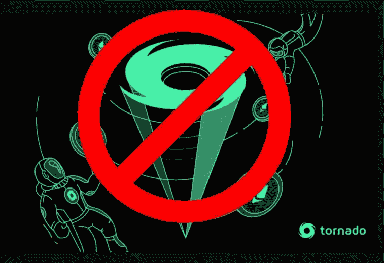

# 全部被加密—2022 年 8 月 12 日第 12 周

> 原文：<https://medium.com/coinmonks/all-been-crypto-week-12-aug-2022-8bd3b0b7f3ee?source=collection_archive---------16----------------------->

在 CPI 发布后，宏观经济看起来发生了多么大的变化，我们收盘时的加密市值远高于 1.1 万亿美元。BTC 上涨了 6%，瑞士联邦理工学院上涨了 17%，ETC 上涨了 19%，因为这次合并是真的了。我们完成了最终的测试网合并，现在离主网合并还有“几周”的时间。但是，当加密市场正在庆祝以太坊的反弹和 PoS 的进展时，我们也有一些头条新闻。一直以来，美国监管机构追求隐私工具龙卷风现金，更多的暂停，撤回停止和破产申请和调查，由联邦贸易委员会和 DOJ。然而，在采用方面，贝莱德在上周宣布 coinbase 的基础上再次提升，并透露支持私人比特币信托。享受阅读！

蝙蝠太极—[btc21@mail.com](mailto:btc21@mail.com)

# 标题:

## [美国财政部批准的龙卷风现金](https://home.treasury.gov/news/press-releases/jy0916)

Tornado cash 是一个分散的协议，允许用户混合他们的 ETH、USDC 和其他硬币，从而在链上追踪 obfiscate。它本质上是一个非常有效的隐私工具，因此被许多同样重视隐私的非法行为者所使用。本周，该协议和 45 个相关的以太坊钱包地址已被 OFAC 列入禁止名单，因此任何美国公民与之互动都是非法的。这不仅导致了密码社区对隐私价值的强烈抗议，也引发了言论自由和如何禁止隐私保护工具的问题。请注意，他们在 5 月份禁止了另一款名为 [Blender.io](https://home.treasury.gov/news/press-releases/jy0768) 的混音器，但不同的是，Blender 是被监管的。龙卷风现金不是，所以如果你的目标是一个开源协议，它基本上是不可阻挡的。这就是去中心化的美妙之处——它仍然有效——没有办法关闭它，除非你关闭互联网。但我们也很快意识到，尽管 Tornado Cash 是开源和分散的协议，但仍有相当多的集中攻击媒介。首先，USDC 很快冻结了龙卷风现金池中的 75k USDC，但是我们也移除了他们的 [github](https://github.com/tornadocash) ，甚至 [Infura 和 Alchemy](https://twitter.com/0xdev0/status/1556933551073153024?s=21&t=hF7Z1hRomAS55q1u9vJDcw) 现在也阻止了 RBC 来自龙卷风的请求。当然，现在这些代理商没有真正的选择，因为他们在美国，必须遵守 OFAC 规则，否则将面临关闭自己，但像 Tornado Cash 这样的隐私保护工具对于像区块链这样完全透明的 leger 技术来说是至关重要的。例如，outlet 自己作为 TC 的用户向乌克兰捐款，你可以看到并非所有隐私都是非法/不道德的。但这个问题是法院的问题，已经有一些非常有趣的边缘案例，其中似乎有人将 0.1 ETH 存入 Tornado cash，然后将其取出)到许多美国公民的公共域名中。从技术上来说，这些人现在都违反了 OFAC 教，可能面临起诉，即使他们自己可能从未与 TC 互动，很可能不打算接受这些资金，甚至可能不知道他们接受了这些资金。这是一个聪明的把戏，展示了整个行为是多么荒谬，TC 将叉上一个新的合同，新的地址，其开源和不可阻挡的。但是我们必须仔细考虑以某种方式一直存在的集中攻击媒介。这是一个阅读罗斯·乌布里希特和他的丝绸之路项目的好时机，这个项目在近 10 年前就已经停止了。包括我在内的许多人第一次听说 BTC。

## ETH 合并更新: [Gori Testnet 成功](https://twitter.com/sassal0x/status/1557544104031973377?s=20&t=YLdyXQSrxeP7c0RJWEmOug) — Mainnet next

第三次也是最后一次 testnet 合并在本周再次发生，没有任何大的改动。现在我不是一个开发人员，不得不承认我在合并的“等待戈多”阵营中呆了一段时间，但如果你看二阶指标，一切似乎都指向主网也很快发生。从我的角度来看，从技术上来说，他们已经解决了所有已知的边缘情况，考虑到它被延迟的频率，我相信在未来几周内，技术方面的风险较小，而博弈论和政治方面的风险较大。9 月 15 日的第[周](https://twitter.com/sassal0x/status/1557747849357430784?ref_src=twsrc%5Etfw%7Ctwcamp%5Etweetembed%7Ctwterm%5E1557747849357430784%7Ctwgr%5Eacdf3964bd30c1f3c008b93c0722b9c5e5e328d0%7Ctwcon%5Es1_c10&ref_url=https%3A%2F%2Ffortune.com%2F2022%2F08%2F11%2Fethereum-merge-date-estimate-developers-september%2F)已经被安排好了，但是它是由日历上的日期决定的，甚至不是某个特定的街区高度，而是预计在大约 5 周内的[终端难度](https://twitter.com/TimBeiko/status/1557747656507633665?s=20&t=BcoGRyMONeappcD1LpRVkA)。现在，在合并过程中会发生很多事情，[上周](/coinmonks/all-been-crypto-week-5-aug-2022-ec8e4dd95ad5)我提到了矿工，他们可能打算继续做他们最擅长的事情，即开采区块，以及他们的选择和决策理由。现在，随着即将到来的硬分叉，许多交易和潜在的套利机会出现了。我已经看到两个交易所( [Poloniex](https://poloniex.com/campaigns/eth-fork) 、 [BitMex](https://blog.bitmex.com/ethpow-coin-listing/) )列出了 ETHPos 和 ETHPoW 的合成版本，并期待更多的出现。尽管流动性非常低，但价格显示交易价格在 100 美元左右。同样有趣的是即将到来的“分叉”在期货市场引起的现货溢价，因为每个人都想做多现货硬币，做空期货进行对冲。其他一直在浮动的交易是根据 DeFi 贷款协议借入 ETH vs stable 硬币，然后猜测 Circle 不会支持 ETHPoW 的影响，因此该链上的 USDC 价格将崩溃，实际上是大规模拯救你的债务。有这么多这种类型的机会主义交易正在出现，我甚至没有提到 MEV…所有这些都使我们相信，随着我们越来越接近这一事件，我们将看到许多动荡和主要参与者可能退出和观望。

## 违约、暂停和压力

尽管 ETH 和 macro 引发了乐观情绪，但我们本周在市场头条上看到了系统压力以及持续的破产和停工。本周，Coinflex 在塞舌尔申请重组，德国加密交易所 T2 Nuri T3 申请破产，交易所 T4 hot bit T5 因受到刑事调查而停止交易，Hodlnaut T7 暂停提款。最后一个受到了特别严重的打击，因为他们最近刚刚获得了 MAS 的原则批准，在此之后，围绕 3AC 的问题新加坡监管机构将加强对加密行业的监管。在美国，我们第一次有了联邦贸易委员会的调查，一个密码玩家 [BitMart](https://blockworks.co/ftc-probe-into-200m-bitmart-hack-continues-after-doc-block-denied/) 去年被黑了 2 亿美元，证券交易委员会在收益率和赌注产品上追查[比特币基地](https://www.coindesk.com/policy/2022/08/10/coinbase-faces-sec-probe-over-crypto-yield-staking-products/)，最后也是监管机构的目标，可能是 Biftinex——根据[司法部(DOJ)对信息自由法(FOIA)请求的回复](https://twitter.com/oleh86/status/1557450499032596480?s=20&t=ZVz12xdGs3NuaOoJQc6ISw),我们本周得知在美国面临可能的刑事调查。我们还没有走出困境，事实上监管机构才刚刚开始。

# **行情:**

> 我的 GitHub 账号刚刚被暂停，现在写开源代码违法吗？

**罗曼·谢苗诺夫，龙卷风现金公司的联合创始人**

> 到 9 月底，加密货币和智能合约将在与目标国家的对外贸易中广泛使用

**伊朗贸易促进组织负责人 Alireza pey man-Pak**

> 我认为我们应该认真考虑准备与美元脱钩。这几乎是不可避免的，只有做大量的准备才是现实的

**鲁恩·克里斯滕森，马克尔道创始人**

> 交易新手？试试[加密交易机器人](/coinmonks/crypto-trading-bot-c2ffce8acb2a)或者[复制交易](/coinmonks/top-10-crypto-copy-trading-platforms-for-beginners-d0c37c7d698c)