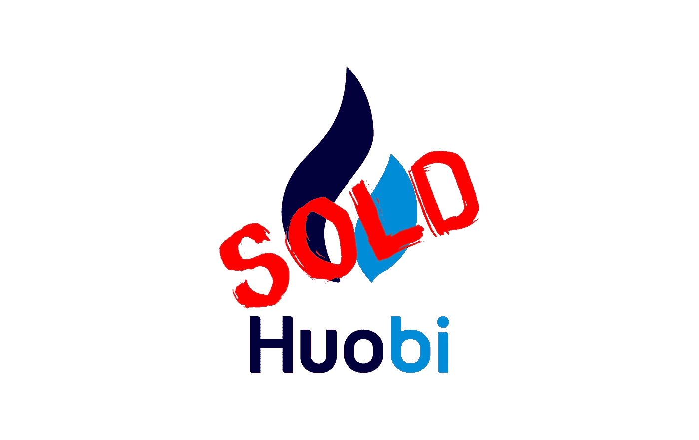

# 全部被加密—2022 年 10 月 14 日第一周

> 原文：<https://medium.com/coinmonks/all-been-crypto-week-14-oct-2022-11ba59c3536b?source=collection_archive---------56----------------------->

随着市值下滑至 9500 亿英镑，BTC 下跌 2.5%，瑞士联邦理工学院下跌 4.5%，我们继续压低价格。所有的手指都指向宏观经济，在美国公布了更强劲的 CPI 数据后，我们看到了短暂的下跌，这证实了美联储将采取更多的紧缩措施。随着收益率的上升，发行稳定的硬币变得越来越有利可图，所以毫不奇怪 USDT 宣布他们现在摆脱了所有的商业票据——如果你在美国国债上获得 4.5%的收益率，你为什么要这样做，甚至 MakerDAO 也在增加它们。在创始人李(Leon Li)终于找到了收购其股份的买家后，本周 Huobi token +80%的表现明显优于市场。在企业方面，我们看到谷歌宣布与比特币基地和银行业巨头 BNY·梅隆公司合作推出加密托管。Uni 成功将其 B 轮融资估值提高到 16.6 亿英镑，SOL DEX 芒果市场被开发了 1 亿英镑。在监管方面，美国证券交易委员会(SEC)对宇迦实验室的证券产品穷追不舍，葡萄牙调整了其加密税法，只对长期持股免征资本利得税。享受阅读！

蝙蝠太极—[btc21@mail.com](mailto:btc21@mail.com)

# 标题:

## [火币销售关闭](https://www.huobi.com/support/en-us/detail/84919491689932)

最大的密码交易所之一霍比现在有了新主人。创始人 Leon Li 已同意将其在加密交易所的全部股份出售给香港投资公司 About Capital。在中国的打击行动之后，他已经四处寻找买家有一段时间了，据彭博社(bloomberg)报道，他在 8 月份寻求 30 亿美元左右的估值。鉴于市场在过去几个月的表现，我预计收盘价会低于这一水平。有传言称[的孙正义](https://wublock.substack.com/p/exclusive-the-real-buyer-of-huobi)是购买股份的香港实体的幕后黑手，但他多次否认。不过对贾斯汀来说，这并不是什么新鲜事，如果你还记得他参与的 [Poloniex](https://www.coindesk.com/markets/2019/11/12/despite-denials-tron-founder-confirms-investment-in-poloniex-crypto-exchange/) 也遵循了类似的策略。然而，这一次他甚至更新了他的推特简历，在公司发布新闻稿后，增加了他在 HuobiGlobal 的顾问角色。至于未来，听说降薪但没有裁员(还没有？)以及市场营销的重新转变和对全球业务的关注。即使是品牌重塑也无法摆脱仍然笼罩在火币周围的“中国”光环。看着交易所变成什么样，以及它如何符合 Justin 的愿景将会很有趣，特别是因为他已经拥有了一个交易所。再次提醒我们 Justin(格林纳达常驻世贸组织代表)是多么有创造力和丰富多彩，本周多米尼加政府宣布任命 TRON Protocol 为其发行多米尼加硬币的指定国家区块链基础设施。

## [谷歌云与比特币基地合作](https://www.prnewswire.com/news-releases/google-cloud-and-coinbase-launch-new-strategic-partnership-to-drive-web3-innovation-301645592.html)

你可能在大多数主要的加密会议上见过他们——我指的是谷歌云，所以他们宣布开放加密也就不足为奇了。伙伴关系的选择也是我们许多人在他们的宾果卡上有的。然而，这是 Web2 巨头向 Web3 迈出的重要一步。该新闻稿称，作为合作伙伴关系的一部分，谷歌云的定位是让选定的客户，从 Web3 生态系统中的客户开始，通过选定的加密货币支付其云服务。比特币基地将使用谷歌云的计算平台，那么谁想猜猜谁是被选中的客户之一？让我们看看其他人如何有资格，因为许多 Web3 玩家实际上依赖于云服务，如 AWS 和 Google Cloud，所以这肯定是对这项业务的积极出价。谷歌一直在为其服务添加更多的加密功能，如[以太坊钱包余额现在在谷歌上搜索地址时显示](https://www.theblock.co/post/176153/google-now-showing-ethereum-wallet-balances)， [BNB 连锁店与谷歌云合作](https://www.coindesk.com/business/2022/09/14/bnb-chain-and-google-cloud-work-together-to-advance-the-growth-of-web3-and-blockchain-projects/)以支持早期 Web3 和区块链初创公司的增长。他们甚至给合并的[加上了倒计时钟](https://www.coindesk.com/tech/2022/09/15/the-ethereum-merge-is-done-did-it-work/)——贝佐斯，该你了

## Solana DEX [芒果市场](https://twitter.com/mangomarkets/status/1579979342423396352) DEX 被开发了 100mm

所以这个看起来不是经典的黑客。攻击者找到了操纵甲骨文价格的方法，从而抬高了他的 MNGO 代币的价值。这更像是一种典型的恶意交易活动，我也更倾向于山姆的阵营，认为这是工程团队依赖强大神谕的设计缺陷。这种策略也不是没有风险的，因为任何人都可能利用另一方，利用攻击者以虚高的价格向他倾销 MNGO 令牌，而他却在哄抬这些令牌的价格以操纵甲骨文。这里有一个来自 [OtterSec 的很好的总结，](https://twitter.com/osec_io/status/1580019583854862338)这一集提醒了我们 dex 的多种攻击媒介以及 lindy 效应的真正价值。有趣的是，OG Uni 本周在 B 轮融资中以 16.6 亿英镑的估值融资 1.65 亿英镑。

# **行情:**

> 当(转向美联储)发生时，各种被压低的通胀交易可能会大幅反弹，包括加密交易

**保罗·都铎·琼斯**

> 这是多米尼克通过拥抱数字创新和指定 TRON 协议作为其指定的国家区块链基础设施来推动经济增长的历史性一步

**多米尼加总理罗斯福·斯凯里特**

> 我们不仅是在为隐私权而战，而且如果这个先例被允许成立，OFAC 可以在未来将比特币或以太坊等整个协议添加到制裁名单中，从而在没有任何公共程序的情况下立即禁止它们。这件事不能不受到质疑

**硬币中心执行董事杰里·布里托**

> 交易新手？尝试[加密交易机器人](/coinmonks/crypto-trading-bot-c2ffce8acb2a)或[复制交易](/coinmonks/top-10-crypto-copy-trading-platforms-for-beginners-d0c37c7d698c)