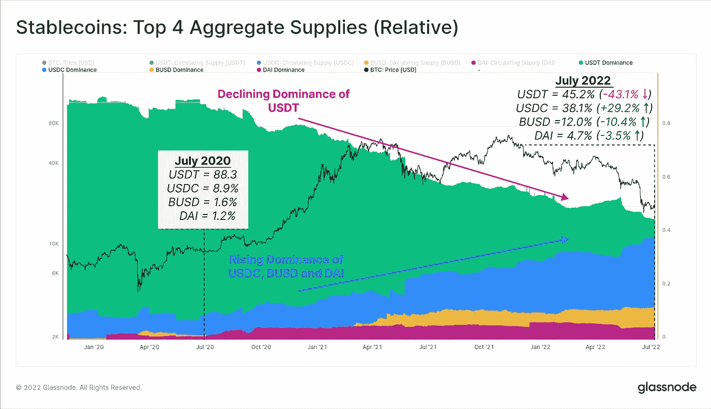

# 全部被加密—2022 年 7 月 15 日第一周

> 原文：<https://medium.com/coinmonks/all-been-crypto-week-15-july-2022-8627e2e193b6?source=collection_archive---------41----------------------->

我们过去的一周为美联储更积极的加息定下了基调。美国上周公布的就业数据更加强劲，最新的通胀数据几乎预示着进一步收紧政策。所有资产类别都遭受了打击，因此我们的市值也跌破 1 万亿美元也就不足为奇了。本周明显跑赢大盘的是 DeFi protocols，AAVE、UNI、CRV、LDO 均上涨两位数，因为我们看到智能合约越来越清晰，不会持有违约 CeFi 平台的袋子。另一个表现突出的股票是 Matic，在宣布加入迪士尼加速器计划时上涨了 26%。在+ve 方面的新闻中，Multicoin 筹集了 4.3 亿美元的风险投资基金，Circle 的 USDC 储备披露了更多信息。但是考虑到我们正处于熊市，当然还有更多的新闻，OpenSea 宣布裁员 20%,另一个平台区块链。com 披露了他们从 3AC 贷款中获得的 2.7 亿英镑。Arrows 以及 Voyager 和 Celcius 现在都在申请破产，所以我们将来会听到更多关于 OTC 交易和削发的消息。希望没有火灾销售和匆忙清算。享受阅读！

蝙蝠太极—[btc21@mail.com](mailto:btc21@mail.com)

# 标题:

## [第十一章破产程序](https://www.ft.com/content/0babff4f-2212-41a4-844e-bbd09b1ef245)

在我们看到他们从 DeFi 平台获得所有抵押品后，这是意料之中的。[备案](https://pacer-documents.s3.amazonaws.com/115/312902/126122257414.pdf)透露了很多有趣的信息。Celsius 拥有 11.75 亿美元的加密货币、1.7 亿美元的现金、9.3 亿美元的贷款和 7.2 亿美元的“矿业资产”。该公司表示，6 亿美元的资产在自己的 CEL token 中。Celsius 向破产的加密对冲基金 Three Arrows Capital 提供了总额为 7500 万美元的两笔贷款。这个缺口是由“糟糕的”投资和“意料之外的”损失造成的资产负债表上 12 亿英镑的缺口。但实际上，它的规模可能要大得多，因为没有公司，CEL 就不值钱了。我们现在正在寻找清算人，看看他们在处理抵押品方面有多积极。人们希望，折价交易将是更具战略性的场外交易，不会像几周前发生的那种类似的时尚大甩卖那样影响市场。但这也意味着，在我们的牛市追逐中，中短期内上涨空间有限。
谈到清算人[失踪数周后，3AC 的苏竹](https://twitter.com/zhusu/status/1546801270014758912?s=20&t=ly8gHm2Uy8yO0E9cDMWkNw)再次在推特上发帖。他指责他们没有诚信行事，没有行使 7 月 5 日到期的 StarkWare 授权令。他的指控还导致网络[透露](https://twitter.com/StarkWareLtd/status/1547223754832478209?s=20&t=SX3EuS0dBux2AudWzln2dg)他们确实打算在 9 月份推出令牌。这是 L2 缩放解决方案发行令牌的典型举措，听起来这确实是计划已久的。然而，当前最大用户 DYDX 的离开(见[ABC 6 月 24 日](/coinmonks/all-been-crypto-week-24-june-2022-14be31e8cee3))是一个相当大的打击，因此推出的时机可能会更合适一点。

> 交易新手？尝试[加密交易机器人](/coinmonks/crypto-trading-bot-c2ffce8acb2a)或[复制交易](/coinmonks/top-10-crypto-copy-trading-platforms-for-beginners-d0c37c7d698c)

## [迪士尼 Web3 加速器计划](https://thewaltdisneycompany.com/2022-disney-accelerator-participants-announced/)

迪士尼是全球最大的知识产权持有者之一，正在启动一项有 6 家 Web3 公司参与的加速器计划。它专注于构建沉浸式体验的未来，并专注于增强现实(AR)、不可替代令牌(NFTs)和人工智能(AI)角色等技术。其中最著名的是 L2 以太网扩展解决方案 Polygon，它在企业和 NFT 项目中取得了重大进展，并成为以太坊生态系统中的主导链之一。在我看来，迪士尼支持元宇宙这个“Meta”应该是一件好事。尽管象征性的价格比几个月前低得多，我们看到主要的 Web2 公司继续进入 Web3 的范围和兴趣。这是一个明显的迹象，表明行业正在继续成熟成为主流，看看迪士尼能提出什么样的分散式合作伙伴关系和使用案例将会很有趣。内容供应链中显然存在非中介玩家的空间，我相信迪士尼正在密切关注行业动态的这一转变。

## 圈子披露与稳定的硬币市场

USDC 一直在稳定的硬币市场获得市场份额，他们主要通过与美国监管友好和更好更透明的资产披露来实现这一点。本周，他们公布了第一份月度资产明细。其非常乏味的 420 亿美元国债和 135 亿美元现金，仍然是一项非常有利可图的业务，尤其是在利率不断上升的情况下。 [USDT](https://tether.to/en/transparency/#reports) 仍然只有大约 55%的储备是美国国债，5%是现金，其余是风险更高的商业票据和货币市场基金。因此，很明显，USDC 似乎得到了更好的支持，因此，我们看到市场份额增加也就不足为奇了，但增长速度令人难以置信。2 年前，USDT 有 88%的市场份额，USDC 有 9%,现在是 45%和 38%,所以竞争很快就会发生。话虽如此，系绳也大大改善了他们的披露，现在是一个比 2 年前更安全稳定的硬币。谈到稳定硬币创新 flexUSD，Coinflex 的计息稳定硬币继续承压。[该交易所](https://www.coindesk.com/business/2022/07/14/coinflex-restarts-withdrawals-with-10-limit/)已经停止提款，等待一个主要交易对手付款。本周，他们[宣布](https://coinflex.com/blog/update-july-14-2022/)部分恢复，允许客户从平台上提取 10%的资产，其余部分由交易对手解决。一个有趣的举动，因为你很可能会看到银行挤兑 10%，也因为 flexUSD 实际上被排除在提款之外。所以想知道为什么启用，但我想这是他们关心用户的象征。

# **语录:**

> 我们确实有来自国会的强有力的权力来使用我们的豁免权力，我们可以(为信息披露和投资者保护)量身定做

**证券交易委员会主席加里·詹斯勒**

> 我们准备花费 50 亿美元帮助工业建筑商继续建造

**孙正义**

> 近 20 年来，欧元首次与美元平价。没有什么是相对于其他事物稳定的。

**赵昌鹏，CEO**

> 加入 Coinmonks [电报频道](https://t.me/coincodecap)和 [Youtube 频道](https://www.youtube.com/c/coinmonks/videos)了解加密交易和投资

# 另外，阅读

*   [币安 vs FTX](https://coincodecap.com/binance-vs-ftx) | [最佳(SOL)索拉纳钱包](https://coincodecap.com/solana-wallets)
*   [如何在 Uniswap 上交换加密？](https://coincodecap.com/swap-crypto-on-uniswap) | [A-Ads 审核](https://coincodecap.com/a-ads-review)
*   [加密货币储蓄账户](/coinmonks/cryptocurrency-savings-accounts-be3bc0feffbf) | [YoBit 评论](/coinmonks/yobit-review-175464162c62)
*   [Botsfolio vs nap bots vs Mudrex](/coinmonks/botsfolio-vs-napbots-vs-mudrex-c81344970c02)|[gate . io 交流回顾](/coinmonks/gate-io-exchange-review-61bf87b7078f)
*   [CoinFLEX 评论](https://coincodecap.com/coinflex-review) | [AEX 交易所评论](https://coincodecap.com/aex-exchange-review) | [UPbit 评论](https://coincodecap.com/upbit-review)