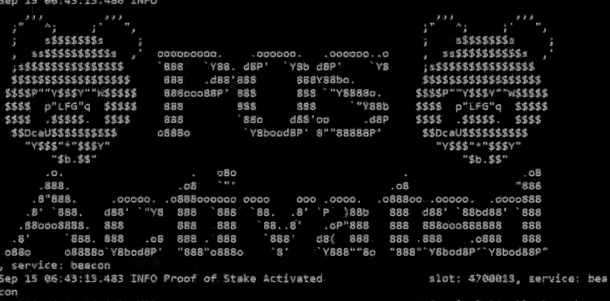

# 全部被加密—2022 年 9 月 17 日第一周

> 原文：<https://medium.com/coinmonks/all-been-crypto-week-17-sep-2022-948664046dad?source=collection_archive---------28----------------------->

这是合并周，所以这当然是每个人都关注的标题和故事。而且好像还很顺利，很大的成就！然而，从价格走势来看，我们并没有看到这种乐观情绪，因为合并后的 ETH 下跌了 10%,与 BTC 相比下跌了 16%,跌幅为 7%。感觉我们回到了宏观推动我们的叙事。在以太坊之外的新闻中，我们有 Microstrategy 宣布股票发行，可能会购买更多的 BTC，韩国法院发出了对跆拳道的逮捕令，在 Near Network 上推出的 Tether 和 Huobi 从他们的平台上删除了主要的隐私硬币。我还在本周的文章中加入了 Chainalysis 最新的加密采用报告，这是一个很好的阅读材料，可以了解用户的情况以及我们从去年以来取得的进展。享受阅读！

蝙蝠太极—[btc21@mail.com](mailto:btc21@mail.com)

# 标题:

## 以太坊合并成功

它发生在 9 月 15 日 06:42:42 UTC，第 15，537，393 块，当时我们达到了 58，750，000，000，000，000，000，000，000 的终端总难度，以太坊 mainnet 执行层与信标链的共识层合并。这是加密领域的一个历史性事件，也是以太社区的一个重大成就。到目前为止还没有大的问题，而且交易也控制住了局面。这是一个值得庆祝的理由，也是所有相关方的功劳。最后一个 PoW block 由 F2Pool 生成，只有 1 个事务和 1 个契约内部事务。美国民族植物学家和神秘主义者特伦斯·麦肯纳(Terence McKenna)在《财富》杂志(transaction)中引用了一句话:“做出承诺，大自然将通过消除不可能的障碍来回应这一承诺。做一个不可能的梦，这个世界不会把你压垮，它会把你提升起来。这就是诀窍。”这个报价可能与以太坊开发者、研究人员、协调员、客户和其他参与合并的人的辛勤工作有关。第一个区块还有一条由[哈什基资本](https://twitter.com/HashKey_Capital/status/1570310322145337345)发布的消息“推动下一波区块链创新”放眼新的 ETH PoS，我们毫不意外地看到[的 ETC](https://2miners.com/etc-network-hashrate) 跳涨了 4 倍，因为一些矿工被重新分配，ETHPoW 链出现了一些小问题。许多试图与该链交互的用户都经历过[链 ID](https://twitter.com/cascadia_coin/status/1570432855884570625) 已经被另一个链使用。至于以太坊的下一步，我们已经在前几周的路线图中讨论过了。下一步是上海升级(从现在起 6-12 个月),以允许从信标链中拆分，然后我们正致力于利用分片来改进扩展和数据可用性。

## 【2022 年 Chainalysis 加密采用报告

Chainalysis 每年都会发布这份报告，它很好地反映了我们与一年前相比的情况，以及哪些国家在新的 Web3 环境中最努力。他们使用 5 个分项指数，然后取这些指数的几何平均数，得出一个国家的总得分。总体数据显示，自 2019 年年中以来持续增长后，全球采用率在去年趋于平稳，并显示出与 2011 年第二季度价格行为见顶的显著相关性。如果我们从国家层面来看，我们可以看到新兴市场继续主导该指数，实际上越南继续排名第一，民意调查显示五分之一的人正在使用或拥有加密技术。这份报告中有很多数据，如果你想对使用/采用的方向和原因有一个更结构化的了解，我建议你阅读一下。

## [火币退市隐私币](https://www.huobi.com/support/en-us/detail/104917015223952)和龙卷风现金更新

该交易所援引监管压力采取行动，并从 9 月 19 日起将 XMR、ZCASH 和其他股票摘牌。不确定这是先发制人还是他们实际上已经得到了政府的通知，但考虑到龙卷风发生的事情，机构保持警惕也就不足为奇了。关于龙卷风，来自[财政部](https://home.treasury.gov/policy-issues/financial-sanctions/faqs/added/2022-09-13)的指导已经更新，他们特别提到了“除尘攻击”和美国公民如果他们的资产仍然被锁定在龙卷风中应该做什么。实质上，他们需要准备向财政部提供所有与交易相关的信息，然后申请提款许可证。现在有一个针对财政部的[诉讼](https://fortune.com/2022/09/08/coinbase-employees-and-ethereum-backers-sue-u-s-treasury-over-tornado-cash-sanctions/)，有像比特币基地这样高调的支持者，它将引导未来对分散协议和隐私工具的制裁方向。可以说我很乐观，但我们可能会看到一些回避 TC 的机构在法院进一步澄清后可能会回来，因为许多支持的下降是玩家的自我预防行动，以便不被监管机构发现。很高兴看到比特币基地支持这场战斗，并为他们的廉价营销。

# **行情:**

> 在过去的 1000 个街区中，有 420 个是由丽都和比特币基地建造的。看到 tbh，控制超过 2/3 股份的前 7 大实体相当令人失望

**马丁·科佩尔曼，灵知的创始人之一**

> 这一合并将使全球电力消耗降低 0.2%

**维塔利克·布特林**

> 从硬币的角度来看……赌注是另一个标记，在豪威测试下，投资大众基于他人的努力预期利润

SEC 主席加里·詹斯勒

> 交易新手？试试[密码交易机器人](/coinmonks/crypto-trading-bot-c2ffce8acb2a)或者[复制交易](/coinmonks/top-10-crypto-copy-trading-platforms-for-beginners-d0c37c7d698c)