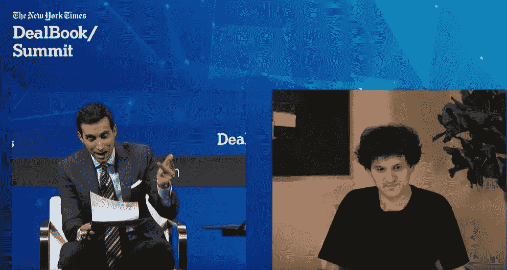

# 全部加密—2022 年 12 月第 2 周

> 原文：<https://medium.com/coinmonks/all-been-crypto-week-2-dec-2022-1b44e048607c?source=collection_archive---------34----------------------->

相对平淡的一周，我们继续徘徊在 1 万亿以下的市值。值得注意的是，我们从 ATH 开始看到比特币杂凑利率略有下降，这是矿商投降的第一个迹象。在引擎盖下，CHZ 继续流血，因为世界杯泵没有实现-10% WoW 以及索尔热-7%。另一方面，在安德烈披露他们的金库后，我们的 FTM +35%，Doge +22%继续猜测 Twitter 将整合，GMX +20%，因为 DeFi 的采用增加了趋势商店对集中交易对手风险的警惕，并寻找取代 FTX 的场所。各大媒体都在报道 SBF 的救赎之旅，北海巨妖 30%的员工被解雇，市场上的一切都让每个人神经紧绷。到目前为止，即使是关于 wETH 的笑话也会引起主流媒体的关注和传播。考虑到大型机构正在缩减风险敞口，要小心谨慎，警惕波动性。

蝙蝠太极—[btc21@mail.com](mailto:btc21@mail.com)

# 标题:

## FTX 传奇继续

不幸的是，这已经是连续第三周我们不得不继续谈论 FTX 了，而且随着事情的继续，这将会持续很长时间，但是我希望这不会成为三大头条新闻的一部分。在这个阶段，我们正处于正式破产，所以正在发生的事情更多地与法律和监管程序有关，在这些方面，我的洞察力远不如对密码世界的洞察力。但我确实想关注 sbf 的新媒体攻势，以及他如何基本上在所有这些主要媒体和相对良性的报道中获得[播放时间](https://www.youtube.com/watch?v=IyoGdwVIwWw)——他正在创造一个犯了一些错误的小男孩的形象，并为自己笨拙的“错误标记账户”感到抱歉。他的他没有！他是一个超级精明的家伙，看他现在如何试图再次愚弄主流，在我看来只是“恶心”。他的叙述和回答都像以前一样精心策划。他从来没有“从未试图实施欺诈”和“过了糟糕的一个月”。非常符合海斯先生对[白人男孩](https://entrepreneurshandbook.co/white-boy-b12c33484a2e)的描述。正如预期的那样，我们收到了第一个[要求加强监管的呼吁](https://www.reuters.com/technology/us-cftc-chair-be-questioned-over-ftx-collapse-by-lawmakers-2022-12-01/)，更多多米诺骨牌在生态系统中倒下。同样不出所料的是，BlockFi 本周(再次)申请破产,并透露他们在 FTX 套牢了 3.55 亿英镑，并从阿拉米达借出了 6.8 亿英镑。鉴于 FTX 帝国的法律结构如此复杂，而且有许多空壳公司，我们发现仍有偿付能力的部分也就不足为奇了。FTX 美国应该已经绝缘，但被拖入破产程序，所以没有 [LegerX](https://www.bloomberg.com/news/articles/2022-11-30/ftx-s-ledgerx-to-make-175-million-available-for-bankruptcy-pot) (美国衍生业务)，谁将使 1.75 亿美元可用于破产程序。DCG 周围的事情本周变得更加平静，我不确定这是否是一件好事，但可以肯定的是，危机仍在蔓延。

## 担忧蔓延至打包资产

WETH 故事是一个蔓延的领域，对我来说，这只是许多市场参与者有多紧张的一个迹象。根源当然在于现在对几乎所有事情的普遍不信任，所以是这种先火后问的心态将[极客笑话](https://twitter.com/0xCygaar/status/1596582523303211008?s=20&t=IukV6zbMOc3rI9NdcDk1lw)变成了被主流媒体报道的东西。具有讽刺意味的是，社区不得不回来声明这一切都是一个笑话，对于任何只做了一点研究并了解我们如何工作的人来说，都能够弄清楚为什么它不是桥接资产，因此不会遭受与 wBTC 相同的风险。在我们了解到阿拉梅达的规模后，打包版本的交易价格一度跌至 1.5%的折扣，但随后随着 wBTC 的官方托管人[BitGo](https://twitter.com/chenbfang/status/1596225826995179520?s=20&t=eKT5_JgCpv2wHeeAK0R4gg)出面安抚市场，该折扣又收窄至 0.5%。现在我不认为 wBTC 有重大风险，除非你认为 BitGo 会破产，但它比 wETH 高得多。如果你把集中发行者作为失败点，你可以看看 soBTC 和 soETH 发生了什么。存在像 renBTC 这样的链上智能合约替代方案，但它们不太受欢迎，显然会带来智能合约风险，而不是交易对手风险。

## [Uniswap NFT 发布](https://uniswap.org/blog/uniswap-nft-aggregator-announcement)——[魔法伊甸园重回版税](https://twitter.com/MagicEden/status/1598400031999918080)

还记得大约 6 个月前 Uni 收购 NFT 市场聚合商 Genie(见[ABC week 6 月 24 日](/coinmonks/all-been-crypto-week-24-june-2022-14be31e8cee3))的时候吗——他们本周正式启动了整合，对以前的用户进行了小规模空投，对新用户进行了汽油促销。这里的想法是有一个主要 NFT 市场的集合，集中流动性，这是 Uni 在代币方面做得很好的事情，但 NFT 当然是一个不同的野兽。令人惊讶的是，在当前整体情绪非常悲观，甚至蓝筹股底价比 ATH 低 80-90%的环境下推出。NFT 的销量已经枯竭，所以密切关注这里的发行，将是多少玩家仍然留在这里的一个指标，因为机会现在也更加稀缺。在 NFT 的空间里还有一件有趣的事情，那就是魔法伊甸园的人们正在做的事情。他们宣布[开放创作者协议](https://twitter.com/MagicEden/status/1598400031999918080)，允许创作者创作保护版税的 NFT。该协议建立在 Metaplex 现有的 Solana 上的 NFTs SPL 令牌标准之上，基本上允许将不支付版税的市场列入黑名单。这可能是创作者的要求，他们显然想要版税，但感觉像是一场猫捉老鼠的游戏。这显然对现有的收藏不起作用，如果市场想要 0 版税，那么它会想办法包装资产，以避免支付他们，我觉得。

# **语录:**

> SBF 和麦道夫的唯一区别是麦道夫没有代币

**杰西·鲍威尔，北海巨妖联合创始人&首席执行官**

> 如果什么都没发生，如果我再也不能做任何事情…FTX 美国将得到 1 美元，FTX 将得到 1 美元的 25%

**SBF**

> 说我疯了吧，但我觉得@sbf 说的是实话

比尔·阿克曼

> 交易新手？尝试[加密交易机器人](/coinmonks/crypto-trading-bot-c2ffce8acb2a)或[复制交易](/coinmonks/top-10-crypto-copy-trading-platforms-for-beginners-d0c37c7d698c)