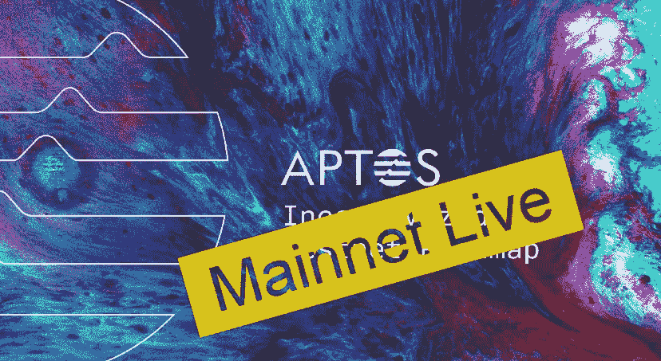

# 全部被加密—2022 年 10 月 21 日

> 原文：<https://medium.com/coinmonks/all-been-crypto-week-21-oct-2022-5632ef5afefa?source=collection_archive---------48----------------------->

随着交易量和波动性的下降，我们将继续保持加密资产价格的区间波动。例如，BTC 的波动性现在已经下降到与纳斯达克相似的水平。主要的跑赢者是 AAVE +14% WoW，他们发布了一篇关于他们即将推出的 GHO stablecoin 的技术论文；LDO+18%，在宣布推出乐观和 Arbitrum 之后。在新闻中，我们有 Aptos mainnet 的发布，另一个 NFT 市场取消了版税，更多的 tradfi 玩家宣布与 crypto native 合作，以及最新的[chain analysis crypto 采用报告](https://go.chainalysis.com/rs/503-FAP-074/images/2022-Geography-of-Cryptocurrency.pdf)确认了越南的排名第一。享受阅读！

蝙蝠太极—【btc21@mail.com 

# 标题:

## Aptos 在 Mainnet 上上线

被大肆宣传的 alt L1 build on 脸书/Diems Move 语言本周在 mainnet 上上线。[基金会](https://twitter.com/AptosFoundation/status/1582504536354136065?s=20&t=A7bvnDsahwWNBlX0OTB_JQ)宣布向大约 110，000 个地址空投 20，000，000 个 APT，其中许多直接进入了渴望上市新代币的交易所。一些媒体称这次发射为[【混乱】](https://decrypt.co/112259/crypto-twitter-reacts-chaotic-aptos-launch-apt-token-distribution)。继[批评](https://twitter.com/cobie/status/1582208726639206400)实际的令牌组学在上市时并不清晰之后，基金会紧随其后，迅速出版了[令牌组学概述](https://aptosfoundation.org/currents/aptos-tokenomics-overview)。Aptos 的不和也曾短暂下线，而被大肆宣传的区块链本身似乎也成了一座鬼城。许多人对内部人员分配给风投的资金水平以及空投缺乏防西比尔攻击的措施提出了担忧。看看他们的[分配](https://twitter.com/moshaikhs/status/1582470821347401728?s=20&t=BMFSAna6kdklsUS7CgmMpg) 51%给社区，49%给开发者、基金会和开发者。就价格行为而言，在开盘交易接近 14 美元后，令牌稳定在 7-8 美元之间。这使得市值接近 10 亿英镑，几乎进入前 50 名。

## [魔法伊甸园让版税变得可选](https://twitter.com/MagicEden/status/1581101016686399491)

另一个 NFT 市场选择让卖家选择版税。这并不完全令人惊讶，更多的玩家在 8 月份跟随 [X2YX](https://twitter.com/the_x2y2/status/1563021437811638274?s=20&t=BklP-phNapugqL-XFGyKrA) 发布，但是 Magic Eden 并不是一个小玩家。他们是 Solana 目前最大的 NFT 市场，约占该连锁店总销量的 90%,并已开始向其他连锁店的 NFT 扩张。他们在 6 月份以 16 亿英镑的估值筹集了[1.3 亿英镑的 B 轮融资](https://news.crunchbase.com/fintech-ecommerce/nft-magic-eden-unicorn-vc/)，因此他们选择了“版税可选”这一行，在我看来，我们将看到这成为新的行业标准。有些人可能会说这是一场底层竞赛，在某种程度上违背了将更多权力交到创造者手中的最初承诺，而其他人则认为这是可选的，因此创造者当然可以选择在哪里上市。现在，这些都是市场，所以一般来说，更多的流动性将意味着那里是你想去和销售的地方，所以我的猜测是，我们将看到更多“量友好”的平台上的整合，我不会惊讶地看到 Opensea 等人很快拿起同样的旗帜。

## [万事达卡与 Paxos 合作](https://www.mastercard.com/news/press/2022/october/mastercard-to-bring-crypto-trading-capabilities-to-banks/)

万事达卡表示，它已经与 Paxos 合作推出了加密源码程序。该计划将充当加密交易平台 Paxos 和银行之间的“桥梁”。万事达卡还将负责监管合规性和安全性，这是银行一直努力想要涉足的两个领域。它们将基本上有助于遵循加密合规性规则、验证交易、提供反洗钱和身份监控服务，从而增加采用率并支持传统银行的加密轨道。长期以来，信用卡一直是零售进入加密领域的第一个入口，但万事达卡和维萨卡肯定意识到未来可能会有所不同，因此它们必须彻底改造自己。Visa 在与 Crypto.com 和 FTX 等玩家的联名信用卡方面做得很大，早在去年 12 月就推出了一个加密咨询部门，但现在万事达卡又与 Paxos 合作推出了一个。

# **语录:**

> 格兰纳特[霍德瑙特]有足够的事实根据声称赖特在试图证明他是中本聪时撒谎和欺骗

【Helen Engebrigtsen 法官对 Hodlnaut 诉克雷格·赖特案的裁决

> 我们希望丽都成为一个从家庭主妇到专业经营者的管道。因为老实说，大多数单独提供者是不理性的，他们不是在做生意，他们只是为了好玩，这很好。但(如果)他们想把它作为日常工作，他们应该有能力赢得声誉，获得进入大男孩圈子和成长所需的指标

**丽都首席技术官瓦西里·沙波瓦洛夫**

> 有人应该做一个名为“协议”的项目，这样他们的推手就可以说“看，这么多提到了！”几乎任何时候任何人说任何话

维塔利克·布特林

> 交易新手？试试[密码交易机器人](/coinmonks/crypto-trading-bot-c2ffce8acb2a)或者[复制交易](/coinmonks/top-10-crypto-copy-trading-platforms-for-beginners-d0c37c7d698c)