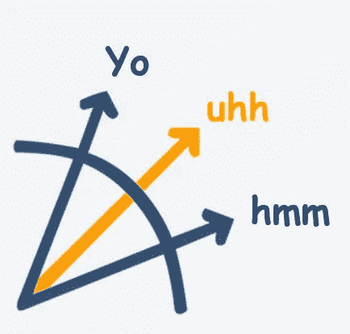

# 全部被加密—2022 年 7 月 22 日

> 原文：<https://medium.com/coinmonks/all-been-crypto-week-22-july-2022-c0b78832af46?source=collection_archive---------38----------------------->

连续两周看涨——你已经忘记那种感觉了吗？经过一周的全面强劲表现，我们现在达到了 1.1 万亿美元。排名最靠前的显然是 ETH，它在 L2 发布了新的扩展解决方案，并在巴黎的 ETH CC 上发表了关于合并的其他+ve 评论。ETH 和 Matic 都增长了 30%,而 BTC 增长了 13%。然而，ETC 和 Lido 都超过了 78%，我在巴黎错过了什么吗？在新闻中，我们有一份法院文件在 3AC 和特斯拉上泄露，披露他们已经以 8%的亏损出售了 75%的 BTC 堆栈。市场似乎认为最糟糕的时期已经过去，并开始转向买入模式。话虽如此，我们继续看到 blockchain.com 裁员和停止更多撤军的头条新闻。在监管方面，义大利已经批准了另外两个主要的加密交易所 Crypto.com 和比特币基地。最后，Curve 似乎也加入了稳定硬币的行列，本周有传言称他们即将推出自己的硬币。享受阅读！

蝙蝠太极—[btc21@mail.com](mailto:btc21@mail.com)

# 标题:

## 3AC 泄露法庭文件

本周早些时候，[的一份 1157 页的宣誓书](https://www.docdroid.net/xKIqrjq/20220709-3ac-bvi-liquidation-recognition-1st-affidavit-of-russell-crumpler-filed-pdf)被广泛泄露，让我们深入了解了最大的索赔者 vs 三箭以及交易和实践。那里有很多有趣的东西，crypto twitter 很快就发现了一些新的迷因。今年 5 月，凯尔·戴维斯签署了一份 AUM 信函，将该公司的资产净值定为 24 亿英镑，根据一份聊天记录，该公司的杠杆率明显低于 1。难怪 Szu 和 Kyle 现在似乎真的在逃亡，因为清算人声称他们“拒绝有意义的参与(或根本不参与)”。我们还了解到据称是用借来的钱购买的 50 毫米游艇，以及与[太平山](https://www.coindesk.com/business/2022/07/19/crypto-trading-firm-tps-capital-denied-ties-to-insolvent-three-arrows-court-documents-indicate-a-connection/)和[迪法恩斯](https://thedefiant.io/defiance-founder-had-no-visibility-on-three-arrows-condition-statement/)的关系。就抵押品而言，似乎所有的流动资产都已被抛售(BTC、瑞士联邦理工学院等)，剩下的是私产(斯塔克威尔、德里比特、..)和锁定令牌以及 NFT。

## [多边形宣布 zkEVM 汇总](https://blog.polygon.technology/the-future-is-now-for-ethereum-scaling-introducing-polygon-zkevm/)

这是本周在巴黎举行的 ETH 社区会议，作为会议的一部分，我们似乎有许多公告。其中最令人兴奋的显然是多边形团队的更新，他们宣布了第一个 EVM 版的 ZK·L2。那是什么意思？一些人批评 Polygon 制造了一个 EVM 兼容的侧链 vs L2，这次宣布的 ZK(零知识)汇总测试网证明了他们对以太坊母舰的承诺。如果你想了解上卷以及乐观上卷(乐观，Arbitrum)和 zk 上卷之间的区别，这里有一个来自 [Vitalik](https://vitalik.ca/general/2021/01/05/rollup.html) 的很好的入门。但是不仅仅是 Polygon 有公告。 [Scroll 团队](https://mirror.xyz/scroll.eth/XQyXDgyxoefag6hcBgGJFz8qrb10rmSU-zUBvY3Q9_A)也插话说他们正在发布基于 zkEVM 的 zkRollup 的预 alpha 版本。zkSync 构建者 Matter Labs 透露， [zkSync 2.0](https://substack.com/redirect/1af850b8-4604-4930-87a3-cc14ca76a94a?u=75525983) ，另一个基于 zkEVM 的 zk 汇总，“将在 100 天后在 mainnet 上上线。”我们现在有多名选手参加 zkEVM 推广活动，这表明 L2 的推广势头非常强劲，并预示着未来的竞争格局。

## 意大利监管机构大许可证

Crypto.com 和 T2【比特币基地本周都宣布，他们获得了意大利反洗钱监管机构 Organismo Agenti e Mediatori (OAM)的加密资产服务提供商许可。这是继五月份 T4 的批准之后。尽管欧盟在欧洲做出了努力，但加密监管仍然主要是在国家层面上进行，因此交易所需要获得每个国家的批准，通行证仍然很棘手。国家政府似乎比欧盟议会对加密更友好，欧盟议会多次试图通过敌意监管。还记得[工作禁投](https://bitcoinmagazine.com/markets/eu-parliament-backtracks-ban-on-bitcoin-proof-of-work)等证明吗？谈到主要的交流，比特币基地本周有一些其他的不太积极的方面的更新。他们本周宣布，他们将[关闭](https://decrypt.co/105354/coinbase-cites-bear-market-suspending-affiliate-program-influencers-report)他们的美国联盟计划，可能会在熊市期间削减开支，因为零售用户的加入无论如何都是具有挑战性的。这让他们在 crypto twitter 上受到了严厉的批评，但这还不是全部，还有一个更糟糕的标题，关于一名被指控内幕交易的前雇员。比特币基地公司前产品经理伊山·瓦希、他的兄弟尼基·瓦希和他的朋友萨梅尔·拉马尼共非法获利约 150 万美元。伊山基本上是给他们通风报信，哪些硬币将上市，他们跑在前面。这一切都是连锁的，难以掩盖。

# **行情:**

> 我们没有卖掉任何一只狗。我们仍然拥有它[……]我们当然愿意在未来增加我们的比特币持有量

**特斯拉首席执行官埃隆·马斯克**

> 我们的董事会决定暂时暂停，直到我们能够在基金内部筹集到资金，然后确保人们有秩序地离开

**天桥资本创始人安东尼·斯卡拉穆奇**

> 我们通常不会支持或允许非功能性测试与《我的世界》的整合

**《我的世界》开发商 Mojang Studios**

> 交易新手？试试[密码交易机器人](/coinmonks/crypto-trading-bot-c2ffce8acb2a)或者[复制交易](/coinmonks/top-10-crypto-copy-trading-platforms-for-beginners-d0c37c7d698c)