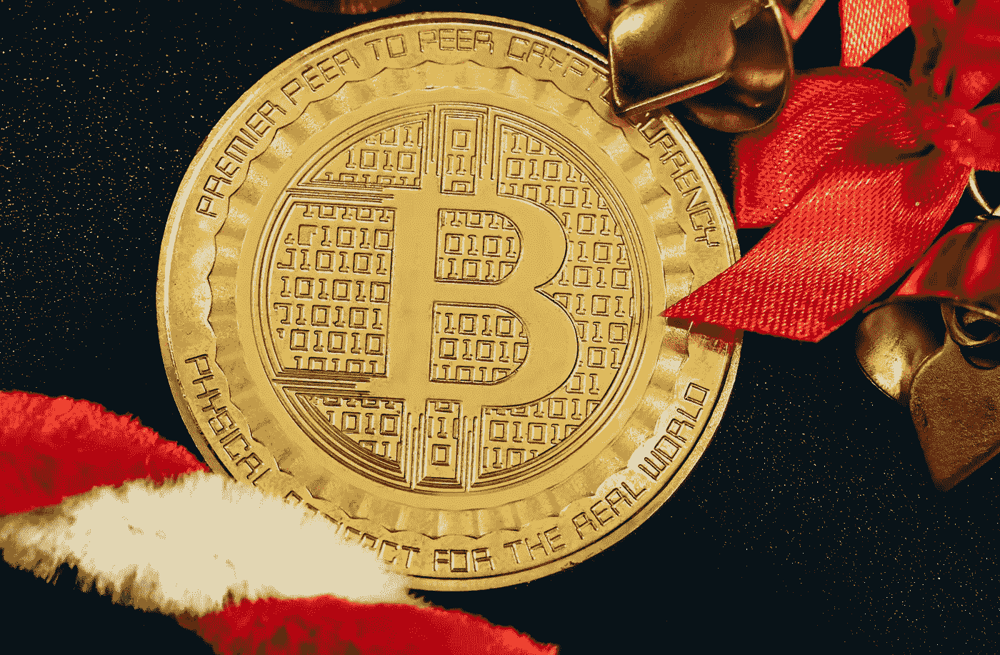

# 全部被加密—2022 年 12 月 23 日

> 原文：<https://medium.com/coinmonks/all-been-crypto-week-23-dec-2022-3f463e9e1426?source=collection_archive---------67----------------------->

节日快乐！我知道在 crypto 已经过了相当长的一年，所以希望你能在这一年的最后几天好好休息和充电。这是一个反思的时候，也是为即将到来的事情做准备的时候。所以这将是我的最后一周，我会在一月份继续。我计划通读《梅瑟里斯 2023 展望》一文，这本书总是很棒，还有《T2》的《街区》(我仍然认为这是一个很好的平台，尽管最近在 FTX 曝光了他们的前领导人)。在本周的头条新闻中，我们了解到 FTX 和卡洛琳终于站出来说话了，币安赢得了对航海家号的竞标，更多的矿工重组了债务。这些主题可能会伴随我们进入新的一年。假期愉快，2023 年再见。

> 从顶级交易者那里复制交易机器人。免费试用。

蝙蝠太极—[btc21@mail.com](mailto:btc21@mail.com)

# 标题:

## 卡洛琳和加里宣誓——SBF 保释

毫不奇怪，FTX/阿拉米达的领导层开始互相指责。阿拉米达首席执行官卡罗琳·埃里森以及阿拉米达和 FTX 的联合创始人王微都承认有罪。我们知道[的交易](https://s3.documentcloud.org/documents/23495436/crypto-cooperator-ftx-alamedas-caroline-ellisons-plea-agreement-inner-city-press-on-the-case.pdf)卡洛琳被罚款 25 万，就这样，哦，她必须归还她从 FTX 诈骗案中获得的收益。记住这一点，她(很可能还有加里)基本上毫发无损地离开了这个烂摊子。对于那些认为失去的资产永远失去的人来说，这里有一个提醒，多年后外汇欺诈仍然在起作用，来自 [QuadrigaCX](https://www.coindesk.com/policy/2022/12/19/bitcoin-addresses-tied-to-defunct-canadian-crypto-exchange-quadrigacx-wake-up/) 的> 100BTC 加拿大交易所从以前认为丢失的钱包中移出。据说只有已经去世的前首席执行官杰拉尔德·威廉·科滕(Gerald William Cotten)控制的钱包。尽管他以前的所有朋友都反对他，但本周并非所有人都对山姆不利，他被引渡到美国，但以 2.5 亿美元保释，现在被允许与父母生活在一起。有了卡罗琳和加里的证词，现在很清楚他将面临严重的指控，但至少他现在离开了巴哈马监狱。最大的问题是萨姆·特拉布科在哪里？我们现在知道(之前对此没有太多怀疑)，FTX/阿拉米达的资金混合从一开始就发生了，所以他很难洗手，因为他只是从阿拉米达的联合首席执行官职位上退下来的。

## [航海家号去…Binace](https://www.prnewswire.com/news-releases/voyager-announces-agreement-for-binanceus-to-acquire-its-assets-301706065.html) ，[矿工再融资](https://www.reuters.com/technology/bitcoin-miner-core-scientific-file-chapter-11-bankruptcy-cnbc-2022-12-21/)

这是快乐的季节(至少在加密之外)，所以原谅蹩脚的雾凇。

Binace US 将收购航海家破产资产。在 FTX 不得不退出后，他们显然是最受欢迎的，这是他们获得新用户的明智方式，也是在上周的混乱和银行挤兑后改善公众形象的明智方式。它也不是很贵，因为出价代表了 Voyager 加密货币组合的公平市场价值，即 10 亿英镑和 2000 万美元。[币安。美国](http://binance.us/)将缴纳 1000 万美元的保证金，并将为旅行者报销高达 1500 万美元的某些费用。所有这些仍然需要在 2023 年 1 月 5 日的破产法庭听证会上澄清。谈到破产听证会，Core Scientific 宣布，它也申请了第 11 章，但从现有债权人那里获得了 3750 万美元的贷款，以继续运营。与此同时，NYDIG 同意以 7400 万英镑的价格与他们的借款人之一 Greenidge Generation 达成重组协议。该交易以非约束性条款清单的形式出现，将导致 [Greenidge 目前的](https://www.prnewswire.com/news-releases/greenidge-generation-executes-term-sheet-with-secured-lender-nydig-regarding-debt-renegotiations-provides-liquidity-update-301706932.html)业务战略发生重大变化，实质上将 Greenidge 从自营采矿转变为托管 NYDIG 的采矿设备。这些标题向您展示了对核心加密基础设施的意愿和一定程度的支持，这只是一个价格问题。

## [灰度浮动 20%标书的想法](https://www.bloomberg.com/news/articles/2022-12-19/grayscale-floats-tender-offer-idea-for-fund-gbtc-if-sec-lawsuit-fails)

我们都知道 DCG 集团在创世纪后露娜，3AC 和现在阿拉米达的大量信贷出现问题后陷入困境。这可能是为什么 [GBTC](https://ycharts.com/companies/GBTC/discount_or_premium_to_nav) 的交易价格相对于资产净值有大约 50%的折让的原因之一，现在有两种方法可以缩小这个折让，解散信托，将原生 BTC 还给持有人，或者在公开市场上回购。第一个解决方案是不可能的，因为 DCG 每年有 2%的管理费，所以你为什么要放弃这个肥缺，这也是他们为什么没有动力认真考虑将其转换成 ETF 的主要原因。事实上，他们受益于美国目前没有现货 BTC ETF 获批的困境。但是我跑题了，他们需要一些现金来填补 Genesis 的整个基金，所以他们不是出售整个基金，而是谈论投标高达 20%(如果 ETF 没有获得批准)，这将在一定程度上有助于折扣，也允许他们获得流动性——我们了解了他们的[公司间贷款](https://www.bloomberg.com/news/articles/2022-11-22/genesis-balance-sheet-reveals-web-of-loans-across-silbert-empire-dcg)，所以他们在它咬之前还有一点时间，但显然需要提前做好准备。如果 GBTC 崩溃(即使只是其中的一部分)，我预计贴水将进一步下跌，即 BTC 现货价格将更接近 GBTC 目前的交易价格。记得他们持有> 60 万 BTC。

# **语录:**

> 核心加密理论没有改变。加密是不可避免的，因为我们在人才和资本上取得了胜利，我们受益于数字原生代的变化，并且在过去的一年中已经开发了几十个高影响力的开源创新。

**Ryan selk is——Messari 的创始人**

> 我本能地想要相信人们最好的一面。当我坚信一个人在被证明有罪之前是无辜的，我可能会冒险去相信一个骗子。SBF 支付 2.5 亿美元保释金本身就是一项刑事起诉，驳斥了他迄今所说的一切。

比尔·阿克曼

> 考虑到 FTX 的内爆，我很惊讶比特币的价格没有现在的一半。人们已经逃离了这个领域，所以它仍然停留在 17，000 美元的水平上是非常了不起的

**比尔·米勒**

> 加入 Coinmonks [电报频道](https://t.me/coincodecap)和 [Youtube 频道](https://www.youtube.com/c/coinmonks/videos)了解加密交易和投资

# 另外，阅读

*   [比特币基地僵尸程序](/coinmonks/coinbase-bots-ac6359e897f3) | [AscendEX 审查](/coinmonks/ascendex-review-53e829cf75fa) | [OKEx 交易僵尸程序](/coinmonks/okex-trading-bots-234920f61e60)
*   [如何在印度购买比特币？](/coinmonks/buy-bitcoin-in-india-feb50ddfef94) | [WazirX 评论](/coinmonks/wazirx-review-5c811b074f5b)
*   [加密交易机器人](/coinmonks/crypto-trading-bot-c2ffce8acb2a) | [Probit 审查](https://coincodecap.com/probit-review)
*   [CryptoHopper 替代品](/coinmonks/cryptohopper-alternatives-d67287b16d27) | [HitBTC 审查](/coinmonks/hitbtc-review-c5143c5d53c2)
*   [CBET 评论](https://coincodecap.com/cbet-casino-review) | [库科恩 vs 比特币基地](https://coincodecap.com/kucoin-vs-coinbase)