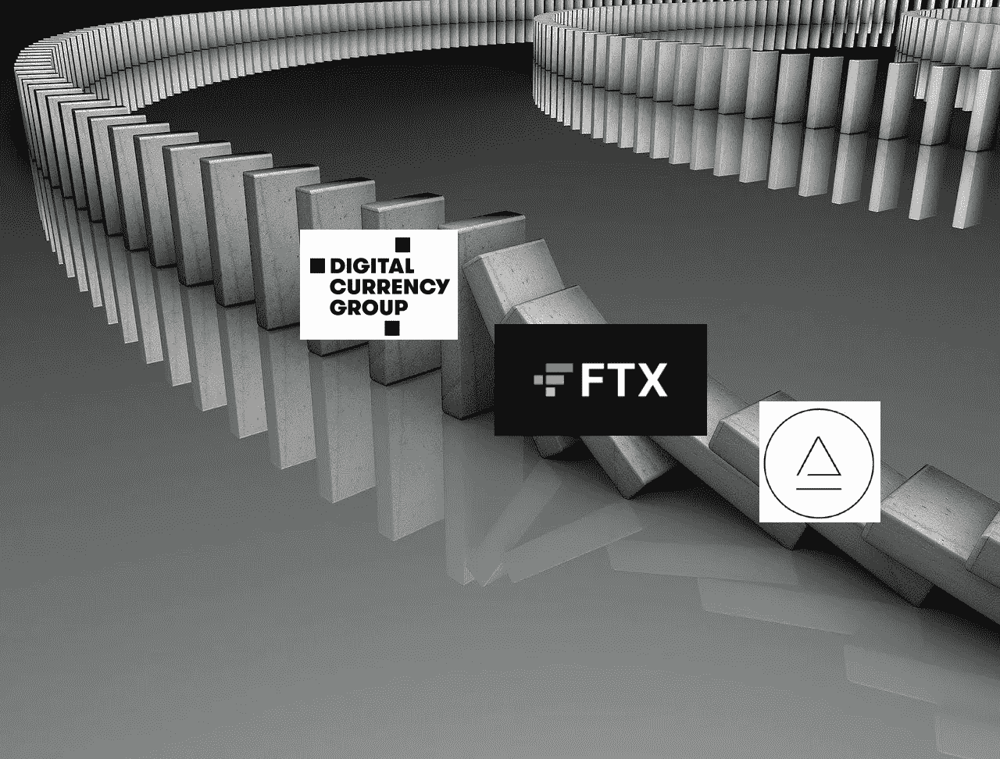

# 全部被加密—2022 年 11 月 25 日第一周

> 原文：<https://medium.com/coinmonks/all-been-crypto-week-25-nov-2022-cbcefae7d6f?source=collection_archive---------37----------------------->

本周总体持平，市值不变，低于 9000 亿英镑，因为交易量继续下降，息差扩大。这允许一些最一致的空头出现一些短暂的挤压。否则很难解释为什么 LTC +23%和 BCH +11%是本周涨幅最大的股票，当然还有 CRV +22%的 AAVE 事件。在新闻中，我们继续关注 FTX 破产法院的第一次听证会，以及围绕 DCG 和创世纪的新故事，他们自己离破产有多近。我们对 ConsenSys 的隐私政策有一些不幸的披露，还有一个非常有趣的标题，关于 EOS/block.one 创始人对陷入困境的加密银行 Silvergate 的投资。尽管所有的头条新闻，我们听到新的 HFs 推出他们的加密武器和币安的产业复苏基金正在形成。享受阅读！

蝙蝠太极—[btc21@mail.com](mailto:btc21@mail.com)

# 标题:

## FTX 多米诺骨牌继续倒下

所以我们知道 FTX 的余波将会伴随我们一段时间，记住 Luna collaps 在我们经历 Celcius 和 3AC 翻滚之前花了一个多月的时间，现在可以说阿拉米达的裂缝显示了 6 个月。我希望我现在不会每周都写这个，但目前仍然有很多事情发生，不幸的是，它仍然是叙事的主要驱动力。所以我们举行了第一次破产听证会，现在债权人将保持匿名。人们普遍担心一个类似于摄氏温度的数据库会作为申请的一部分被公之于众。我们还听到他们希望尽快出售一些资产，特别是在看到协议可以为令牌持有者提供什么后。 [Serum](https://twitter.com/brianlong/status/1592514197329674240) 上周就这么做了，我们可以看到其他人也在复制交易，这意味着在黑客攻击之后，没有多少象征性的股权了。媒体报道铺天盖地，但报道却喜忧参半。尤其是《纽约时报》因为善意的报道，甚至让 SBF 继续在下周的 [DealBook 会议](https://www.bloomberg.com/news/articles/2022-11-23/ftx-founder-sam-bankman-fried-says-he-ll-speak-at-new-york-times-dealbook-summit)上演讲而受到了严厉的批评。就多米诺骨牌而言，本周所有的目光都集中在 DCG 集团和他们的子公司创世纪上。现在，他们上周停止了提款，但本周早些时候有报道称，他们警告破产，但后来被澄清为不是“迫在眉睫”。然而，事物是脆弱的，这是不可否认的。Genesis 聘请投资银行 Moelis Co 提供建议，DCG 首席执行官 Barry Silbert 写了一封信给股东。与此同时，我们看到 [GBTC 折扣率](https://ycharts.com/companies/GBTC/discount_or_premium_to_nav)达到历史最高值-45%,然后在我们得知[凯茜·伍兹](https://decrypt.co/115283/cathie-woods-ark-invest-scoops-another-1-4m-grayscale-bitcoin-trust)再次开始购买后，折回 40%。密切关注 DCG 及其融资/重组努力。

## DeFi Exploit(失败？)

就 DeFi 发生的事情而言，这可能是本周最大的故事，它也突显了事情是如何相互关联的，即使它们起初看起来并不如此。本周，一家公司受到了一些人称之为“火警调查”和“利用”的攻击。发生了什么事？在 [blockworks](https://blockworks.co/news/aave-curve-bad-debt) 中有一个很好的总结。一个身份不明的交易者，据信是芒果市场的开发者 Avraham Eisenberg，在 Aave 上积累了大约 9200 万 CRV 的象征性贷款。然后，他没有偿还，而是看着它被清算，因为 CRV 的价格开始下跌。由于流动性不足，头寸在 50 分钟内通过 [385 笔个人](https://etherscan.io/tokentxns?a=0x57e04786e231af3343562c062e0d058f25dace9e&ps=100&p=1)小型清算交易平仓，这给 AAVE 留下了 264 万 CRV(约合 170 万美元)的坏账——借自 CRV，永远不会偿还。现在这个很小，很可能由财政部负责[，但它清楚地表明协议设计必须更新。为什么这是相关的，因为 AAVE 不清算他们自己，而是依靠清算人来完成任务。现在，这些机器人基本上是在与其他流动性领域进行交易，由于 CEX 的做市商和交易量减少，这种清算变得更加困难。我想说的是，这种“利用”之所以可能，是因为 FTX 倒台后，CEX 的流动性已经枯竭。这是一个不幸的提醒，说明 DeFi 和 CeFI 实际上是如何交织在一起的。](https://twitter.com/The3D_/status/1595122277854904325?s=20&t=9ovWcAKoIYCHm09_WSfwag)

## 前端和后端隐私

毫无疑问，情况变得更糟了，不仅现在我们的大多数 ETH 块都符合 OFAC 的标准，而且本周 Consensys 更新了他们的 T2 隐私政策。Infura 的用户现在可以收集一些数据。对于那些不熟悉 Infura 的人来说，它是最受欢迎的 API，允许您连接到以太网，并为许多关键的 Web3 项目提供基础，如 Aragon、Gnosis、OpenZeppelin，当然还有他们自己的旗舰钱包服务 MetaMask。所以每次你在 MetaMask 中使用默认的远程过程调用提供者时——那就是 Infura。现在，每当您进行交易时，它都会收集您的 IP 地址和您的以太坊钱包地址。当然，您可以通过运行自己的节点或使用不同的第三方进行远程过程调用来选择退出，但我们不要在这里欺骗自己，有多少元掩码用户会这样做呢？大多数人认为，即使设置元掩码也太复杂，他们更愿意将自己的密码保存在 CEX 上。不幸的是，crypto 中默认的隐私保护再次遭到破坏。当然，Consensys 并不是唯一这样做的， [UNI](https://uniswap.org/blog/commitment-to-privacy) 最近也宣布他们开始收集一些外链用户数据，如浏览器或设备类型。他们说这只是为了改善用户体验的内部目的，他们不会收集个人数据(目前？).同样，这是在前端级别，后端仍然完全支持隐私，但有多少零售用户实际上要构建自己的 API 来访问 UNI 后端呢？这就是 SBF 在国会推动他的法案的目的，基本上使前端 DeFi 协议符合 OFAC——为此，他们当然必须能够收集用户数据。在外面要小心。有替代方案吗？本周，Flashbots 提供了一些有趣的东西，应该会受到爱好者的欢迎。如上所述，现在我们有> 70%符合 OFAC 标准，这主要是因为在 Flashbots MEV 市场，大多数建筑商都在建造符合 OFAC 标准的积木。现在，他们在 MEV-boost 中添加了一个功能(该工具只挑选出价最高的区块，以便最大限度地提高产量)，以设置最小阈值。该参数的作用是仅接受来自中继的块，如果它们的出价高于选择的值，否则将建议本地构建的块。这利用了 mev-boost 带来的利润增长对大多数区块来说并不算大的事实。因此，验证者可以放弃少量利润，以换取网络更具弹性，同时为高 MEV 机会敞开大门。Vitalik 鼓励这种“短期”的审查阻力修复，但谁愿意放弃利润(即使很少)来增加审查阻力仍有待观察…不知何故，这种类型的行为即使在 crypto 中也不太常见。

# **行情:**

> 这是第一个允许在所有这些实现上撤销的 devnet，是一大进步。它还帮助其他客户机通过加入网络来测试它们的实现。

**以太坊开发者马里乌斯·范德维登**

> 自我监护是一项基本人权。你随时都可以做这件事。只要确保你做得正确。

**赵昌鹏，创始人**

> 我完全支持 BNBCHAIN 生态系统和#BUSD。事实上，我们将很快宣布一个大的合作伙伴关系。

**孙正义**

> 交易新手？尝试[加密交易机器人](/coinmonks/crypto-trading-bot-c2ffce8acb2a)或[复制交易](/coinmonks/top-10-crypto-copy-trading-platforms-for-beginners-d0c37c7d698c)