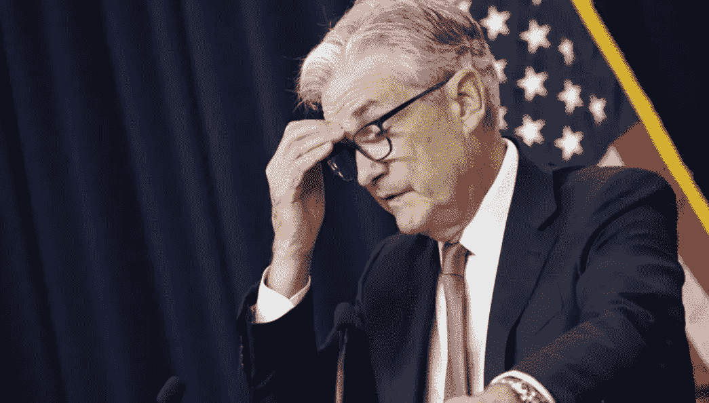

# 全部被加密—2022 年 9 月 25 日第一周

> 原文：<https://medium.com/coinmonks/all-been-crypto-week-25-sep-2022-4b86b98c398?source=collection_archive---------33----------------------->

在美联储再次加息 75 个基点后的血腥一周，加密普遍处于红色，现在回到 1 万亿市值以下。ETH 承受了抛售压力，在合并交易中失去了大部分优于 BTC 的表现。在证交会的诉讼似乎接近尾声后，唯一表现突出的是 XPR。我们又经历了一次痛苦的黑客攻击，大型做市商 Wintermute、北海巨妖的杰西鲍威尔(Jesse Powell)辞职，以及几笔引人注目的融资，即梅萨里以 3 亿英镑的估值再融资 3500 万英镑，还有野村证券(Nomura)成立了一个秘密风险投资部门。享受阅读！

蝙蝠太极—[btc21@mail.com](mailto:btc21@mail.com)

# 标题:

## **温特穆特黑客**

这是一个 160 毫米的大家伙。这次黑客攻击涉及一系列未经授权的交易，这些交易将美元硬币、币安美元、Tether 美元、Wrapped ETH 和 66 种其他加密货币转移到[攻击者的钱包](https://etherscan.io/tx/0xedd31e2a949b7957a786d44b071dbe1bc5abd5c57e269edb9ec2bf1af30e9ec4)中。[首席执行官 Evgeny Gaevo](https://twitter.com/wintermute_t/status/1572531790904168449) y 很快在 twitter 上披露了发生的事情，并向每个人保证他们有足够的流动性来弥补损失。温特穆特的贷款账簿还包括欠枫叶金融公司的一笔[7500 万美元的债务，由 USDC 和 wrapped ether (WETH)](https://app.maple.finance/#/earn/pool/0x6f6c8013f639979c84b756c7fc1500eb5af18dc4) 组成，以及欠 Clearpool 的一笔[2240 万美元的债务。目前尚不清楚用于延续黑客攻击的确切利用方法的细节，尽管 Gaevoy 表示，攻击可能是由交易钱包中的“亵渎型利用”引起的。Wintermute 进一步承认，就在 6 月份，它确实使用了以太坊虚荣心地址生成软件](https://app.clearpool.finance/pool/0xCb288b6d30738db7E3998159d192615769794B5b?market=mainnet) [Profanity](https://github.com/johguse/profanity) ，以及一个内部工具来生成前面有许多零的地址。这个开源项目目前被它的匿名维护者放弃了，这个匿名维护者的绰号是 johguse，理由是“私钥生成中的基本安全问题”。顺便说一句，在分散交换(DEX)聚合器 1inch Network [披露了一个漏洞](https://blog.1inch.io/a-vulnerability-disclosed-in-profanity-an-ethereum-vanity-address-tool-68ed7455fc8c)后，亵渎也受到了关注，该漏洞可能被滥用来从使用该实用程序创建的地址重新计算私人钱包密钥。 [Cointelegraph](https://cointelegraph.com/news/the-impact-of-the-wintermute-hack-could-have-been-worse-than-3ac-voyager-and-celsius-here-is-why) 有点煽情的来电影响比 3AC 还糟糕。事实上，这已经不是他们第一次被黑客攻击了，他们在六月份被乐观公司雇佣来帮助市场进行他们的象征性发布。

## 北海巨妖首席执行官下台

杰西·鲍威尔(Jesse Powell)周三宣布，他将从他在 2011 年创立的加密货币交易所北海巨妖离职，并将在未来几个月内由长期首席运营官戴夫·里普利(Dave Ripley)接任。鲍威尔将成为公司董事长，并仍然是北海巨妖最大的股东。对于北海巨妖和整个密码学来说，这是艰难的一年。但首席执行官杰西·鲍威尔表示，他将辞去这一职务，因为他不喜欢这份工作。他希望专注于宣传工作，并补充说有许多来自立法者的“糟糕的提议”。这很有趣，因为交易所更多地被拉向了 KYC 监管的方向，而杰西则更多地保留了更古老的加密朋克精神。还记得《加拿大卡车司机》中的一集吗，他建议每个人把他们的资产从北海巨妖转移出去，这样他们就不会被没收了。这对北海巨妖来说是一个损失，但希望我们现在能让他作为一个倡导者更加努力地朝着正确的方向前进——他现在可以说得更多，做得更多，而不用承担为投资者领导公司的责任。巧合的是，本周我们获悉北海巨妖合规高级副总裁 Steven Christie 于 5 月份跳槽去了币安，这也是在币安宣布将组建一个董事会为其提供监管和政治事务建议之后。

## [FTX 正在商谈再融资 10 亿英镑](https://www.cnbc.com/2022/09/21/ftx-in-talks-to-raise-1-billion-at-valuation-of-about-32-billion.html)

FTX 正与潜在投资者讨论一轮融资，这将使该公司的估值与今年早些时候的 320 亿英镑融资保持一致。谈判正在进行，条款可能会改变，消息人士称，由于谈判是保密的，他们要求不透露姓名。继 FTX 1 月份的上一次融资后，Coindesk 此前曾报道过一次估值持平的投资。现有投资者包括新加坡淡马锡、软银的愿景基金 2 和老虎环球。显然，他们一直在部署资本收购其他陷入困境的加密公司(BlockFI、Voyager)，可能是想为未来可能更具挑战性的冬天充实资金。[《华尔街日报》](https://www.wsj.com/articles/binance-and-ftx-make-top-bids-for-bankrupt-lender-voyager-11663708731)本周有一篇文章称 FTX 和币安都在竞购航海家号的资产。FTX 在这个冬天处于有利位置，他们和币安现金充裕，希望巩固市场。虽然有两种不同的方法，但 FTX 显然与山姆在美国有很好的关系，在全国各地的广告牌上微笑着，有更好的机会争取监管机构，而 Binace 显然在美国以外占据主导地位，大部分流动性仍在该交易所。

# **语录:**

> 我们的财务状况仍然非常强劲，拥有数亿股本，我们很乐意像往常一样偿还所有贷款。

**温特穆特首席执行官叶夫根尼·盖沃伊**

> 随着 PoS 的成熟，我预计它的合法性会随着时间的推移而增加。我希望 Zcash 转会过去，我也希望 Dogecoin 尽快转会到 PoS

**维塔利克·布特林**

> 我非常怀疑加密代币，你称之为货币，就像比特币一样。他们是分散的庞氏骗局。

**摩根大通首席执行官杰米·戴蒙**

> 交易新手？尝试[加密交易机器人](/coinmonks/crypto-trading-bot-c2ffce8acb2a)或[复制交易](/coinmonks/top-10-crypto-copy-trading-platforms-for-beginners-d0c37c7d698c)