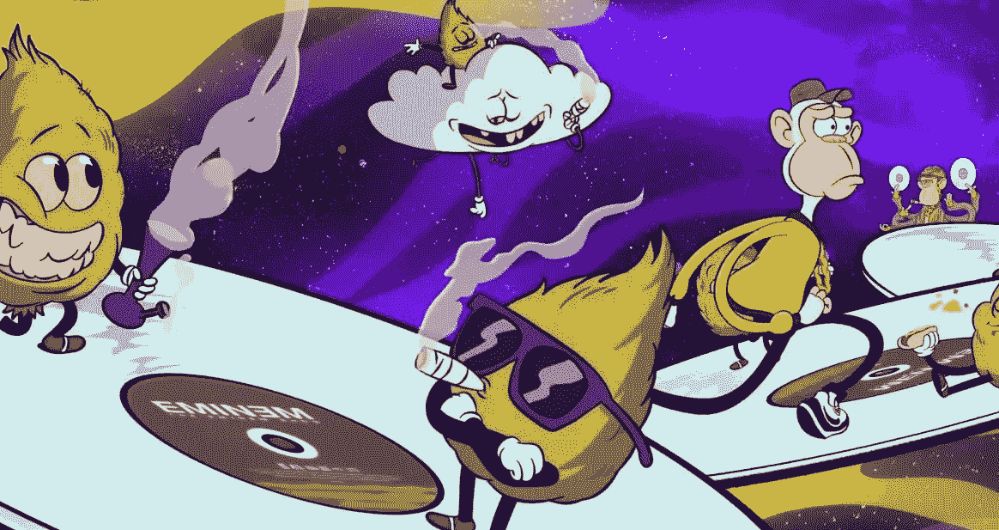

# 全部被加密—2022 年 8 月 28 日

> 原文：<https://medium.com/coinmonks/all-been-crypto-week-28-aug-2022-49ac46d1e00d?source=collection_archive---------34----------------------->

还在路上，所以一点点 ABC。Powerl 在 Jackson Hole 的评论被市场认为是鹰派后的一周。我们以大幅下跌结束了这一周，使我们回到 1 万亿美元的市值。ETH 在合并中涨幅最大，为 9%。BTC 下跌了 5%，目前跌破 2 万点。在新闻中，我们继续看到龙卷风现金 OFAC 制裁的后果，以及 FTX/阿拉米达管理层的一些变化。在项目和资金方面，我们有了更多的葡萄干，很明显，猩猩们现在要来 MTV 了。享受阅读！

蝙蝠太极—[btc21@mail.com](mailto:btc21@mail.com)

# 标题:

## 龙卷风的后摆动继续

我知道 OFAC 龙卷风现金禁令已经超过 3 周了，它占据了我们的头条，但我们继续看到它的影响，这可能是今年迄今为止加密领域最重要的事件之一。我们已经看到了一些最糟糕的可能结果，比如停止纳入龙卷风现金交易，这基本上是协议层面的审查。通常许多其他核心基础设施都符合 OFAC 标准。 [Flashbots](https://writings.flashbots.net/writings/Flashbots-Relay-open-sourcing/) 宣布在黑名单 TC 钱包后加速发布其中继代码作为开源。 [Paxos](https://paxos.com/2022/08/25/clarifying-paxos-approach-to-recent-ofac-sanctions/) 和 [Tether](https://tether.to/en/tether-holds-firm-on-decision-not-to-freeze-tornado-cash-addresses-awaits-law-enforcement-instruction/) 没有冻结任何与禁令有关的地址。USDT 说，他们一直在沟通，没有收到这样做的指示，这与除尘攻击的背景相比很有趣(你的钱包里转移了少量的 TC 资产)，当然他们不是美国的/受监管的。更有趣的是 paxos 说他们在 TC 没有资产，因此不需要冻结。TC 开发者阿列克谢·佩尔采夫(Alexey Pertsev)将不得不在监狱里再呆 90 天，然后才能听取他的指控和开庭日期。约翰·霍普斯金大学教授 Matthew Green 在 Github 上发布了一个 TC 源代码的存档分支，以供研究之用。故事继续展开

## [FTX +阿拉米达风投合并](https://www.bloomberg.com/news/articles/2022-08-25/sam-bankman-fried-s-ftx-and-alameda-merge-their-vc-operations)

这让山姆·特拉布科从阿拉米达联席首席执行官的位置上退下来，有了不同的看法。现在，没有人真的对这两个实体一直在合作感到惊讶，所以我的猜测是，这只是一个合适的时机作出这一宣布。实质上，FTX 风险投资公司过去是，现在也将是 SBF 加密帝国的主要风险投资部门。然而，Sole 首席执行官 Caroline Ellison 表示，将其风险投资部门迁至 FTX 的协议并不意味着两家公司之间的关系更加密切，“我们是公平的，不会从其他做市商那里获得任何不同的待遇”。

## 比特男孩诉讼传奇

这是一个更深奥的标题，但我想分享一些积极的东西。Bitboy 是 youtube 上一个广受关注的加密影响者，据称他一直在为金钱兜售代币和项目。另一个不太知名的加密 youtuber Atozy 以更直接的方式指出了这一点，然后[被 Benjamin Armstrong(又名 Bitboy)以诽谤起诉](https://twitter.com/atozy/status/1562206338293309440)。目前为止没什么奇怪的，然而有趣的是接下来发生了什么。阿托兹在推特上寻求法律诉讼的帮助——[科比](https://twitter.com/cobie/status/1562220965253218304)和其他人慷慨解囊，然后比特男孩临阵退缩，说他[撤销了诉讼](https://decrypt.co/108172/youtube-bitboy-atoz-defamation-lawsuit-dropped)。为什么这是重要的，因为它显示了该行业如何工作的几个要素。首先，Youtube 和 Twitter 的区别在于，谁在消费内容，产品是什么/谁。另一个概念是，事情发生的速度有多快，如何改变所有这些转折，这一周或多或少发生在 Twitter 上的公开场合。筹款的速度以及随之而来的诉讼数量的下降令人着迷。许多人也支持 Atozy，认为它是我们行业如何“自我监管”的一个例子，并指出一些演员的不良行为。

# **语录:**

> 龙卷风现金的例子提出了美国政府可能使用制裁来禁止源代码分发和科学言论的前景

**约翰·霍普斯金教授，马修·格林**

> 我接到德州的电话。是我，约翰，我付钱让人们假装我死了，但我没有死。你是这个世界上唯一知道我还活着的人。然后他让我和他一起私奔

约翰·迈克菲的前女友萨曼莎·埃雷拉

> VMApes 本周日——我们很高兴支持@SnoopDogg & @Eminem，他们将表演他们的新单曲《他们的猿》和@OthersideMeta。

**无聊猿游艇俱乐部**

> 交易新手？试试[密码交易机器人](/coinmonks/crypto-trading-bot-c2ffce8acb2a)或者[复制交易](/coinmonks/top-10-crypto-copy-trading-platforms-for-beginners-d0c37c7d698c)