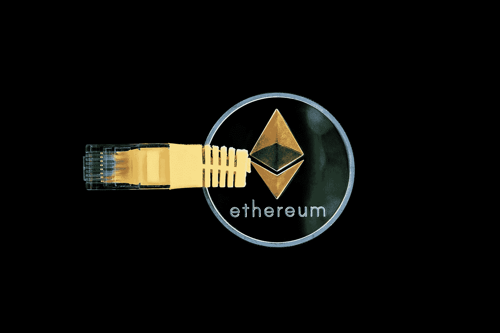

# 全部被加密—2022 年 7 月 29 日

> 原文：<https://medium.com/coinmonks/all-been-crypto-week-29-july-2022-9da535129389?source=collection_archive---------46----------------------->

又是一个绿色的一周，市值回到 1.1 万亿美元，美联储在加息 75 个基点后不再那么鹰派，以太坊合并继续成为人们关注的焦点。我们得到了 Gori testnet 合并日期，并得出了另一个成功的影子分叉。具有讽刺意味的是，在这种背景下，我们看到 ETC +58%和 LDO +40%大幅跑赢大盘。前者是在主要矿商宣布支持和猜测合并后的前景后，丽都在这个过程中持有巨大的价值，仍然拥有超过 30%的市场份额，当然还有像和这样的风投试图从 DAO 购买更多的代币。我们的 Sol Dex [Nirvana](https://www.coindesk.com/tech/2022/07/28/solana-defi-protocol-nirvana-drained-of-liquidity-after-flash-loan-exploit/) 遭遇了一次 flashloan 攻击，Juno 在一次似乎是 DoS 攻击的事件中被叫停，并为 Aptos 融资 1.5 亿英镑，传言巴克利在托管公司 Copper 中持有股份。享受阅读！

蝙蝠太极—[btc21@mail.com](mailto:btc21@mail.com)

# **头条:**

## [ETH2 路线图— Gori testnet 合并日期公布](https://blog.ethereum.org/2022/07/27/goerli-prater-merge-announcement/)

在 8 月 6 日到 8 月 12 日之间(预计在 8 月 10 日)，Goerli testnet 计划与 Prater 合并，Prater 是其相关的信标链。这是最终的测试网合并，到目前为止一切进展顺利。第 10 次阴影分叉在本周结束，[没有检测到重大故障](https://www.coindesk.com/tech/2022/07/27/ethereums-mainnet-shadow-fork-10-goes-live-ahead-of-september-merge/)。我们已经看到 ETH 价格行动已经在上周开始，ETHCC 和 3Q 路线图开始成形。我们看到的另一个迹象是矿商的反应，实际的合并越来越近了。 [Antpool](https://www.coindesk.com/business/2022/07/26/antpool-supports-ethereum-classic-ecosystem-with-10m-investment/) 在 Bitmains 世界数字矿业峰会上宣布投资 1000 万美元并继续支持 ETC 生态系统。在过去的两周里，我们已经看到 ETC 强劲增长了 2 倍。在/post 合并时会发生很多事情。这里有一个很好的 [twitter 帖子](https://twitter.com/galois_capital/status/1552695699413909506?s=11&t=rsYgBBvDAQNR98R0gaH5Ng)关于一些最广泛离开和推测的转折点。wBTC，稳定的硬币是今天以太坊价值的重要组成部分，将会有一个艰难的抉择。交易所的情况也是如此，当然，这也会对包含硬分叉条款的合同的法律索赔产生影响。et h1(power chain)保留一些用户的机会不小，对于那些在块大小战争和 DAO hack 期间不在的用户来说，围绕 forks 总是存在不确定性和波动性。

## [系绳& Bitfinex 推出 P2P 视频通话应用 Keet](https://tether.to/en/tether-bitfinex-and-hypercore-launch-holepunch-a-platform-for-building-fully-encrypted-peer-to-peer-applications/)

社交媒体正在成为 Web3 的下一个战场，玩家希望从 Web2 获得市场份额，而 Tether & Bitfinex 也想分一杯羹。messenger 是基于 [Holepunch](https://www.crowdfundinsider.com/2022/07/194061-bitfinex-tether-and-hypercore-launch-holepunch/) 开发的第一款应用，该平台允许开发人员构建安全的点对点应用。它目前是封闭源代码，处于 alpha 测试阶段，但预计将在第四季度开放源代码。有趣的是，它建立在 Lightning 之上，并承诺隐私保护功能。这并不奇怪，因为 USDT 的人更多地属于 BTC 阵营，所以 care 自然会高度尊重抵制审查和权力下放的价值观。随着 USDC 继续从 USDT 窃取市场份额，以及更多的 defi 协议开始发行自己的代币，我们正在密切关注稳定硬币市场的发展。当然还有[美国稳定货币法案](https://www.reuters.com/markets/currencies/us-house-delays-consideration-stablecoin-bill-sources-2022-07-26/)，它再次被推迟。

## M&A 和加薪

本周，我们让 Aptos 用来自 FTX、Jump Crypto、A16c、Multicoin 等公司的 150 毫米关闭了他们的 A 系列。他们的项目基本上是从 Meta(脸书)派生出来的，并且是他们稳定的 coin Diem 项目的领导者。记得这个项目在今年早些时候被正式关闭，Silvergate 收购了一些资产。然而，团队的部分成员[创建了 Aptos 实验室](/aptoslabs/the-genesis-of-aptos-ff98d86e9445)来建造一个 alt L1，并很快从高支持者那里获得了 2 亿美元的资金。他们正在建立 Diems/Libras 自己的编程语言 Move。但是 Aptos 不是唯一的一个，在 Mysten Labs 下还有另一个团队在 Sui 上构建，而 Linear all 在 Move 上构建。 [ChainCharter](https://chaincatcher.medium.com/new-public-chain-sui-aptos-and-linera-the-heirs-of-diem-being-bet-by-top-vcs-42a682241308) 对三者和原点有很好的细分。鉴于秘密风险投资基金的高调支持，Move 周围的生态系统正在积聚动力。请记住，开发人员总是会去有资源的地方，而这些资源似乎得到了很好的资助。
在 ALT L1s 之外，我们得到了 M &一个来自 FTX 的传言也在关注一家韩国交易所与此同时，那里的监管机构开始调查[泡菜溢价](https://decrypt.co/105964/south-korean-authorities-launch-probe-bitcoin-kimchi-premium)和[巴克莱](https://news.sky.com/story/barclays-snaps-up-stake-in-2bn-cryptocurrency-firm-copper-12658295)据传参与了 Coppers 的最新一轮融资，估值为 20 亿英镑。

# **行情:**

> 你知道那个有趣的迷因吗？人们会问你在比特币领域是否是“为了技术”，嘲笑每个人当然都是为了钱？事实上，我们在 Tether 和 Bitfinex——这是我们的伟大联盟——我们实际上是在科技的区块链空间

**Tether 和 Bitfinex 的首席技术官 Paolo ardo ino**

> 同意谚语“最想统治人民的人是最不适合统治人民的人”和支持由可转移的治理令牌来管理 Dao 是矛盾的。可转移的治理令牌都是为了给“那些最想统治的人”更多的权力。

**维塔利克·布特林**

> 请接受这个善意的请求，为了整个涅槃团体的利益，归还我们的国库。你没有从风投或大型基金那里拿钱——你拿走的国库代表了普通人的集体希望

**涅槃财经**

> 交易新手？试试[密码交易机器人](/coinmonks/crypto-trading-bot-c2ffce8acb2a)或者[复制交易](/coinmonks/top-10-crypto-copy-trading-platforms-for-beginners-d0c37c7d698c)