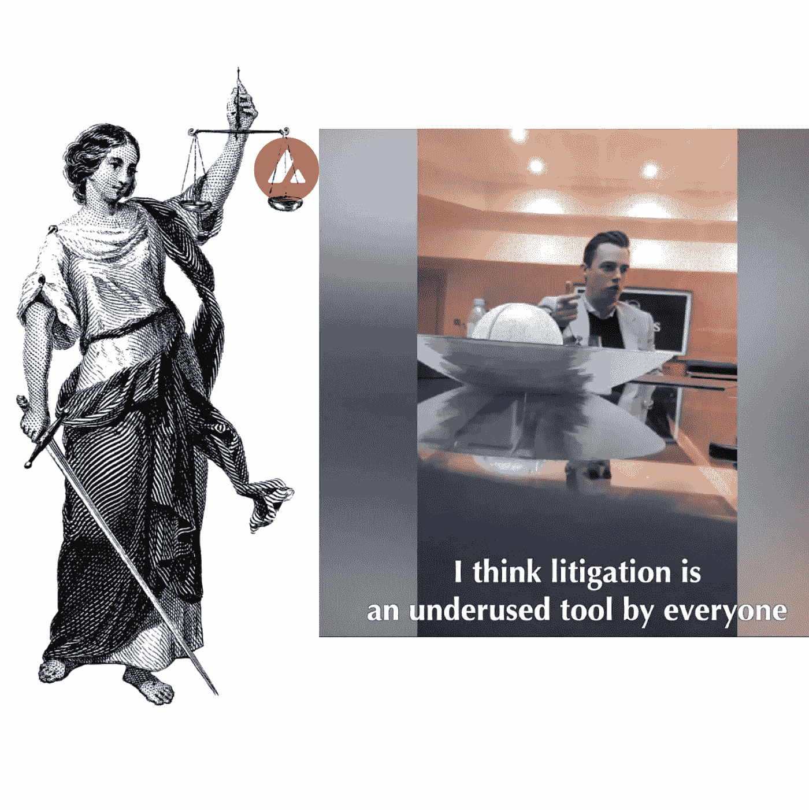

# 全部加密—2022 年 9 月第 3 周

> 原文：<https://medium.com/coinmonks/all-been-crypto-week-3-sep-2022-36bca870ad5f?source=collection_archive---------32----------------------->

总体来说，这是平淡的一周，我们收盘时相对持平，BTC 下跌 2%，瑞士联邦储蓄银行上涨 2%，市值约为 1 万亿美元。叙事再次转向宏观经济，就业数据强于预期，所有人都在关注 9 月美联储会议之前的 CPI。本周表现最差的是 AVAX 在反弹前的某个时候跌破 18，但在围绕罗氏弗里德曼诉讼策略的指控爆发后，整体仍下跌了 9%。另一方面，随着合并的临近，我们的 LIDO +15%，在 OpenSea 宣布支持后，我们的 MATIC。其他新闻有退出与欧足联的传闻，迈克尔·塞勒因逃税被地方法院起诉，关于戴未来的争论仍在继续。享受阅读！

蝙蝠太极—[btc21@mail.com](mailto:btc21@mail.com)

# 标题:

## 艾娃实验室围绕罗氏弗里德曼律师的指控

8 月 26 日 [Cryptoleaks](https://cryptoleaks.info/case-no-3) 发布了一份“告密者”报告和一些隐藏的摄像机视频，据称显示著名律师事务所 Roche Freedman 的创始合伙人 Kyle Roche 声称他收到了 AVAX 代币和艾娃实验室股票，作为帮助该项目的秘密安排的一部分。实质上，据说他收到了大约 1%的代币，因为他攻击了其他竞争对手的项目，让监管机构忙个不停，从而避开了 AVAX。确实是疯狂的指控，这在上周末的 twitter 上引发了一场辩论，导致艾娃实验室创始人兼首席执行官 Emin Gün Sirer 在 [Twitter](https://twitter.com/el33th4xor/status/1564006450531377156) 上发表言论，称这些指控是荒谬的。事实上，因为竞争对手的行为和商业运作与自己非常相似而对其提起诉讼是一种非常短视的行为。但是艾娃实验室和罗氏公司非常接近的事实是不可否认的。Avalanche】早在 2020 年 12 月就推出了第一个 ILO ，并引用 Roche Cyrulnik Freedman LLP 作为带头冲锋的法律之鹰。不管这里有多少是真的还是假的，它揭示了我们行业中的肮脏做法(要么是真正的法律诉讼，要么是编造虚假的索赔)，这肯定没有帮助。我们也看到了不管怎样的反应。Kyle Roche 本人退出了针对 Bitfinex、Tether、DigFinex 和其他人的一些案件([法院文件](https://storage.courtlistener.com/recap/gov.uscourts.nysd.524076/gov.uscourts.nysd.524076.229.0.pdf))，现在球员们实际上正在[要求法院](https://www.theblock.co/post/167615/poloniex-and-bittrex-join-tether-in-asking-court-to-terminate-roche-freedman-from-class-action)终止 Roche Freedman 的集体诉讼。巧合的是，本周我们还了解到一群其他[高飞的加密律师](https://www.coindesk.com/business/2022/09/01/5-top-crypto-lawyers-join-law-firm-brown-rudnicks-digital-commerce-practice/)在一家新的伞式律师事务所下跳槽。熊市无疑暴露了许多人更多的阴暗面，现在人们怀疑，在未来几个月甚至几年内，我们将面临一场持续的法律战。

## 创客道谈戴德鹏

几周来，制造商 DAO Rune Christensen 的创始人一直在引发一场关于戴未来的辩论。但是围绕龙卷风现金和 USDC 冰冻的事件可能使情绪高涨。基本问题是如何抵押分散的稳定硬币。为了提醒大家，戴开始只是 ETH 作为抵押品，然后转向多种抵押品，最终成为稳定硬币的大多数，所以事实上在 Circle 的支配下。就在几周前，DAO 投票决定购买真实世界的资产，并将美国国债和企业贷款计入账面。现在，Rune 想回到根本，通过建议让戴在他的[残局计划](https://forum.makerdao.com/t/endgame-plan-timeline-to-free-floating-dai/17529)中自由浮动来减少集中攻击向量。这是一场未来主义者和集权主义者之间的斗争，前者希望保持戴的分权，后者希望增加现实世界的资产，并专注于增长和盈利。来自[的 Greg Di Prisco](https://twitter.com/g_dip/status/1564716178819653632) 的一条好线索。作为创造者密切关注这场辩论显然是最古老的加密协议之一，并将被许多人视为两个方向的领导者。毫无疑问，你知道我更喜欢哪一方，但如果你担心的话[曲线](https://www.cryptotimes.io/curve-finance-to-launch-its-stablecoin-possibly-next-month/)也暗示了他们稳定的硬币发行即将到来。所以竞争总是好的。

## Crypto.com 抛弃欧足联

报道称，Crypto.com 据说接受了俄罗斯天然气工业股份公司 5 亿英镑的 5 年期赞助协议，但这与持续的熊市无关。去年，他们和马特·达蒙一起为斯台普斯球馆和它在 T2 广为人知的“财富偏爱勇敢者”[广告](https://www.youtube.com/watch?v=9hBC5TVdYT8)花费了 [700mm](https://decrypt.co/86267/crypto-com-pays-700-million-naming-rights-lakers-clippers-arena-reports) 。但是他们也起诉了一名妇女，因为她不小心给了她 1000 万美元。转移发生在 2021 年 5 月，直到 2021 年 12 月才被注意到……当然，Crypto.com 在 6 月份进行了第一轮裁员，本月进行了更大规模的第二轮裁员。因此，这也可能是营销预算目前确实有点紧张。如果你还没有意识到，这毕竟是一个熊市。

# **行情:**

> 最新消息:今天，我们起诉迈克尔·塞勒(Michael Saylor)——一位亿万富翁科技高管，他在该区居住了十多年，但从未缴纳任何 DC 所得税——税务欺诈。

**DC 司法部长卡尔·拉辛**

> 这个网站上的指控是绝对错误的。艾娃实验室相信透明度和直面世界，而不是通过幕后交易或活动。

**Emin gün Sirer——艾娃实验室创始人兼首席执行官**

> 因此，新加坡金融管理局正在考虑采取进一步措施来减少对消费者的伤害

**新加坡金融管理局常务董事拉维·梅农**

> 似乎为了对冲通胀，你所要做的就是做空比特币

亚历克斯·克鲁格

> 交易新手？试试[加密交易机器人](/coinmonks/crypto-trading-bot-c2ffce8acb2a)或者[复制交易](/coinmonks/top-10-crypto-copy-trading-platforms-for-beginners-d0c37c7d698c)