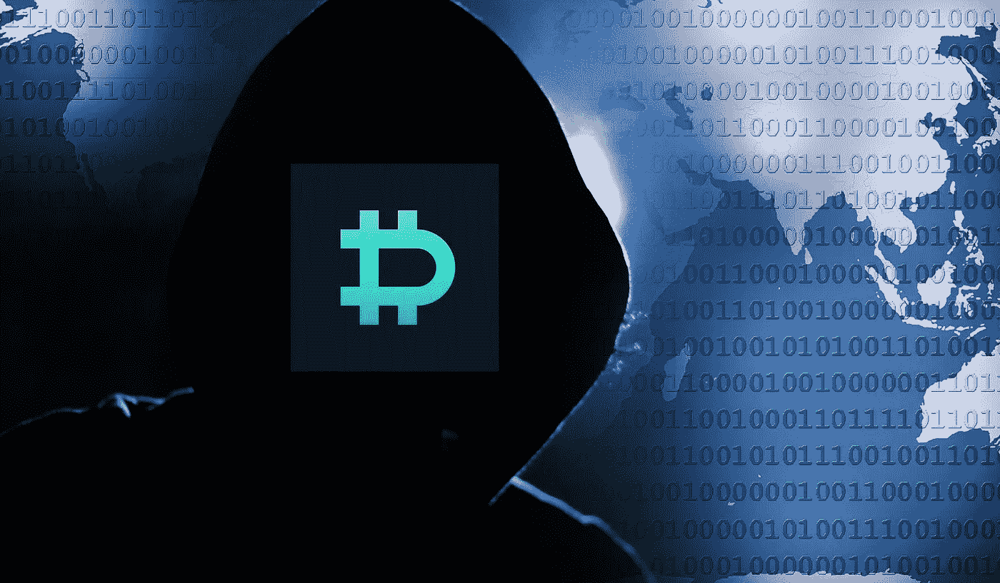

# 全部加密-2022 年 11 月 4 日第 4 周

> 原文：<https://medium.com/coinmonks/all-been-crypto-week-4-nov-2022-8157f0575fe3?source=collection_archive---------45----------------------->

尽管美联储(FED)加息 75 个基点，且最新言论给宏观世界带来了一些波动，但 back 联邦医疗保险巨头本周表现平平，基本保持不变，市场上限仍为 1 万亿英镑。然而，在引擎盖下，我们看到了一些重大的象征性动作。doge WoW 翻了一番，然后又收回了部分收益，因为埃隆接管了推特，FTM 从 Andre Cronje 和 MATIC 出人意料的回归中获得了+22%的收益，而随着机构认知度的提高，这一比例达到了+13%。另一方面，Aptos 继续出血-16% WoW。在阿拉梅达的资产负债表被泄露的消息中，比特币基地 3Q 的盈利显示出零售和交易量放缓的痛苦，主要加密平台宣布更多裁员，一家主要交易所的 2800 万黑客攻击。在+ve 方面，香港看起来将再次转向加密友好型，一些大型 TradFi 银行正深入 DeFi 和新的 NFT 系列 Arte Gobblers，提醒我们动物精神依然存在。享受阅读吧！

蝙蝠太极—[btc21@mail.com](mailto:btc21@mail.com)

# **头条:**

## [德里比特黑客](https://twitter.com/DeribitExchange/status/1587701883778523136)

本周最大的加密期权交易所遭受了他们热门钱包的黑客攻击。交易所通常把一小部分资金放在热门钱包里，以便用户快速取款。他们宣布，由于妥协，价值约 28 毫米的 [BTC](https://blockchair.com/bitcoin/address/bc1qw5g8lw4kzltpdcraehy2dt6dqda8080xd6vhl4kg4wwsypwerg9s3x6pvk) / [ETH](https://etherscan.io/address/0xb0606f433496bf66338b8ad6b6d51fc4d84a44cd) 和 USDC 被盗，但也表示用户资金不会受到影响，因为这将从公司储备中支付。他们可以可信地声称，因为他们似乎刚刚经历了另一轮 4000 万英镑的现有投资者融资。请记住，他们还有一个来自 3AC 的大洞，据 [FT 报道](https://www.ft.com/content/09f2cb5a-5e2d-4b5f-96cd-ffed455ae23b)在 80 毫米范围内。黑客的处理做得很好，即时推文让人放心，资金是安全的，但我们还不知道安全方面发生了什么，事实上，他们受到了损害，这是一个大问题。Derbit 被广泛认为是蓝筹股交易所之一，在安全支出上并不容易，所以我们需要看到攻击本身的更多细节。一旦我们得到更多的信息，希望他们能发布验尸报告

## [摩根大通的第一笔违约交易](https://blockworks.co/jpmorgan-trade-on-public-blockchain-monumental-step-for-defi/)

一些 TradFi 银行(JP 最大)本周在 Polygon 进行了首次 DeFi 交易。他们基本上将新加坡元令牌化，然后使用修改后的(分叉)版本的 [Aave Arc](https://blockworks.co/aave-arc-to-provide-30-financial-institutions-access-to-private-pools-of-defi-liquidity/) 与令牌化版本的日元进行交易，作为 [MAS 试点项目](https://www.mas.gov.sg/news/media-releases/2022/first-industry-pilot-for-digital-asset-and-decentralised-finance-goes-live)的一部分。有趣的是，他们基本上是在区块链的公共基础设施上建造的，这是对这些团队所建造的巨大信任投票。然而，这当然不是没有许可的，因为美国志愿行动协会已经特别为需要 KYC 互动的机构制定了该协议。Aave Arc lending pool 的增长最多可以被描述为“不冷不热”,尽管它使用的是分散的流动性，并且只有大约 7.8 毫米的 TVL。相比之下，整个 TVL 的平均收入为 52 亿美元。但这不是为加密反正这个试点是基于外汇和债券发行的潜力。说到这里，瑞银集团本周宣布在区块链的 SIX Digital Exchange 平台上发行首只数字债券。结算将在 DLT 进行，不需要中央结算对手。

## [Instagram NFTs](https://www.coindesk.com/web3/2022/11/02/instagram-users-will-soon-be-able-to-mint-and-sell-nfts/)

IG 表示，从本周开始，他们允许一小部分创作者直接在平台上制作和销售 NFT。他们早就推出了数字收藏功能，但现在也进入了初级市场。你将能够直接在应用程序中购买 NFT，它们将有一个闪烁的效果来表明真实性。最初在 Polygon 上推出，但也宣布基于视频的收藏品将是下一个以及 SOL 集成。Meta 还指出，它不会对在 Instagram 或脸书上展示和分享数字收藏品收取费用，至少在 2024 年之前，它不会对销售数字收藏品收取任何额外费用。然而，正如上周在[的 ABC](/coinmonks/all-been-crypto-week-28-oct-2022-fc827968a627) 中所讨论的，这些交易仍然要缴纳来自 iOS 和 Android 的应用商店税。与此同时，有传言称，Twitter 上的加密钱包[似乎暂停了](https://www.platformer.news/p/inside-twitters-product-roadmap-under)。

# **行情:**

> 监管环境是我们发展这个行业的最大障碍之一，甚至可能让价格朝着正确的方向回升

**Brian Armstrong，比特币基地首席执行官**

> 我们想要支持有实力的企业家。埃隆·马斯克是一位非常强大的企业家。Twitter 是我个人经常使用的工具，所以我们希望确保 crypto 在言论自由方面有一席之地。

**赵昌鹏又名 CZ——币安 CEO**

> 现在 Twitter 掌握在@elonmusk 手中，我可以看到 doge 以某种方式与平台融合的真实可能性。

**查尔斯·霍金森——卡达诺创始人**

> 交易新手？尝试[加密交易机器人](/coinmonks/crypto-trading-bot-c2ffce8acb2a)或[复制交易](/coinmonks/top-10-crypto-copy-trading-platforms-for-beginners-d0c37c7d698c)