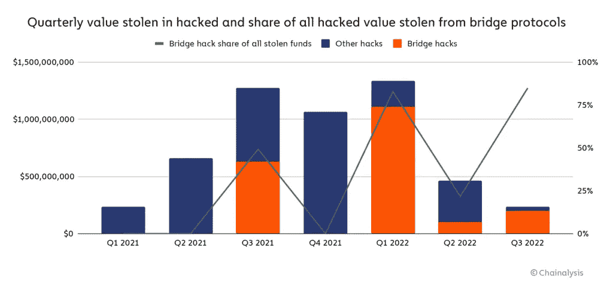

# 全部被加密—2022 年 8 月第 5 周

> 原文：<https://medium.com/coinmonks/all-been-crypto-week-5-aug-2022-ec8e4dd95ad5?source=collection_archive---------44----------------------->

总体上相对平稳的一周，BTC/ETH 下跌了 3%，而 SOL 表现不佳，下跌了 6%，BNB +13%，DOT +8%。有趣的是，LDO 相对于 ETC 的持续强势+16%回吐了一些最近的涨幅-10%，ETH 的总交易量今年首次超过 BTC，期权交易量实际上也是有史以来第一次。在新闻中，我们有两个主要的黑客在以太坊桥和索拉纳，主要的 TradFi 机构加强他们的数字资产足迹，迈克尔·塞勒辞去 MicroStrategy 的首席执行官，星巴克戏弄一个 Web3 奖励计划。享受阅读！

蝙蝠太极—[btc21@mail.com](mailto:btc21@mail.com)

# 标题:

## SOL 和 ETH 桥上的新黑客

据 chain analysis 报道，今年已经有 13 起独立的黑客攻击导致 20 亿英镑流失，本周我们又看到了另外两起黑客攻击。他们还估计，价值 10 亿英镑的密码最终落入了朝鲜黑客手中。本周的黑客攻击令人惊讶的是，与之前的黑客攻击相比，这两次攻击都有点不同寻常。SOL 于周二晚上开始，主要是持有相对少量 SOL 的零售钱包被耗尽。花了很长时间才找到漏洞的根源，直到昨晚官方的 Solana Status Twitter 账户分享了[的初步调查结果](https://twitter.com/SolanaStatus/status/1554921396408647680)，指出漏洞指向移动钱包应用。Slope 团队也[承认](https://twitter.com/slope_finance/status/1554916417044156419)他们的钱包参与了黑客攻击。正如我们在 Solscan 上看到的，攻击似乎已经停止，但总共 8000 个钱包和价值 4000 万美元的加密资产被清空。一个好的 OPSEC 有多重要的提示。另一次黑客攻击更不寻常，被许多人描述为甚至是混乱的。Nomad bridge 刚刚宣布了他们 4 月份 22mm 种子轮的[投资者](/nomad-xyz-blog/nomad-announces-new-cohort-of-investors-to-help-grow-security-first-cross-chain-messaging-solution-d538f955d8c)的完整名单，并自称为“安全第一”的跨链消息协议，遭受了 Blockworks 所谓的[疯狂的免费](https://blockworks.co/nomad-token-bridge-raided-for-190m-in-frenzied-free-for-all/)攻击。基本上发生的事情是，Nomad 的开发人员不小心推动了一次例行升级，告诉协议处理任何带有默认根哈希“0x00”的交易，而区块链网络通常需要一个唯一和特定的根作为交易有效的证明。这意味着他们有效地批准了任何交易，因此在攻击者意识到这一点后，其他用户只需复制粘贴他们的交易脚本，并用他们自己的地址替换接收者地址。PeckShield [报告称](https://twitter.com/PeckShieldAlert/status/1554350737957998592)大约有 41 个地址袭击了 Nomad，耗尽了所有[1.9 亿美元的流动性](https://defillama.com/protocol/nomad)。事实上，这是一个简单的复制和粘贴练习，也使得白帽黑客更容易介入并“保存”一些资产。根据诺曼的推特账户的指示，大约 9 毫米已经被退回。很难想象这是因为开发人员部署了一个错误的升级而发生的——它向我们展示了桥梁是多么复杂，甚至微小的攻击媒介都可能导致完全崩溃。

## 机构收养叙事又回来了

本周，贝莱德宣布与比特币基地合作，这将为他们的客户提供加密交易和托管服务。具体来说，这一合作将把贝莱德的专有投资软件 Aladdin 与比特币基地 Prime 连接起来。贝莱德是最大的资产管理公司，他们的客户群一直要求他们投资数字资产。比特币基地是最自然的选择，因为它是唯一的主要上市交易所，符合许多必要的监管要求。我们还有 Brevan Howard，据报道，他已经为他们的旗舰加密基金[筹集了【T10 亿英镑。它们是最大的传统资产全球宏观基金之一，管理着 230 亿英镑的整体交叉资产配置。因此，这仍然是迄今为止传统资产管理公司对我们领域的最大承诺，甚至对他们来说，是他们投资组合中的一个重要垃圾。](https://blockworks.co/brevan-howard-scores-largest-crypto-hedge-fund-launch-ever/)

## 塞勒辞去首席执行官一职

Microstrategy 的 Michael Saylor 本周[宣布](https://www.microstrategy.com/content/dam/website-assets/collateral/financial-documents/events-presentations/Q2-2022_microstrategy-earnings-presentation.pdf)他将辞去首席执行官一职，转而担任执行董事长，而前任首席财务官 Phong Le 将担任首席执行官一职。围绕这一点的公关是为了让迈克尔能够更专注于公司的“比特币收购战略”，但当然，房间里的大象正是关于这一点。他们在 BTC 的平均入门价格是 3 万英镑左右，因此 mark to market Microstrategy 的 13 万英镑 BTC 亏损了 10 亿英镑。有人谈论这种过渡是否意味着 MSTR 将跟随特斯拉，出售他们的 BTC 国债的一部分，但这里的反驳论点是，尽管 Saylor 下台，他仍然拥有大多数投票权，所以对我来说，政策的变化似乎不太可能。他是一个真正的马克西，甚至被维塔利克称为小丑。我的猜测是，如果他们想出售美国国债，更聪明的方式应该是像特斯拉那样悄悄地做，然后只披露——如果他们这样做，我们反正只有在他们报告第三季度数据时才知道。

# **语录:**

> 我们的机构客户对接触数字资产市场越来越感兴趣，并关注如何有效管理这些资产的运营生命周期

**black rock 战略生态系统合作伙伴全球主管 Joseph Chalom**

> 这一新的支持数字网络 3 的举措将使我们能够利用其强大的“花钱赚星星”方法，在当前星巴克奖励参与模式的基础上，同时引入在情感上吸引顾客的新方法

**星巴克首席执行官霍华德·舒尔茨。**

> 作为执行主席，我将能够更加专注于我们的比特币收购战略和相关的比特币宣传计划

**迈克尔·塞勒**

> 交易新手？尝试[加密交易机器人](/coinmonks/crypto-trading-bot-c2ffce8acb2a)或[复制交易](/coinmonks/top-10-crypto-copy-trading-platforms-for-beginners-d0c37c7d698c)