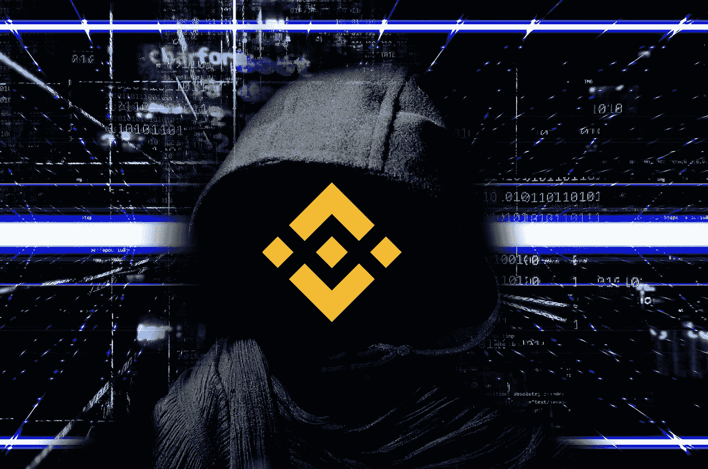

# 全部被加密—2022 年 10 月第 7 周

> 原文：<https://medium.com/coinmonks/all-been-crypto-week-7-oct-2022-3194ba0b27f?source=collection_archive---------38----------------------->

又是一个波动幅度很大的一周，BTC +2% WoW 仍徘徊在 2 万以下，总市值在 1 万亿大关徘徊。显然，大新闻和仍在展开的故事是约 600 毫米币安智能链利用和链停止。目前，BNB 股市在过去 24 小时内仅下跌了 4%，与预期持平。本周另一个表现不佳的是 Celcius token——随着竞购资产截止日期的临近以及前管理层新的不当行为指控浮出水面，该股将跌出前 100 名。除此之外，欧盟最终确定了 MiCA 的措辞，并加强了对俄罗斯的限制，现在禁止所有加密交易，而金·卡戴珊(Kim Kardashian)去年 6 月因非法加密推广活动向 SEC 支付了 126 万美元的罚款。监管正向我们走来。享受阅读！

蝙蝠太极—[btc21@mail.com](mailto:btc21@mail.com)

# 标题:

## 币安智能链在被利用后停止

现在这刚刚发生，所以故事仍在展开，但我分享我们(认为)我们目前所知道的。似乎有一个黑客在一个跨链桥上允许发行更多的 BNB。1 毫米 BNB 有 2 个[退出](https://bscscan.com/tx/0xebf83628ba893d35b496121fb8201666b8e09f3cbadf0e269162baa72efe3b8b)。攻击者然后使用这些交换到以太网，并通过以太网带走了大约 100 毫米。预计这些会被龙卷风带走。整体规模本来可以更大，但币安智能链已经停止了，现在甚至有传言说可能会回滚。在救出 BNB 的过程中，攻击者从币安智能链上的许多指数中抽走了流动性，这可能会导致多米诺骨牌效应。攻击者的地址已经被老师列入黑名单。如果你想深入了解技术细节[，SamCZSun](https://twitter.com/samczsun/status/1578167198203289600) 有一个正在发展的很棒的 twitter 平台。我觉得我们会在一段时间内听到这个故事。

## 欧盟最终确定 MiCA 规则

该集团已就其加密资产(MiCA)市场(T1)法规的完整法律文本达成一致。它为我们在整个欧盟范围内的新兴资产类别的统一监管提供了一个框架，其中包括一项揭示进行加密支付的人的[身份的法律](https://data.consilium.europa.eu/doc/document/ST-13215-2022-INIT/en/pdf)。它对稳定的硬币施加了准备金要求和其他限制，这可能会限制美国发行者的准入，并将事实上意味着无主机钱包的终结，因为以限制洗钱的名义转移需要收集 ID。该法律可能只会在 2024 年生效，但这可能是唯一的重大进展。许多人担心这会赶走欧洲大陆的创新，阻碍欧洲吸引人才的能力。在另一项裁决中，欧盟也在一项新的[制裁一揽子计划](https://ec.europa.eu/commission/presscorner/detail/en/ip_22_5989)中禁止了所有来自俄国的加密支付，这只是为了让你了解 MiCA 全面实施后会发生什么。以前高达 1 万欧元仍然是允许的，现在不允许与来自俄罗斯的任何人进行任何服务或交易。

## 塞尔丘斯队的最后一局

因此，celsius 资产拍卖的最终投标截止日期将是 10 月 17 日。我们将知道山姆是否真的也想参与其中——CZ 可能正忙于 atm 的其他事情。更多的法庭文件被公之于众，包括一份 14500 页的文件，其中包含客户姓名、交易类型和金额、客户使用的服务、持有的代币类型和数量等等。自然，这在 CT 上引起了广泛关注，并成为 Celcius 如何将 TradFi 和 Crypto 的最差部分结合起来的又一个例子。本周我们还了解到，就在一般提款被暂停之前，Mashinsky 和其他老年人在 Celcius 提取了数百万的个人资金。他们在那边看起来真的不太好。

## 纳米比亚中央银行:商家现在可以接受加密支付

这是 2022 年许多人的宾果卡上的一张。另一个发展中国家对比特币和加密资产开放。现在加密货币在该国不是法定货币，因此纳米比亚银行在其金融科技创新中心下推出了“虚拟资产和虚拟资产服务提供商”央行表示，它也在考虑“与其他相关部门协商，努力修改适用的法律法规。”这些最新的声明表明，即使私人发行的数字货币仍然没有得到法律认可，供应商和贸易商也可能接受这种形式的支付。实际上允许使用稳定硬币和 BTC 等。这是朝着正确方向迈出的重要一步。

# **行情:**

> 暂停连锁【币安智能连锁】。冻结资金。倒回去。这是一家有额外步骤的银行。

**瑞安·肖恩·亚当斯**

> 在投票过程中，国债和债券 80:20 的比例仍然是最受青睐的方法。这展示了与迁移相关的机会，看到社区如此坚定的支持是非常令人兴奋的

**MakerGrowtw(MakerDAO)负责人 Nadia Alvarez**

> 舒适度不平等和权力不平等之间的脱钩。前者会减少，后者会在某些地方增加，尽管民主化的技术可以提供一个平衡的压力。这至少在过去几十年里已经发生了

维塔利克·布特林

> 交易新手？尝试[加密交易机器人](/coinmonks/crypto-trading-bot-c2ffce8acb2a)或[复制交易](/coinmonks/top-10-crypto-copy-trading-platforms-for-beginners-d0c37c7d698c)