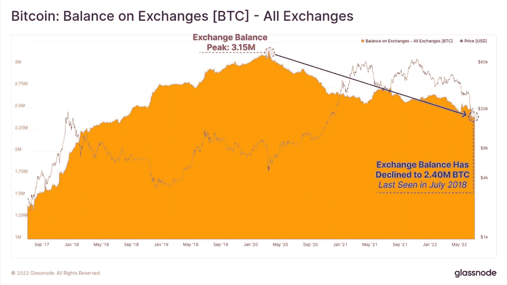

# 全部被加密——2022 年 7 月 8 日

> 原文：<https://medium.com/coinmonks/all-been-crypto-week-8-july-2022-75996ccec8e9?source=collection_archive---------23----------------------->

我们回来了！至少目前看来是超过 1 万亿美元，经过一周的价格稳定，价格已经接近趋势区间的上限。随着大部分资产全线下跌，大赢家中的 stETH 和 cETH 在 Sepolia Testnet 合并成功后超过 20%。交易所的余额继续走低，表明抛售压力降低。在新闻中，我们当然有更多关于破产和救助，一些更有趣的投票在 MakerDAO 扩展到现实世界的资产和一些新的丑陋的指控在 Celsius 出现。在创新方面，有趣的是 Polygon 也发布了一款 Web3 手机，据说 Reddit 将推出一个 NFT pfp 市场。享受阅读！

蝙蝠太极—[btc21@mail.com](mailto:btc21@mail.com)

# **头条:**

## 救助和破产更新

不幸的是，我们将不得不在接下来的几周内保持这个头条新闻，因为我们似乎还没有走出困境。虽然价格已经稳定在这些水平，我们继续看到流动性紧缩的后果正在展开。本周，Vauld T1 和 T2 coin loan T3 是最近宣布事实上破产的两家公司。航海家不得不申请[破产](https://twitter.com/Ehrls15/status/1544550249519357952?s=20&t=byf5Qp28jKaXxP61mA6ogw)，这暴露了一些关于他们交易对手的非常有趣的信息。事实上，97%的客户账户中的资金不足 1 万美元，主要由散户承担，阿拉米达是第二大借款人，未偿还金额为>3.7 亿美元(仅次于 3AV ~ 6.5 亿美元)。现在更容易理解为什么他们(萨姆和阿拉米达)这么快就给了他们[500 毫米的信用额度](https://blockworks.co/voyager-to-borrow-500m-from-alameda-amid-insolvency-rumors/)，我们现在知道这还不够，看起来他们只拿了 75 毫米。航海家号的另一个问题是调查他们是如何将自己推销为受保护的联邦存款保险公司的。看起来他们并不是真的。也许这就是为什么尽管 SBF 是最大的股东(11%)，但他也在疏远自己。还有更多有趣的故事随着气温的升高而出现。就在你认为事情似乎变得“有序”时，他们设法转移了流动性，[偿还了](https://defiexplore.com/cdp/25977)全部 MakerDAO 贷款，并将 [24k wBTC 转移到了 FTX](https://etherscan.io/tx/0xc1c92c02fa895f553735910a55485ad7e353e1efb4b8f60d428ef02fc8b7001a) 。Celsius 的前资产经理提起诉讼，指控他们欺诈和操纵市场。被 Celsius 部分收购的 KeyFi 的创始人兼首席执行官 Jason Stone 表示，Celsius 对他们撒了谎。他们没有进行对冲活动，也没有对冲加密资产价格的波动。整个公司的投资组合都暴露在市场中。本周回顾 BlockFi 也试图安抚散户投资者，他们发出了一封电子邮件，声明他们已经兑现了迄今为止的所有提款，并对其持有的资产进行了一定程度的透明(50%的客户资金是短期头寸，10%是抵押品)。Nexo 实际上与 Vauld 签署了一份条款清单，有可能收购他们的资产。近距离观察太空

> 交易新手？试试[加密交易机器人](/coinmonks/crypto-trading-bot-c2ffce8acb2a)或者[复制交易](/coinmonks/top-10-crypto-copy-trading-platforms-for-beginners-d0c37c7d698c)

## [阿根廷稳定币暴涨](https://www.bloomberg.com/news/articles/2022-07-03/argentines-seek-hedging-in-crypto-after-economy-minister-resigns)

继经济部长马丁古兹曼(Martin Guzman)意外辞职后，上周末，以阿根廷比索计价的稳定硬币价格一度飙升至 10%以上。阿根廷多年来一直受到极高通货膨胀率的困扰，因此难怪该国的加密技术采用率位居世界前列。资本管制限制了每个公民可以兑换比索的美元数量，因此稳定的硬币是避险的最佳方式。同样值得注意的是，大约两个月前，两家主要银行试图进入加密领域，却遭到了中央银行的警告。当局对加密的严格立场很可能与国际货币基金组织贷款的条件有关，该贷款要求严格打击加密。新任财政部长现在也可能会有所改变。

## [一个 PDF 如何成为最大的加密黑客的根源](https://www.theblock.co/post/156038/how-a-fake-job-offer-took-down-the-worlds-most-popular-crypto-game)

今年早些时候的 Ronin Network 黑客攻击是有史以来最大的加密黑客攻击。我已经在我的[前一周](/coinmonks/all-been-crypto-week-1-april-2022-9c750484c7d)中谈过了，现在我们似乎已经得到了更多的细节。据报道，整个黑客的根源是一个虚假的工作添加，诱使一名高级开发人员下载了一个妥协的 PDF 文件，使间谍软件渗透到 Ronin 的系统。从那里，黑客能够攻击并接管 Ronin 网络上九个验证器中的四个——并且他们只需要五个就能成功地袭击桥梁。然后[我们了解到](https://roninblockchain.substack.com/p/back-to-building-ronin-security-breach)他们也可以使用 Axie DAO，该工具之前允许列表中的 Sky Mavis 唱各种事务，以帮助处理繁重的事务负载。现在听完整个故事简直是疯了，一个工程师下载一个简单的 PDF 文件的一个单点故障导致了加密史上最大的黑客攻击。当然，我们知道这是缺乏权力下放，但其规模仍然令人震惊。

# **行情:**

> 智能合约比任何纸质协议都有更高的清算偏好。DeFi 保护你免受高温伤害

PoolTogether 的联合创始人雷顿·库萨克

> 但在 2021 年 2 月下旬，我们发现 Celsius 对我们撒了谎。他们没有对冲我们的活动，也没有对冲加密资产价格的波动。整个公司的投资组合都暴露在市场中。

**杰森·斯通，KeyFi 的首席执行官**

> 当有远见的人意识到任何人的银行账户都可能被关闭时，他们自然会意识到比特币的价值。
> 适应性强的人在自己的银行账户被关闭时，会不情愿地意识到比特币的价值。
> 
> 然后是彼得希夫

**Erik Voorhees，ShapeShift 的创始人**