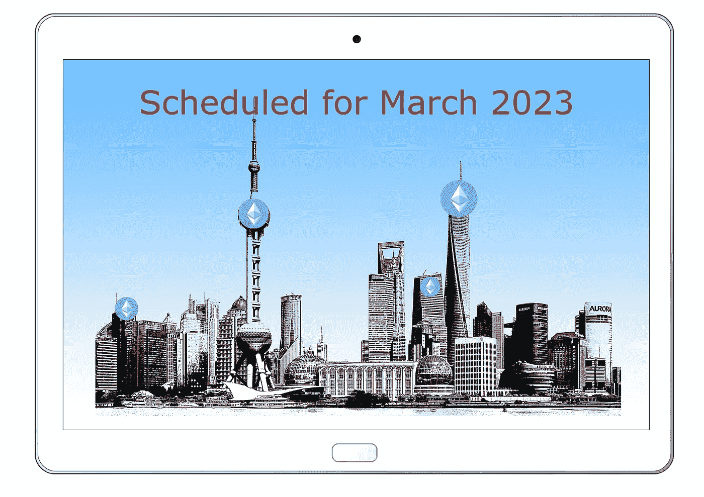

# 全部被加密—2022 年 12 月第 9 周

> 原文：<https://medium.com/coinmonks/all-been-crypto-week-9-dec-2022-8efd29846202?source=collection_archive---------36----------------------->

又是平淡的一周，价格在窄幅波动中徘徊，成交量继续保持低迷。市值远低于 1 万亿英镑，达到 9000 亿英镑，即使在引擎盖下，也没有太多有趣的价格变动值得注意。AXS 可能是唯一一个在发布了其分散化战略的细节后同比增长+20%的城市。在新闻中，我们当然有更多关于 FTX 和国会现在要求 SBF 的更新，圈结束他们的特殊目的收购公司协议，GBTC 创下 47%的新低。多米诺骨牌显然还没有全部倒下，但隧道的尽头有光明。高盛考虑了一些待售资产的兴趣，建筑商仍在与 ETH 核心开发商一起建设，目标是 3 月份完成等待已久的上海升级。享受阅读！

蝙蝠太极—【btc21@mail.com 

# 标题:

## FTX 更新

几个移动的部分仍然需要保持在头条新闻部分。SBF 首先被友好地询问，然后带着更多的指示语气在国会面前作证。[他说](https://twitter.com/SBF_FTX/status/1599511560384225281)他会在完成“学习和回顾发生的事情”后作证。在这个阶段，他可以在每个媒体上接受采访，却仍然厚颜无耻地告诉国会他需要更多的时间，这实在是太滑稽了。好吧，有人似乎比当局说得更快。有传言说[卡洛琳](https://twitter.com/WallStreetSilv/status/1599552440789266432)(阿拉米达首席执行官)在纽约被发现，这向许多人暗示她可能在这个案子上与法律环境合作。这对我来说并不奇怪，考虑到事情发展得如此糟糕，一小撮圈内人开始互相攻击，特别是带着功利主义的心态，我想你可以以某种方式证明为什么你需要为了更大的利益而抛弃别人。不过，当然还有那只大野猫 Trabucco 先生(阿拉米达前首席执行官)，他已经完全从公共舞台上消失了。他在 8 月份正式离开了阿拉米达，但他肯定知道发生了什么。我指的是最乐观的猜测，FTX 在 5 月/6 月的 Luna collaps 中损失了 80 亿英镑……反正这是我在这里的猜测，所以让我们引用 Trabucco 的最后一条推文“非常爱大家——我确信过去的几天对许多人来说是黑暗的，我希望未来的道路更加光明”。听起来不像是有什么嫌隙，是吗？除了“领导”团队的更新，我们还了解到了[阿拉米达斯风险投资组合](https://www.ft.com/content/aaa4a42c-efcc-4c60-9dc6-ba6cccb599e6)，并惊讶地发现那里的一些较大的头寸也列在了 [FTX 的资产负债表上](https://www.semafor.com/article/11/17/2022/the-ftx-spreadsheet-you-havent-seen-belongs-to-alameda-research)，我们还看到了许多其他风险投资基金，这只是一个适当的混乱。作为集团清算的一部分，LegerX 正在被出售，FTX 日本公司正在被单独处理，日本人的提款将在年底前重新开始。这向您展示了这是一个多么复杂的法律程序，因为 FTX 帝国的全球性和他们的客户所在的不同司法管辖区。

## 圆圈结束特殊目的收购公司上市

无论如何，特殊目的收购公司上市的大时代早已过去，但 Circle 仍在与巴克莱前首席执行官鲍勃戴蒙德(Bob Diamond)的特殊目的收购公司就估值 76.5 亿至 90 亿美元进行谈判。他们本可以在 12 月 10 日之前敲定事情，但本周早些时候已经宣布结束交易。我的意思是，估值是在一个非常不同的环境中设定的，所以不得不进行某种重置并不奇怪，但我认为这更多是由于机构的兴趣，只是现在没有进行加密投资。现在不是每个人都想在自己的投资组合中显示“没有加密风险”来列出最大的加密空间之一的时候。我已经说过几次了，但是 12 个月前你的职业风险不是看加密，这在过去的几周里又发生了显著的变化。我担心，许多大型机构现在觉得，在未来几个月里，你很容易再次忽视这个领域，而风险回报在 FTX 之后已经不复存在。但具有讽刺意味的是，从监管角度来看，Circles USDC 可能是该领域“最安全”的投资之一。巴克莱银行本周发布了一份报告，认为 USDC 可以通过他们最近宣布的仅面向政府的贝莱德基金直接与美联储进行反向回购。与美联储保持直接联系将提升 USDC 作为稳定货币的地位，并使其更接近事实上的美国 CBDC。这也是一个奇妙的商业模式。资产端:赚取 4%的 t 账单收入——负债端:向储户支付 0 x[420 亿](https://www.coingecko.com/en/coins/usd-coin)。尽管在币安真正宣布他们稳定的收入漏斗之前很久，他们就已经从 7 月开始失去了市场份额，损失的是 USDT 和 BUSD

## 三月份的 ETH“上海”

中国正在开始开放，似乎正在逐步远离零 Covid。所以具有讽刺意味的是，实际上你可能会在三月份再次去上海。然而，这与 ETH 更新没有任何关系，当我们谈到“上海”更新时，我们指的是为 ETH 引入一个不稳定的机制。目前，销售点链已全面启动，但所有已启动的销售点链都不能取消，一个正常运行的机制是销售点链可持续发展的关键。您需要能够在不同的节点操作符之间进行选择，并且能够从验证过程中撤销您的 ETH。本周核心开发者同意升级的目标是 3 月 23 日。他们似乎同意拆包机制是关键特性，应该优先于其他升级，但问题是扩展到什么程度。由于 POS 过渡，网络还需要进行其他改进，但这些改进已经搁置。例如，EOF 是对 EVM 的改进，它已经 2 年没有更新了，所以有些人认为应该包括它，尽管它可能会把上海挤出去。我认为 3 月的最后期限有点乐观，会认为任何 1 小时 23 分是一个很好的成绩。

# **语录:**

> 如果你可以花所有的时间对媒体喋喋不休地谈论 FTX，你也可以对国会做同样的事情

**众议院金融服务委员会主席玛克辛·沃特斯**

> 我们确实(在数字资产领域)看到了一些真正有趣的机会，定价要合理得多。FTX 在生态系统的许多方面都是典型代表。但要重申的是，底层技术仍在继续发挥作用。

**马修·麦克德莫特，高盛数字资产主管**

> 随着越来越清楚各种 ConsenSys 产品是如何管理数据的，出现了一些有效的批评和担忧——尤其是那些最终拥有最高隐私标准的人。我们将推出一个新的高级设置页面，让所有新用户都有机会在入职时选择自己的 RPC 提供商，并选择退出用于增强用户体验的第三方服务

**丹·芬利，MetaMask 联合创始人**

> 交易新手？尝试[加密交易机器人](/coinmonks/crypto-trading-bot-c2ffce8acb2a)或[复制交易](/coinmonks/top-10-crypto-copy-trading-platforms-for-beginners-d0c37c7d698c)