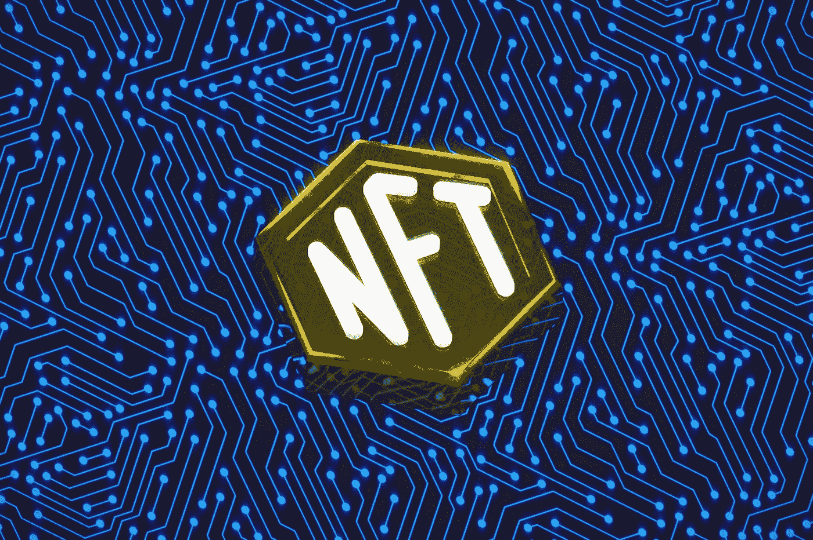
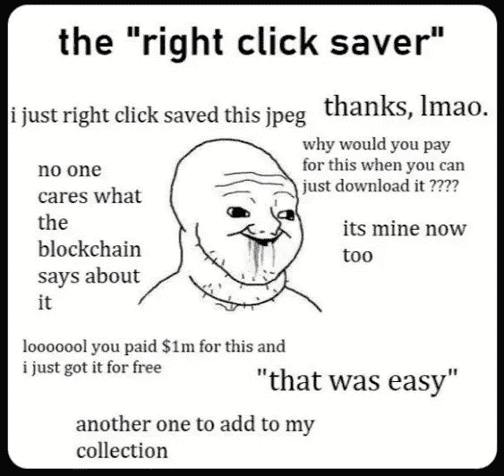

# NFT 的所有阴影

> 原文：<https://medium.com/coinmonks/all-shades-of-nft-2df20c1b1930?source=collection_archive---------10----------------------->

## 区块链|加密货币|不可替代的代币

## 你可能不知道的视角！

Photo by [Choong Deng Xiang](https://unsplash.com/@dengxiangs?utm_source=medium&utm_medium=referral) on [Unsplash](https://unsplash.com?utm_source=medium&utm_medium=referral)

代表**的不可替代代币**是 2021 年的热门话题。主要是由于其中的**投机方面**，一些人发了大财，还有一些...失去了一切。但是在今天的文章中，我宁愿提出背后的**技术。**

# 可替代性

理解题目的一把钥匙。那是什么意思？在加密空间中，有两种令牌:**可替换的**，和**不可替换的**。第一种可以很容易地在任何一个挂牌交易的交易所进行交易。它们通常是加密公司或比特币本身的标志。它们通常被列在 CoinMarketCap 或 Coingecko 等网站上。

加密交易所，至少是集中的交易所，就像其他市场一样，有供需双方进行交易。你总是将**可替换代币**出售给另一个已经下了购买订单的人，或者从挂牌出售代币的人那里购买代币。不想过多赘述细节，让这篇文章不必要地太长。我只是想让你理解可替代性。

Photo by [Luke White](https://unsplash.com/@dynamite_luke?utm_source=medium&utm_medium=referral) on [Unsplash](https://unsplash.com?utm_source=medium&utm_medium=referral)

换句话说，这只是意味着你的可替代代币可以在任何时候(是的，加密市场是 24/7 开放的)兑换成**法定** **货币**(或其他可替代代币 ETH- > BTC 等等)。(BTC *(可替换的:NFT 的 F 代表什么，为什么它很重要，2022)。*

我们可以出售我们拥有的任何数量的代币(一个或多个)或一部分代币。你能卖出的最小比特币数量是**一个“Satoshi”**

> 一个比特币有 1 亿个 satoshi，也就是说每个 Satoshi 值 0.00000001 BTC。为了让一只 satoshi 值一美分，一只 BTC 需要值一百万美元。(乔治，2022)

另一方面，非上市交易不是直接在交易所交易，它们可以在专门创建的平台上上市和销售，其中最受欢迎的是 OpenSea。

# 那它有什么用呢？

NFT 不仅仅是推测性的 JPEGs。

😳**震惊？大概是吧，因为这就是它们经常被介绍的方式，通常还有一个背景故事，关于它最近卖了多少钱！我知道这个话题可能会引起很多炒作，因为在合适的时间出售一台电脑对一个普通公民来说可能是一件改变生活的事情**

有史以来最贵的 NFT 清单可以在[这里](https://sensoriumxr.com/articles/most-expensive-nft-sales)找到。(布雷亚，2022 年)

**荣誉提及** : Visa(是的，你的支付处理器)也拥有一个最具标志性的 NFT，即[加密朋克](https://www.bloomberg.com/news/articles/2021-08-23/cryptopunk-nft-prices-visa-buys-digital-avatar-7610-for-150-000-in-eth)。(阿贝拉德，2022 年)

# 我可以截图吗？

NFT 作为一种技术，给你一个所有权的**数字证书** (Ribas，2022) 意味着通过截屏你不会拥有 JPEG，就像打印一幅“蒙娜丽莎”的画并不意味着你拥有真正的真品，对吗？

但是如前所述，NFT 不仅仅是图像。有了所有权的数字认证，只有我们的想象力限制了我们(也许还有当地法律😄)

实用程序的有趣案例:

*   **教育部门** — [韩国大学将向所有 2830 名毕业生发放 NFT](https://forkast.news/headlines/south-korea-nfts-graduates-hoseo/#:~:text=South%20Korea's%20Hoseo%20University%20will,its%20graduation%20ceremony%20on%20Friday.)——祝试图伪造文凭的人好运，那些文凭被储存在**区块链太空深处一个不可改变的账本**。在没有第三方参与的情况下，确认此类证书的合法性需要几分钟时间。**将死，诈欺！** 这不是 NFT 用法的唯一案例，类似的历史可以在这里[阅读](https://forkast.news/headlines/samsung-backed-university-nfts-graduates/)。
*   **门票**——有了 NFT 门票，你只需一个二维码就可以参加任何活动。NFTs 也可以代替纸质的拷贝，纸质的票据可能会丢失、被水泼溅或被销毁。(Takyar，2022)未来终于来了😃。
*   时尚产业——对一件昂贵的独家商品进行快速鉴定，对经销商和买家来说肯定会很方便。不要再买假古驰了😄
*   **房地产行业—** 已经有以 NFTs 形式出售的房产。第一套公寓在 2017 年以 36 以太坊的价格卖了回来。关于此交易的更多信息，请点击阅读[。(Gedeon，2021 年)](https://www.laptopmag.com/news/the-worlds-first-real-estate-nft-just-got-sold-why-this-is-revolutionary)
*   **投票—** 随着数字身份识别的普及，NFT 投票可能会成为现实。选举通常需要大量的信任，尤其是在全球的某些地区。NFTs 能解决这个问题吗？希望如此。

**通过阅读这篇文章，你可能会发现，非功能性食物不仅仅是推测性的图片，它们可能会永远改变我们的未来。任何利用 NFT 属性的解决方案都有可能被现实世界采用。它会是改变游戏规则的技术吗？可能性很大，但正如尖端解决方案一样，这一切都需要时间。**

# 参考

北卡罗来纳州阿贝尔拉德，2022 年。 *Visa 以 15 万美元*买下数码头像 NFT 的莫霍克发型。[在线]Bloomberg.com。可在:<https://www . Bloomberg . com/news/articles/2021-08-23/cryptopunk-NFT-prices-visa-buys-digital-avatar-7610-for-150-000-in-eth>【2022 年 10 月 14 日访问】。

布雷亚河，2022。[在线]感知器。可用时间:<https:>【2022 年 10 月 14 日访问】。</https:>

商业内幕。2022.*可替换的:NFT 的 F 代表什么，为什么它很重要*。【在线】可在:<https://www . business insider . com/personal-finance/functionable-meaning？r = US&IR = T>【2022 年 10 月 14 日访问】。

傻瓜，男，2022。NFT 10 大最佳市场。[在线]见:<https://www . fool . com/the-ascent/crypto currency/NFT-market places/>[2022 年 10 月 14 日访问]。

2021 年，堪萨斯州，吉迪恩。*世界上第一个房地产 NFT 刚刚售出——为什么这是革命性的*。[在线] LaptopMag。可从以下网址获取:<https://www . laptopmag . com/news/the-worlds-first-real-estate-NFT-just-get-sell-why-this-is-revolutionary>【2022 年 10 月 14 日获取】。

乔治，b，2022。*什么是聪？了解比特币的最小单位*。[在线] coindesk。可从以下网址获得:<https://www . coin desk . com/learn/what-is-a-Satoshi-understanding-the-minimum-unit-of-bit coin/>【2022 年 10 月 14 日获取】。

华盛顿公园，2021。*韩国大学将向所有 2830 名毕业生发放 NFT*。[在线]福卡斯特。可在:<https://forkast . news/headlines/South-Korea-nfts-graduates-hoseo/#:~:text = South % 20 Korea ' s % 20 hoseo % 20 university % 20 will，its % 20graduation %典礼%20on%20Friday。>【2022 年 10 月 14 日获取】。

里巴斯，e，2022。 *NFTs —数字证书、使用许可、所有权*。[在线] Artlaw.club .可从以下网址获得:<https://art law . club/en/art law/nfts-digital-certificate-license-use-ownership-1>【2022 年 10 月 14 日获取】。

2022 年的塔克亚尔。*NFT 票务如何颠覆票务行业？*。[在线] LeewayHertz —软件开发公司。可在:<https://www.leewayhertz.com/how-nft-ticketing-works/>【2022 年 10 月 14 日进入】。