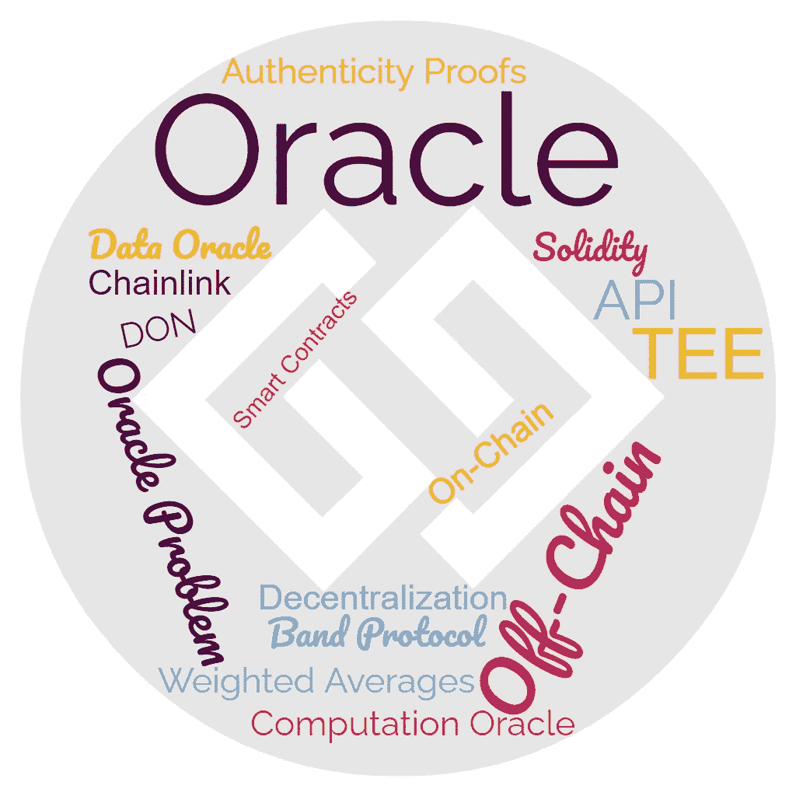

# 关于区块链神谕，你需要知道的

> 原文：<https://medium.com/coinmonks/all-you-need-to-know-about-blockchain-oracles-a47618bbc94d?source=collection_archive---------3----------------------->

## Oracle 问题、设计模式和考虑因素、Oracle 类型、智能合同示例、著名的 Oracle 等等！

甲骨文有一个希腊词根，指的是一个与神接触并对未来有预见的人。