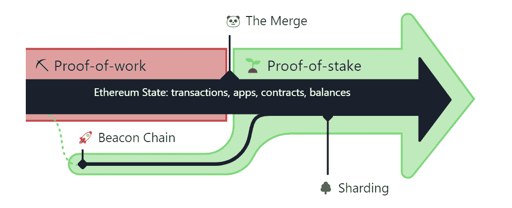
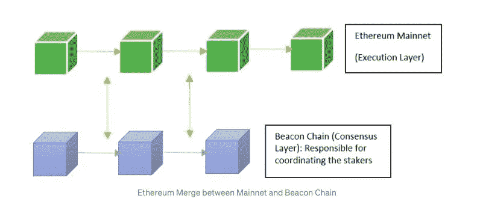

# 关于以太坊合并你需要知道的

> 原文：<https://medium.com/coinmonks/all-you-need-to-know-about-ethereum-merge-c777b1b2fab1?source=collection_archive---------24----------------------->

在著名的“以太坊合并”之后，以太坊 2.0 的出现是 web3 生态系统中最重要和最令人期待的发展之一。此次合并是对以太坊区块链的增强，推动了加密货币行业的发展。这次合并是以太坊新的利害关系证明共识层(Beacon Chain)与其最初的执行层(Mainnet)的结合，Mainnet 自平台成立以来就一直存在。它使得使用能源密集型采矿变得没有必要，并允许使用桩 ETH 来保护网络。更多的可伸缩性、安全性和可持续性使它成为将以太坊的目标变为现实的非常令人兴奋的一步。以太坊合并将以太坊的工作证明(PoW)变为利益证明(PoS)安全机制，这反过来对区块链的加密经济学和加密货币市场产生了巨大影响。

# 到底发生了什么变化

因为以太坊是一种去中心化的加密货币，所以像银行这样的组织不需要在交易在它的网络上发生之前批准交易。以前，交易是使用 PoW 共识方法批准的，这主要是由矿商进行的。第一个完成复杂数学挑战的矿工将被选为验证者。矿工们将利用尖端计算机技术的庞大基础设施，竞相解开这些谜题。密码农场是一个巨大的仓库，里面装满了一排排可以解决问题的计算机，它基本上是这种方法的唯一动力来源。然而，有一个主要问题:这些采矿场是能源消耗大户。因此，对加密货币行业最大的批评之一是，它们偶尔消耗的电力比整个国家都多，这就对它们维护环境的能力提出了严重的问题。

切换到 PoS 共识流程和“合并”尽管新的想法将消除对矿工和采矿场的需求，以太坊仍将是一个分散的平台。取而代之的是，一个验证者将由一个算法从一群“下注”(基本上，在网络上抵押至少 32 个以太币)他们的钱的个人中随机选择。因此，以太坊网络将不再需要任何矿工。

# 与 MAINNET 合并

以太坊主网从一开始就受到工作证明的保护，直到以太坊合并。这使得我们都熟悉的以太坊区块链成为可能——完成交易、智能合约、账户等。—将于 2015 年 7 月创建。

在以太坊的整个发展过程中，程序员计划最终从工作证明转换到利益证明。信标链作为第二个区块链于 2020 年 12 月 1 日与 Mainnet 同时运行。

Mainnet 上的事务最初不是由信标链处理的。取而代之的是，它决定主动验证器和它们的账户余额，以便获得关于它自己的状态的协议。经过漫长的测试后，是时候让信标链就实际数据达成一致了。合并后，信标链成为整个网络数据的共识引擎，包括执行层事务和帐户余额。

合并后，信标链被正式用作块生产的基础。挖掘不再能有效地创建块。相反，利害关系证明验证器承担了这一职能，现在负责处理所有交易的有效性和提交块。

合并没有删除任何历史记录。当 Mainnet 和 Beacon 链融合时，以太坊的完整交易历史被整合。

# 开机自检

通过结合 PoW 和 PoS，将使用两种模型的所有组件。就验证结构的经济性、能源需求和采矿所需的硬件而言，向利益证明(PoS)的过渡将从根本上改变工作证明(PoW)共识方法。PoW 技术是向区块链添加新区块的一种屡试不爽的方法。矿工采用这种策略来克服困难的计算问题，以便添加区块。那是你好。

对于以太坊的所有者来说，转换到以太坊 2.0 是有利的。由于以太坊 2.0 的变化，用户将为交易支付更少的费用，这也将使拥有所需 ETH 数量的持有者能够在网络中下注他们的货币，并承担验证者的角色。此外，已经在以太坊网络上运行的应用程序可以轻松切换到以太坊 2.0，而不会牺牲任何交易历史或数据。

随着以太坊 2.0 的推出，PoW 挖矿方式将被跑马圈地取代。因此，我们目前所知的采矿将变得过时，矿工将不得不转向赌注，以核实交易，获得大宗奖励和交易费。

如果持有人将自己的以太坊押注在合并后的网络上，将提供 4%-6%之间的年收益。由于利益证明(PoS)模型鼓励诚实的验证者并试图惩罚不诚实的验证者和他们的委托者，通过使用以太坊，网络将扩展并变得更加安全。

当一切都结束了，合并证明以太坊是成功的。它将支持基于区块链的新开发，并为去中心化应用和行业用例打开一个全新的世界。这些发展最迷人的一面是每个人都可以利用它们，这在 Web2.0 中是不可能的

# Eth 2.0 会有什么变化

“Eth2”一词已被淘汰。现在只有以太坊，因为“Eth1”和“Eth2”已经合并成一个链，不需要区分两个以太坊网络。

为了避免歧义，机构群体更改了这些术语:

“执行层”目前称为“Eth1”，负责事务和执行。

“共识层”管理利益相关共识的证据，现在被称为“Eth2”

这些术语上的变化只会影响命名标准；它们对以太坊的目标或发展时间表没有影响。

# 合并和信标链

从合并开始，信标链现在正式成为原始 Mainnet 执行层的替代一致层。自从合并以来，以太坊主网由验证器保护，基于工作证明的挖掘不再是一种可接受的块生成方法。

取而代之的是，验证那些以参与共识的特权作为交换的节点，从而产生所建议的块。这些改进为后来的可伸缩性改进铺平了道路，比如分片。

# 上海最新消息

整合后，上海将升级。与其他变化一起，升级将处理代码和数据的分离，信标链上的 staked Ethereum 的撤销，以及第二层区块链交易成本的降低。

升级后以太坊的实用性预计会增加，特别是在交易的汽油费方面，这一直是一个问题。

> 交易新手？试试[加密交易机器人](/coinmonks/crypto-trading-bot-c2ffce8acb2a)或者[复制交易](/coinmonks/top-10-crypto-copy-trading-platforms-for-beginners-d0c37c7d698c)