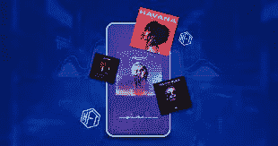

# 关于音乐 NFTs 你需要知道的

> 原文：<https://medium.com/coinmonks/all-you-need-to-know-about-music-nft-b05f95d7c787?source=collection_archive---------34----------------------->

finextra.com

人们经常将 NFT 限制在收藏品和数字艺术上，忘记了——NFT 代表不可替代的令牌——意味着不同形式的数字物品可以加强所有权和不变性。

NFT 音乐的概念对大多数人来说可能是新的，对一些人来说，它很难理解，因为围绕它们的讨论水平很低，音乐艺术家的使用率也很低。

在某些情况下，艺术家对数字艺术 NFT 而不是音乐 NFT 表现出浓厚的兴趣。尽管如此，我们已经看到了世界著名的艺术家，如 Snoop dog，Doja Cat，Eminem，Tory Lanez 等。，通过推出他们的收藏来投资 NFT。

这篇文章探索了所有你需要知道的关于音乐 NFTs 的知识。

## 概述

⁃What 是音乐 NFT
⁃A 音乐 NFT 简史
⁃Notable 音乐 NFT 出自艺人
⁃Advantage 与音乐 NFT 的独特性
⁃音乐 NFT 平台
⁃如何入门
⁃结语

## 什么是音乐 NFT？

术语 [*不可替代令牌*](https://dolapolayiwola.medium.com/nft-is-probably-the-most-confusing-topic-in-crypto-out-there-c4e74fbd6e73) 代表存储在区块链上的数字资产的所有权——这些数字资产是唯一的，没有复制品。音乐作为数字艺术的一种形式，允许它被符号化。令牌化后，它作为 NFT 存在于区块链。就像其他 NFT 一样，音乐 NFT 是独一无二的，不可改变的。

一个理想的视角是 NFT 音乐如何让音乐人灵活地为他们的部分粉丝创作独家内容——每个人的内容都是独特的。

> 交易新手？尝试[加密交易机器人](/coinmonks/crypto-trading-bot-c2ffce8acb2a)或[复制交易](/coinmonks/top-10-crypto-copy-trading-platforms-for-beginners-d0c37c7d698c)

## NFT 音乐简史

NFT 音乐的历史似乎是一个很难指出的壮举——有一点需要注意的是，2020 年围绕 NFTs 的大肆宣传极大地促进了它的采用和变形。

在封锁期间，音乐家的活动受到限制，他们需要一种方式来传播他们的艺术，探索更多的机会，赚更多的钱。在这个阶段，音乐 NFTs 成为了一个东西。艺术家们开始更多地发现它，并对探索它表现出极大的兴趣——随着几位艺术家宣布他们有兴趣推出他们的项目，它变得广泛起来。

## 来自艺术家的著名音乐

3Lau 是音乐 NFT 空间的主要贡献者。他通过合作或创造为其发展做出了贡献。

合作关系:其中一项合作是创造珍妮。3LAU 与艺术家史蒂夫·青木合作——两人创造了 Jenny——结合了 DJ 的艺术技巧和人工智能声音，类似于 Euler Beat。铆接方面是珍妮采用了分散式自治组织的启动方式；珍妮道-联合当代艺术收藏。珍尼道的非艺术藏品的所有权是通过分数获得的——收藏者可以购买 NFT 的“部分”或“份额”，而不是拥有整件藏品。珍妮卖了大约 100 万美元。

**创作:**2021 年初，3lau 将自己的专辑令牌化，拍卖三天。这张专辑最终以 1100 万美元的价格售出——包括 33 张独特的 NFT——购买后，收藏家们获得了其他奖励，包括包装上有签名的限量版黑胶唱片。通过观察，你会注意到音乐 NFT 是如何以不同的笔触出现的——促进了一种社区感，并为艺术家带来了更强大的粉丝基础。
其他一些早期差点拥抱 NFT 音乐的艺术家包括雅克·格林(JG)，他是最早通过 NFT 将音乐主流化的人之一。“去年(2020 年)，我结束了与一家大公司的长期、非常糟糕的出版交易，”JG 在推特上写道。2 月晚些时候，他在 Foundation 拍卖了自己的单曲“promise ”,并以 13 ETH 的价格售出——JG 认为这是一笔好交易。

> 莱昂国王史蒂夫·青木(一个乐队)和唐·迪亚波罗也为 NFT 音乐的主流采用开辟了道路。

一系列嘻哈艺术家也参与其中，每个人都采取了略有不同的路线来释放音乐 NFTs 的潜力。例如，Snoop Dog 在推出 NFT 后不久就分享了他成为元宇宙第一大唱片公司的愿景。其他人如 Doja cats 和 Jay-Z 拍卖了他们的 NFT。

## 音乐 NFT 的优势和独特性

NFT 的音乐思想对大多数人来说是不清楚的，但有几个值得注意的特征最明显；是 NFT 带给造物主的所有权。要理解 NFT 音乐的效果及其给艺术家带来的机遇，有必要从现实世界的挑战和艺术家在该领域的经历中寻找线索。总的来说，这些问题的主要亮点包括分配、奖励制度和扩大创收。

对于音乐 NFT 来说，有一个机会可以让音乐家通过使用 NFT 更好地推广他们的工艺，NFT 是一种通过将他们的单曲或专辑作为收藏或拍卖出售来产生经常性或一次性收入的方法。这样一来，艺术家的收入就超过了通过 Youtube music 和 Apple Music 等 Web2 流媒体平台获得的回报。

对于独立艺术家和后起之秀来说，这可能会像取消限制他们艺术家潜在报酬的过高费用或合同一样——唱片公司或中间商获得交易的最大份额。有了 NFT 音乐，艺术家们可以更好地与他们的粉丝和潜在听众直接交流——以一种更引人注目的方式。

有些情况下，音乐 NFT 充当版权和被盗数据的看门人。NFT 和音乐 NFT 的剖析是这样存在的，它消除了盗版并提供了出处。有了区块链提供的公开分类账，篡改音乐甚至盗版歌曲都是不可能的。

在列出的这些有限的优势中，NFT 空间为音乐家创造了更多的机会——考虑到这些有限的优势，NFT 空间为音乐家创造了更多的机会——考虑到艺术家采用技术的容易程度，随着艺术家对空间的贡献，更多的优势将被挖掘出来。知道音乐行业在采用新技术时领先于其他行业，这些优势将变得更加可行——新技术旨在缓解生产、发行和其他与他们行业相关的问题。优势——旨在缓解生产、分销和其他与行业相关的问题。

## 音乐 NFT 平台

自从 NFTs 出现以来，已经为 NFTs 的各个方面创建了几个平台，例如收藏品、艺术、音乐和游戏。对于音乐 NFTs，音乐 NFT 平台提供的解决方案有许多子集。

与 Spotify 和 Apple music 等 Web2 音乐流媒体平台相比，为各种流派的 NFT 音乐人提供的平台提供了更多激励。
要知道平台各不相同；基于不同的区块链在他们的创作中使用。一些领先该领域的著名连锁店是以太坊、索拉纳、币安智能连锁店和 Tezos——每个区块链都有其优点和缺点——为用户提供独特的(有时类似的)体验以及他们如何与 NFT 互动。

该图显示了不同的 Nft 音乐平台和提供的服务。最常见的包括 Opensea、Rarible、Nifty gateway、仿植物怪兽佐拉、Audius、Opus 和 gatekeeper。

## 如何开始

NFT 音乐入门是基于用户或创作者(艺术家)的主观需求；你所需要做的就是选择一个适合你想要的目标的平台，然后按照提示进行操作——这和任何 Web2.0 音乐平台一样简单。

在这个过程中有一个最小的困难。要开始使用，请浏览如何使用该平台，并按照说明进行操作。您可能还需要密切关注您决定使用的任何平台的条款和条件。

## 结论

音乐 NFTs 的优势还没有完全展现出来，因为艺术家和音乐家正在处理如何完全和理想地将其应用到他们的艺术中。

更重要的是，音乐家关心的是如何让乐迷了解他们艺术中的这一新发展，同时又不影响艺术家与乐迷的关系以及他们的价值是如何被感知的。

采纳 NFT 音乐和走向主流背后的原则需要双方的平衡。对于艺术家来说，这是对 NFT 音乐的理解，以及如何定位他们的艺术(NFT 音乐)，以使粉丝群联系紧张，对于粉丝来说，这是理解如何平稳地适应新的发展。

久而久之，进入的障碍将减少，NFT 音乐的采用变得明显。