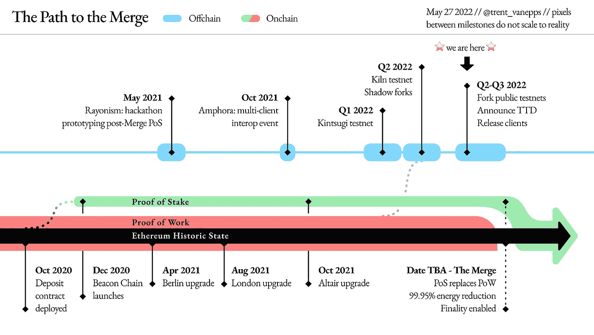
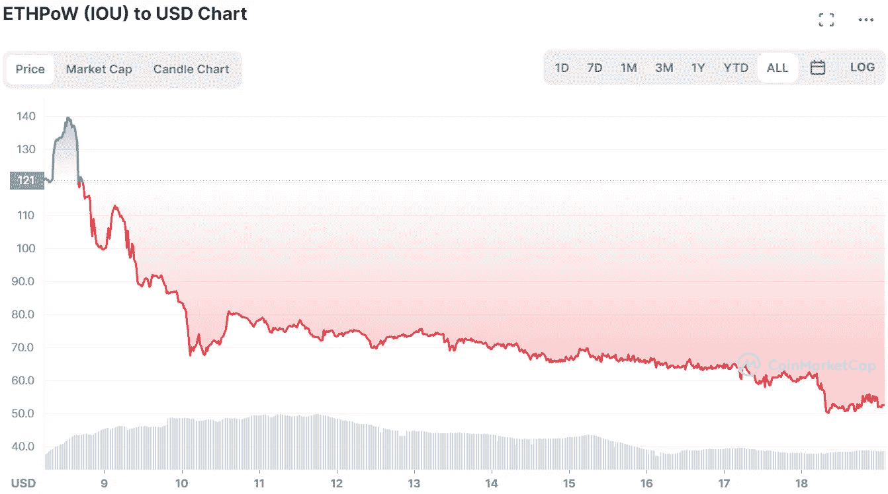

# 关于合并你需要知道的

> 原文：<https://medium.com/coinmonks/all-you-need-to-know-about-the-merge-32b5f025a659?source=collection_archive---------24----------------------->

我们在这里，大约一个月前的一个最重要的事件在加密的历史。暂定于 9 月 15 日[(取决于开采难度如何变化)，以太坊计划最终开始从目前的工作证明共识向利益证明过渡，这就是所谓的“合并”。虽然更新不会影响最终用户与区块链的交互方式，但新的 2.0 版本将以不同的方式处理验证，能耗更低，至少在未来，允许更有效地扩展数十亿美元的以太坊生态系统。之所以称之为合并，是因为 PoW Ethereum Mainnet 将与 Pos Beacon 链合并，开发人员已经在构建和测试该链，以期待现场发布。](https://blog.ethereum.org/2022/08/12/finalized-no-36/)

在 crypto 短暂而紧张的历史中，从来没有实现过如此大的更新，甚至可以说没有尝试过。这是区块链科技史上最重要的事件之一，围绕这个话题有很多误解。本文旨在成为解决该问题的简明指南。

# 为什么会发生合并？有必要吗？

以太坊自 2015 年由 Vitalik Buterin 和其他七名联合创始人推出以来，已经走过了漫长的道路。这个项目基本上诞生于一个与《魔兽世界》相关的[事件](https://markets.businessinsider.com/news/currencies/vitalik-buterin-created-ethereum-following-world-of-warcraft-debacle-2021-10)，暴雪削弱了维塔利克的“心爱的术士的虹吸生命法术”，从而唤醒了他“集中服务可能带来的恐惧”。以太坊旨在反对这一点，比特币旨在成为去中心化的货币，以太坊旨在成为去中心化的互联网。

这一愿景在很大程度上得以实现，因为按市值计算，ETH 是第二大加密货币，仅次于 BTC。许多项目和行业都诞生于此，即第一批 NFTs，即玩即赚游戏和一个非常健康的去中心化金融协议。网络开始被自己的成功压垮。很快，汽油费开始上升到荒谬的水平，交易时间开始变长。

来源:墨西哥湾博客

因此，必须找到升级网络的解决方案。该解决方案以以太坊从当前 PoW 模式过渡到 PoS 的形式出现，这一举措甚至在以太坊推出之前就经过了深思熟虑和研究，是最初路线图的一部分。简而言之，在当前的 PoW 共识模型中，网络由矿工通过硬件来保护。在这个系统中，电力被用来交换大宗交易，矿工们从提供的服务中获得一部分交易费。在 PoS 模型中，网络由验证者保护，验证者标记令牌。这种模式消耗的电力非常少，从 PoW 到 PoS 的过渡预计将以太坊的能源需求减少[约 99.95%](https://blog.ethereum.org/2021/05/18/country-power-no-more/) 。

# 合并将如何进行？

简短的回答是:通常是无缝的。以太坊基金会已经进行了大量的研究、工程和测试，特别是在过去的 18 个月里，因此合并对日常用户来说没有明显的区别。在网络仍在运行和验证价值数百亿美元的交易时，改变共识模型并非易事，因此开发人员已经为合并准备好了一系列更新。

资料来源:ethereum.org

一个非常重要的里程碑是 2020 年 12 月信标链的启动。信标链运行新的 PoS 共识，并通过影子分叉镜像以太坊主网。通过在信标链上进行所有更新，然后将其“连接”到 Mainnet，区块链应该保持正常运行，验证事务并保持相同的状态，没有任何中断。

资料来源:ethereum.org

在 PoS consensus 从 PoW 接管之前的特定时刻，节点操作员将运行一个现有的客户端实现。按照 ethereum.org[的说法，“客户端是以太坊的一个实现，它根据协议规则验证数据并保持网络安全”。这些基本上是实现，允许用户与以太坊互动，帮助保持网络安全和维护状态。与大多数其他区块链不同，以太坊有四个客户端实现(执行层)，即 Nethermind、Geth、Erigon 和 Besu。作为参考，比特币只有一个叫核心的。](https://ethereum.org/en/developers/docs/nodes-and-clients/#:~:text=A%20client%20is%20an%20implementation,run%20by%20different%20client%20software.)

拥有多个实现使得每当发现一个 bug 或者一个恶意行为者试图攻击网络时，可以在它们之间进行切换。这使得以太坊更加安全和高效，因为它仍然可以在其他区块链可能遇到问题的地方正常工作。此外，拥有多个客户端在合并后将更加有利，因为漏洞或恶意行为对网络的影响与其在 PoS 共识中影响的赌注份额成比例。因此，可以更容易地隔离它们的来源。

因此，在合并发生之前，客户端实现将通过引擎 API 将执行层(EVM)和共识层(PoW)组合在一起，形成一个完整的节点。为了平稳过渡到 PoS，这两层将被分开，可以单独运行。不同的团队甚至可以在其中任何一个上开发，直到 PoS 共识占主导地位。在此之前，执行层将与共识层一起工作，形成一个完整的节点。流行的主流共识实现是灯塔，库特和 Prysm。

Finematics 做了很好的解释，在两层上有多个实现将转化为一个更安全的网络，两层可以通过 20 对组合进行通信。例如，一个验证者可能更喜欢用 Nethermind 运行库特，而另一个可能会用 Prysm 和 Geth 的组合。当合并发生时，执行客户机将监听来自 PoS 链的块。

只有当网络有足够的功率超过一个名为 TERMINAL _ TOTAL _ difference 的变量时，这种情况才会发生。这个变量仅仅代表以太坊中每一个方块通过 PoW 达到的难度总和。当变量被超过时，节点简单地切换到跟随 PoS 链。神奇！

# 这对用户来说意味着什么？

合并发生后，所有以太坊 Dapps 应该像以前一样运行，具有相同的状态和事务历史。当然，这适用于锁定在[凸](https://www.convexfinance.com/)或[曲线](https://curve.fi/)的 ETH，在 [Aave](https://app.aave.com/) 借入或借出的资金，在 [Homora](https://homora-v2.alphaventuredao.io/) 杠杆化的农场或者在[分散化的](https://decentraland.org/)资产。如果一切顺利，对最终用户来说，什么都不会改变。

来源:凸

这也正是这次更新对区块链如此重要的原因。许多公司在更新软件时都出现过停机和重大错误，有些甚至导致客户损失金钱。想象一下，如果一个分布式网络能够在运行的同时完全切换其引擎，而对用户体验没有任何影响，那将会是什么样的情况。

# 合并的影响

所以所有这些谈论的都是密码史上最重要的事情之一，最终对普通用户来说什么都不会改变？是啊！但是也有一些事情确实会改变，如果不是在转变的时候，而是在一段时间之后。

首先，我们将获得稍微快一点的 12 秒的阻塞时间，低于当前 PoW 链上的 13 秒。如果一个块将在一个固定时隙中丢失，那么它将高于 12 秒，但总是短于 13 秒。再加上这种减少的块时间差异，理论上以太坊应该有更快的事务时间。

由于两个因素，网络在理论上也将更加安全:首先是 slashing，这意味着网络有能力惩罚不良行为者或未经通知就下线的验证者。第二是赌注经济。由于打桩比采矿更容易，网络变得更加分散，因此故障点不那么集中。虽然创建一个验证器节点需要 32 ETH，但是对于没有这么多 Ethereum 的用户来说，也有一些选择，通过做分布式验证器的项目，比如 [Obol](https://docs.obol.tech/) 。

另一个影响是，第二大最受欢迎的加密货币将不再是“可开采的”,这个行业在 2021 年估计约为 22 亿美元。无论是专业还是业余，这些钻机中的许多都将不得不被出售或用于开采其他电力项目，如比特币、Monero 或 Zilliqa。GPU 的价格甚至可能会略有下降。采矿机会减少可能意味着需求减少。

最后，随着时间的推移，ETH 的供应将会减少，使其成为一种日益通缩的资产。据估计，从 1 . 2 亿 ETH 的峰值开始，总供应量预计在未来几十年内将达到 6000 万至 1 亿 ETH。

# “玩”合并的方法？

就像大多数加密货币一样，无论什么时候、什么事情发生，人们都想从加密货币中获利。为了让大家对并购有个全面的了解，我们还将简要介绍一下 disrupt group 和各个论坛正在讨论的两种策略，它们都是假设性地用于制造额外的 ETH。一个是关于利用分叉场景，而另一个是关于 Lido 和 stETH。我的另一个书呆子同事史蒂芬是个喜欢用计算器的家伙，他在这方面做得非常好——我们在这里详细讨论了这两款产品的细节。

第一个策略是关于一个场景，如上所述，对于一个实例，PoS Ethereum 和 PoW Ethereum 将共存。虽然 PoS 分叉将是幸存的一个这一事实几乎没有讨论，但有些人的理论是，他们可以以任何价格出售他们的 PoW ETH，同时当然保留他们的 PoS ETH。这种理论基本上将 PoW 分叉视为空投，一些交易所已经存在 ETHPoW 代币，尽管价格已经下降到两位数。虽然我们很想看看 PoW 链能存活多长时间，以及它可能带来哪些异常，但这种策略似乎充其量只是一厢情愿。不过，我不得不承认，这些年来我在数字加密货币中看到了一些更奇怪的东西。

资料来源:Coinmarketcap

第二个策略是关于[丽都](https://lido.fi/)及其衍生利息 stETH。Lido 是一项 staking 服务，它将用户的 ETH 打包成 32 个 ETH 批次，然后转化为即将到来的 PoS 共识的验证者。用户会收到 stETH 形式的数字收据。在最近的“三支箭”传染病疫情波及左右后，利多的 stETH 未能幸免，“T4”将多达 13%的债务与 ETH 脱钩。请在我的上一篇文章[中进一步了解这种蔓延。虽然在撰写本文时，stETH 的估值比 ETH 低 2.9%，但 ETHstETH Curve 的主要投资组合仍然存在明显的失衡，比例为 27/73。](https://totiavlad.substack.com/p/why-is-crypto-crazy-right-now)

资料来源:Curve.fi。

这里的主要想法是，合并后，stETH 将重新获得其完全挂钩。因此，理论上收购 stETH 更有意义，因为有近 3%的折扣。更不用说这是一个利息累积令牌，这意味着用户在他们的钱包里得到更多。一旦 PoS 链占优，stETH 可以换成 ETH。尽管这一战略比前一个更加务实，但人们一再表示，被入股的 ETH 只能在上海升级后赎回，预计将在合并后 6 至 12 个月上线。到那时，由于其他市场因素，联系汇率可能会恢复，也可能会再次失去。

# 潜在风险

好事不出门，市值超过 2 亿美元的项目不会没有风险。在合并过程中，有些事情可能会完全或部分出错。

例如，建议下一个块的验证器将提前知道，从而使它们容易受到拒绝服务(DOS)攻击。虽然实现了防止这种情况的措施，例如通过被称为单个秘密领导者选举(SSLE)的高度加密方法进行的选择过程，但是理论上恶意的参与者可以拒绝下一个验证者，从而使他们失去他们的位置。这将使任何交易都容易被攻击者窃取。

另一个风险是许多其他 PoS 第 1 层经历的风险，即集中化。有人担心像比特币基地和丽都这样的人在决定以太坊的状态及其共识方面有多大的赌注权力。更重要的是，Lido 还存在潜在的治理接管风险，这将有效地允许不良行为者对以太坊网络进行大量破坏，如果他们愿意的话。社区提出的解决利多问题的一个办法是允许 stETH 持有者否决危险的提议。

# 消除误解

以太坊基金会有一个很酷的关于合并的误解列表[这里](https://ethereum.org/en/upgrades/merge/)。其中一些非常普遍，这只会有助于在如此重要的一步之前平息风波。以下是他们的一些观点和反驳:

**“合并将降低汽油费”**:虽然这并非完全错误，但共识升级与网络交易数量和验证量之间的关系没有直接关联。当然，以太坊在转型一段时间后应该是一个更具可扩展性和效率的网络，这反过来应该会转化为更便宜的天然气费等。

**“托管的 ETH 在合并后可以提取”**:托管的提取只能在上海升级后赎回，升级计划在合并后的 6-12 个月内进行。费用小费/MEV 通常会被记入各自验证人的 Mainnet 账户。

**“Staking APR 预计合并后将增长两倍”**:以太坊基金会也表示，估计怀疑 APR 会有 50%的变化，而不是 200%。

**“当上海更新启动时，所有下注者将立即退出”**:错误，提款将受到利率限制，以防止这种情况发生。

# 另一边见！

在一个新的行业中看到历史发展到如此程度是非常有趣和令人兴奋的。Crypto 仍然非常年轻，只是到处显示出成熟的迹象。如果合并按计划顺利进行，这将证明区块链科技是多么强大和改变游戏规则。这次升级将为将来实现诸如分片等功能铺平道路，所有这些都是为了使以太坊更快、更有效、更安全和更具可扩展性。我在 2022 年 8 月 19 日星期五凌晨完成了这篇文章，离以太坊过渡不到一个月，我已经等不及真正的开始了。为一个无缝升级和正义被带到一个非常不幸的术士的虹吸生命法术。

> 交易新手？试试[密码交易机器人](/coinmonks/crypto-trading-bot-c2ffce8acb2a)或[复制交易](/coinmonks/top-10-crypto-copy-trading-platforms-for-beginners-d0c37c7d698c)