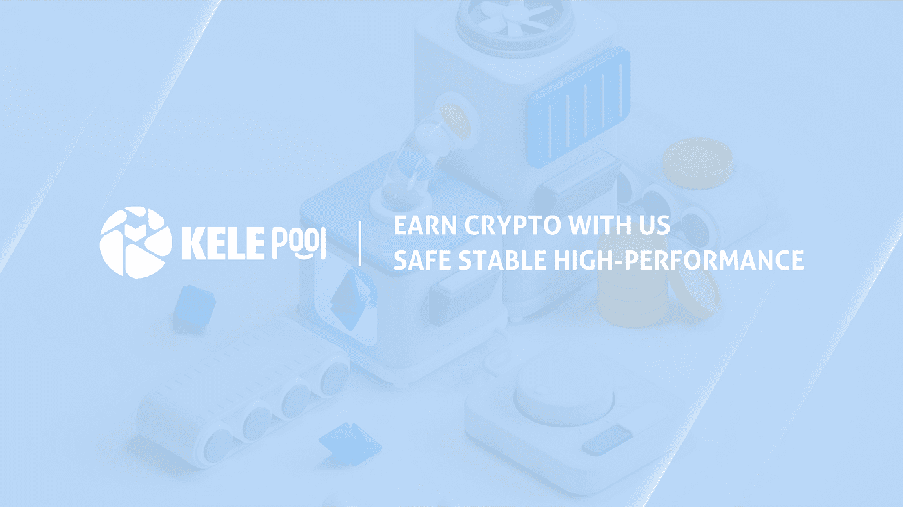

# 关于以太坊的合并你需要知道的

> 原文：<https://medium.com/coinmonks/all-you-need-to-know-about-the-merge-of-ethereum-b45ebf93694f?source=collection_archive---------9----------------------->

在 7 月 14 日的开发者电话会议上，以太坊的主要开发者 Tim Beiko 证实，以太坊合并将在 9 月 19 日左右完成，而第三次也是最后一次 Goerli testnet 合并预计将在 8 月的第二周完成。

到目前为止，以太坊是世界上最大最复杂的区块链生态系统。此次合并是一次前所未有的重要以太坊升级。如果进展顺利，以太坊将首次完成共识机制从 PoW 到 PoS 的转换，也将为其他区块链提供一个有价值的范例。作为投资者，了解以太坊的合并可以为以后的投资决策做铺垫，让我们灵活应对合并带来的机遇和挑战。本文将详细介绍以太坊合并中需要了解的板块，让你快速理清概念。

# 什么是以太坊合并

“合并”是以太坊区块链从使用工作证明(PoW)共识机制转换到利益证明(PoS)共识机制的过程的名称。它被称为合并，因为它是两个独立的区块链并行运行的合并:以太坊主网和一个特殊用途的区块链称为“信标链”。

信标链于 2020 年 12 月 1 日推出，其唯一目的是成为一个利益相关(PoS)区块链。信标链上没有事务、令牌或 Defi 应用，实际上它是一个空链，可以与以太坊区块链合并，取代原来的 PoW 共识机制。

# 我们如何理解合并的过程？

自推出以来，信标链一直与以太坊主网并行运行，相互独立。信标链是基于 PoS 机制的区块链。负责块生成和事务验证的节点是从承诺 ETH 的验证者中随机选择的。所以从上线第一天起，信标链就支持 ETH 质押(股权)和存储(押金)功能。下注 32 个或以上 ETH，可以成为验证者，获得下注收入。目前质押的 ETH 将处于锁定状态，在合并升级正式完成前无法提取资金。

在这个阶段，信标链的功能非常简单，包括承诺 ETH，随机选择节点生成 blocks 和验证事务，奖励和惩罚/砍节点。这些功能只允许维护网络的正常运行，不支持智能合约等功能。相比之下，以太坊 mainnet 已经是一个相当成熟的 PoW 链条，链条上有上万个应用和大量的资金。当信标链并入以太坊主网时，以太坊的 PoW 共识层将被 PoS 信标链取代。信标链可能承担事务执行和数据可用性的责任，事务状态继承自原来的以太坊 mainnet。

*图片来自以太坊官网*

从目前的动作来看，以太坊想通过改造共识机制(PoS)，优化数据存储和验证的效率来提升 mainnet 的性能，Rolllup、分片等技术也将得到进一步应用。为了推动共识机制从 PoW 向 PoS 过渡，以太坊还设置了“难度炸弹”。“难度炸弹”会增加 PoW 计算的难度指数，从而劝阻矿工，保证合并后以太坊成为纯粹的 PoS 链。

> 相关文章
> 
> [秘密采矿与标桩:区别在哪里？](/@kelepool/crypto-mining-vs-staking-what-is-the-difference-dba591704a9)

# 以太坊合并的原因是什么？

*   为以太坊的分片技术做准备

分片技术可以将区块链网络分成几个子网。每个子网将包含一部分节点。网络中的数据存储和事务将被随机分配给每个碎片进行处理。这样每个节点只需要处理一小部分工作，不同分片上的事务可以同时进行，从而整个网络的事务速度更快。利用信标链的协调，以太坊的网络负载将分布在 64 个独立的碎片中，这些碎片同时处理信息，使得整体事务时间更快更高效。

*   对环境更友好

动力对机器(矿工)和电的要求非常高。以比特币为例，比特币网络的年耗电量约为 1213.6 亿太瓦时(TWh)，超过了阿根廷、荷兰、阿联酋的年耗电量。合并后，使用 PoS 的以太坊网络将降低 99.95%以上的功耗。

*   更好的安全和权力下放

相比 PoW 复杂的机器配置、运维，PoS 节点的参与门槛更低，尤其是越来越多的平台支持 ETH 跑马圈地后，不打算投入高额资金的人也可以成为节点的一部分。在安全性方面，Vitalik 曾发文论证 PoS 网络的攻击成本高于 PoW 网络，PoS 被攻击后的恢复能力也优于 PoW 网络。但是，这些已有的观点需要在今后的实践中进一步探索。

# 合并对 ETH 投资者有什么影响

合并对 ETH 经济的改变主要表现在两个方面:一是减少 ETH 的发行，二是 ETH 将逐渐转型为一项稳定的资产。

PoS 可以以较低的成本提供最高级别的区块链安全，并将减少为维护安全而发行的 ETH 数量(即支付给矿工的成本)，允许以太坊将每年发行的 ETH 比例从 4.3%降至 0.43%。由于 PoW 矿工通常倾向于立即出售他们获得的大部分奖励，随着时间的推移，出售的部分几乎占总采矿量的 90%，PoS 可以改变这一现状，并减少 90%以上的新 ETH 发行。

新 ETH 发行的减少通常意味着货币价格将上涨，现在支付给矿商的费用将转移到赌注/验证商，使赌注收益率更高。IntoTheBlock 计算出，在费用激励下，目前 3.8%的年回报率将升至 7.4%。综合这些因素，对 ETH 的需求将进一步增加，成为稳定收益资产。

当然，如果你已经持有一定数量的 ETH，现在也可以参与 ETH 跑马圈地。我们推荐通过[乐可池](https://www.kelepool.com/)进行快速安全的 ETH staking。

> 了解更多信息
> 
> [把你的以太坊押在凯乐坡上是个好主意吗？](/@kelepool/is-it-a-good-idea-to-stake-your-ethereum-on-kelepool-7f136f2eb51d)
> 
> [下注指南:如何下注加密货币](/@kelepool/staking-guide-how-to-stake-cryptocurrency-8957248edf7a)

**安全**:乐可池的跑马圈地智能合约通过了区块链知名权威机构 SlowMist Technology 的审核。和乐可池支持使用分类帐硬件钱包。

**灵活**:与大多数服务形式单一的矿池不同，乐可池支持两种服务模式，您可以自由选择符合您需求的方式。与其他矿池相比，它收取的服务费也更合理。

目前，乐可池支持的货币是 ETH，在不久的将来会推出更多的网络。具体可以去官网了解。

**乐可泳池官网:**

> **跟着我们**
> 
> **🤝[电报](https://t.me/kelepoolcom)**
> 
> **🐦[推特](https://twitter.com/PoolCola)**
> 
> **😊[脸书](https://www.facebook.com/KelePool/)**
> 
> **📺 [YouTube](https://www.youtube.com/channel/UC41u9bo8U8UYNO_rJ6pb8GQ)**

> **加入 Coinmonks [电报频道](https://t.me/coincodecap)和 [Youtube 频道](https://www.youtube.com/c/coinmonks/videos)了解加密交易和投资**

# **另外，阅读**

*   **[什么是保证金交易](https://coincodecap.com/margin-trading) | [美元成本平均法](https://coincodecap.com/dca)**
*   **[支持卡审核](https://coincodecap.com/uphold-card-review) | [信任钱包 vs 元掩码](https://coincodecap.com/trust-wallet-vs-metamask)**
*   **[Exness 回顾](https://coincodecap.com/exness-review)|[moon xbt Vs bit get Vs Bingbon](https://coincodecap.com/bingbon-vs-bitget-vs-moonxbt)**
*   **[如何开始通过加密贷款赚取被动收入](https://coincodecap.com/passive-income-crypto-lending)**
*   **[BigONE 交易所评论](/coinmonks/bigone-exchange-review-64705d85a1d4) | [电网交易机器人](https://coincodecap.com/grid-trading)**