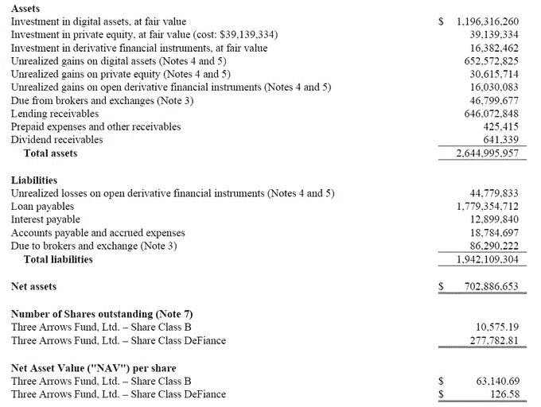
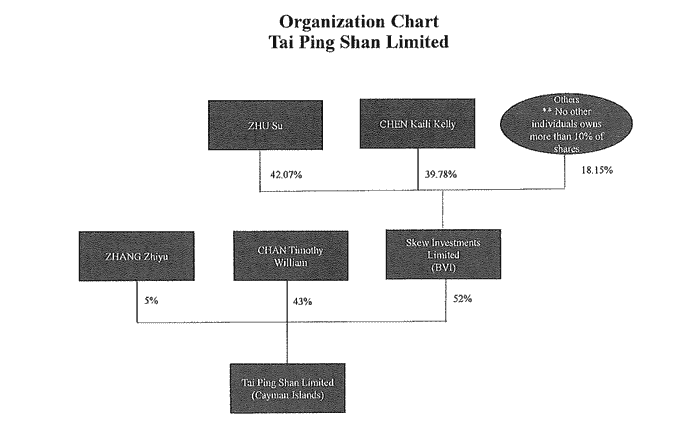

# 你只需要从 1157 页的 3AC 宣誓书中知道

> 原文：<https://medium.com/coinmonks/all-you-need-to-know-from-the-1-157-page-3ac-affidavit-7a650abee611?source=collection_archive---------6----------------------->

我们已经在以前的文章中讨论过 3AC 传奇。关于这一重大事件有许多谣言。根据我现在掌握的信息，大多数债权人认为事情正常，直到 6 月初。

值得注意的是，在 Luna 倒闭后，几家贷款机构询问了 Luna 的敞口，但 3AC 向所有人保证没有什么可担心的。他们甚至提高了贷款利率，以防止贷款被收回。

截至 2020 年底，该公司的净资产为 7.03 亿美元；同样值得注意的是，它当时有 18 亿美元的未偿贷款。

根据这些文件，该公司管理的净资产在 2022 年 4 月达到 30 亿美元。值得注意的是，在 2022 年 5 月 9 日之前，3AC 在卢纳/UST 的敞口为 6 亿美元，这是将他们推到边缘的原因。

然后，他们试图向投资者推销新的机会，不知道这只是拯救已经破产的公司的最后手段。

压垮骆驼的最后一根稻草是 3AC 名为“mobyDck”的账户被加密期权经纪商(Deribit)收取保证金。戴维斯随后试图从 Genesis 安排一笔新贷款来支付追加保证金，但这次他们没有那么幸运。Genesis 对他们支付 3.55 亿美元的额外抵押品更感兴趣。

这种追加保证金的要求是加速该基金灭亡的催化剂。而此时，谣言已经开始在 Twitter、telegram 和 discord 群组聊天中传播。

最后，在多年进行一系列大规模定向交易，并从大约 20 家大型机构借款后，三箭资本(3ac)破产了。到 6 月底，3AC 的破产被广泛报道，整个加密市场开始对这一消息做出反应。创始人跑路了，贷款违约导致了加密领域的大规模蔓延。我们可以在 Celsius 资产文件中看到这一点，其中概述了他们的贷款责任，3AC 是其中的主要部分。

尽管 3AC 的创始人苏竹和凯尔·戴维斯不见踪影，但法律诉讼仍在继续。

但最近，一份法庭文件被泄露。

这份文件包含非常重要的信息，每个加密用户都应该知道。

3AC 总部设在新加坡，本文件是向新加坡高等法院提交的申请，要求承认 BVI 清算程序。这基本上意味着新加坡政府要求他们承认清算程序，并与清算人合作。

这份文件篇幅很长。它有 1000 多页，因为它附加了其他法院文件，这些文件又附加了其他法院文件等。

虽然我没有太多的法律背景来推测这个案件，但从法律文件中可以收集到许多有趣的信息。

虽然其中大部分是心怀不满的债权人的宣誓书，但也有一些有趣的地方。我们来看看。

*   游艇和房子
*   3AC 破产的原因:借贷循环
*   3AC 的不合作
*   债权人
*   3AC 第三箭:太平山

**A .游艇和房子**

如果不先讨论他们现在臭名昭著的游艇，我们甚至无法开始讨论为什么 3AC 会破产。

9 月 20 日至 6 月 22 日期间，朱在新加坡购买了两套昂贵的平房和一艘尚未交付的游艇。这艘游艇出现在清算人的申请中，也在 blockchain.com 的宣誓书中占据显著位置。

December 2021 purchase of S$48.8 million residence in Singapore

3AC 的联合创始人苏(Su)和凯尔(Kyle)对这艘游艇非常自豪，并希望它比新加坡最富有的亿万富翁拥有的任何一艘游艇都要大。但是有一个奇怪的，近乎虐待狂的扭曲。

他们借钱购买游艇，并在需要贷款时用它作为 3AC 的信用证明。

值得注意的是，就在 3AC 被广泛认为资不抵债之前，出现了一些非常可疑的 ETH 和 stablecoin 变动。根据 Blockchain.com 提供的证词，3AC 的联合创始人能够支付游艇的首付款，而忽略了一笔未偿还的贷款。这似乎解释了可疑的资金流动。

最奇怪的是，尽管还有两个月才到期，他们已经开始展示游艇了。

**B .为什么 3AC 破产:借贷循环**

记得我们之前提到过卢娜-UST 的戏剧吗？

现在，看一看泄露的文件，我们肯定地知道，Terra 坍缩完全摧毁了 3AC。他们的风险敞口约为 6 亿美元。这是巨大的！

Reference to LUNA / UST collapse as a catalyst

但尽管如此，3AC 仍继续向投资者(和市场)撒谎，隐瞒自己的风险敞口。他们不断向投资者保证他们没有被 Terra 威胁，他们很好。

Kyle on Telegram responding to concerned creditors

看来，这些贷款人根本没有做功课。举个例子，考虑 Blockchain.com:

当被要求“通知他们”他们的杠杆是否超过 1.5 倍时，Davies(3AC 的联合创始人)在下面的信中签名，确认 TAM 超过 23 亿美元。

当他们问 3AC 是否能偿还贷款时，得到的回答是，“嗯嗯。”

**C. 3AC 的不合作**

随着清算人的介入，许多人预计 3AC 拥有的资产将遭到大规模抛售。3ACs 非流动性投资中的股权和代币协议也将受到影响。3AC 的风险投资也有可能对项目产生负面影响，因为令牌解锁会被清算人卖掉。

清算人还指控凯尔和苏拒绝合作。他们列举了几笔可疑的交易:

*   将 31.6 米长的马厩移至太平山(稍后将详细介绍)
*   将超过 10，000 个 Eth 从 FTX 转移到 Aave
*   把马厩里的 1090 万转到了一个未知地址。

他们安排了一次与凯尔和苏的“介绍性拜访”，两人都出现了。然而，他们的视频和音频都关闭了。尽管被连珠炮似的提问，他们还是保持沉默，什么也没说。清算人还要求进入新加坡办公室，该办公室已被锁起来并被废弃。

他们的律师还表示，苏竹和凯尔·戴维斯在电台保持沉默是因为据称他们的家人受到威胁。然后，当清算人要求提供文件时，3AC 的律师声称他们的新加坡办事处只为管理公司服务。然而，清算人坚持认为，管理公司无疑会收到 3AC 的文件。

Photo of the bottom of office door with letters under it

一段时间后，律师事务所接受了清算人提出的观点，但仍然没有提供访问权。

**D .债权人:**

在写这篇文章的时候，3AC 已经欠了超过 30 亿美元，他们最大的债权人是 Genesis。他们欠创世公司一笔 23 亿美元的巨款

很难想象数字货币集团(Digital Currency Group)的子公司 Genesis 会对 23 亿美元的亏损感到满意。但到目前为止，它们似乎是有偿付能力的。

就像我们在之前的文章中说的，3AC 爆炸造成了很多传染病。他们的债务违约导致了 Celsius 和 Voyager Digital 的破产。以下是一些债权人的索赔:

Credit/liquidation correspondence re: $GBTC shares

Asset liability statement from June 2021

Asset liability statement from June 2021

目前，很难说 3AC 的所有资产是否都已被清算，这有点难以确定。但我们肯定知道，3AC 的大部分公开链上资产已经被清算。

3AC 公共钱包:

*   0 x82 AC 5170 a 837 f 6554d 518 c 71 c 0590723437 e6b 64
*   0x 4862733 b5 FD DFD 35 f 35 ea 8 CCF 08 f 5045 e 57388 b 3

3AC NFT 钱包:

*   0x2e 675 eeae 4747 c 248 bfddbafaa 3a 8 a2 FDD DAA 44 b

**e . 3AC 中的第三支箭:太平山**

在这份文件中，太平山之谜终于被解开了。

该文件显示，泰陈平有限公司是一家开曼群岛实体，由苏柱和凯尔戴维斯的合伙人陈慧琳(作为大股东)间接所有。

业务结构:

该实体最近从一个 3AC 账户转账 3100 万美元。

公平地说，这个实体仍然笼罩在神秘之中。尽管它以前在一些新闻媒体中出现过，但它的完整运作仍然不为人知。Coindesk 写了一篇关于 TPS Capital 的文章，TPS Capital 是太平山有限公司和 Three Lucky Charms 有限公司在新加坡注册的子公司。

TPS Capital 显然是 3AC 的场外交易部门，但太平山有限公司(开曼母公司)是干什么的不得而知。只是一个空壳公司吗？这些投资者是谁？而且，最重要的是，为什么 3AC 在一切都不顺利的时候，却要给太平山有限公司送去 3100 万英镑？

顺便说一句，这不是他们送去的‘场外交易台’；它属于母公司，他们拥有 52%的股份(48%的股份由我们不熟悉的个人持有)。翻阅档案，太平山只出现在一份文件中——米拉娜的要求。

有趣的是:根据主贷款协议，3AC 是太平山有限公司对米拉娜债务的担保人。

3AC 为什么要担保 TPS 有限公司的贷款？再说一次，这不是柜台交易。是拥有一部分 OTC 台的家长！

送给太平山有限公司的三千一百多万呢？没人知道它在哪里，也不知道它是怎么来的。这肯定是一个错综复杂的结构，肯定会让清算人费些力气来确定太平山与 3AC 及其创始人的关系。

**结论:**

3AC 不仅创造了这种借贷循环，而且在交易中也具有欺骗性。此外，Kyle 和 Su 在没有通知任何股东或债权人的情况下将 3AC 进行清算，然后消失，直到 2022 年 7 月 6 日。

他们在亏损程度、杠杆和定向市场敞口以及资金流动方面向贷款人撒谎，而且他们没有向股东/债权人披露自己的清算情况。

这真是令人难以置信！

所有这些都是严重的刑事案件，有可能使这些共同创始人终身逃亡。我们只能希望他们与当局充分合作，让他们的债权人得到补偿。

这也是给所有密码交易员/投资者敲响的警钟。拥有庞大的基金并不意味着你知道自己在做什么。知道什么时候止损，继续前进。不要过度举债，保持你的商业交易直线。

关于传染风险，我们认为 Celsius、矿商和 Mt Gox BTC 解锁是仅存的强制抛售催化剂。即便如此，股票和风险资产仍会受到更广泛的宏观风险的影响。在做任何决定之前，所有这些都应该考虑在内。

愿原力与我们同在。

> 交易新手？试试[密码交易机器人](/coinmonks/crypto-trading-bot-c2ffce8acb2a)或者[复制交易](/coinmonks/top-10-crypto-copy-trading-platforms-for-beginners-d0c37c7d698c)