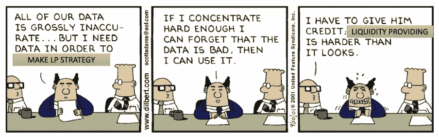

# 你所有的 Uniswap v3 流动性农业计算都是完全错误的！原因如下

> 原文：<https://medium.com/coinmonks/all-your-uniswap-v3-liquidity-farming-calculations-are-dead-wrong-heres-why-20bd47f55d69?source=collection_archive---------0----------------------->

# **2 x 2 = 5**

你知道这是错的，但当你第一次看到它时，你会事后批评自己，并认为:“也许我的计算有问题”。对吗？

嗯，当我发现 Uniswap V3 用户界面上显示的流动性和 TVL(锁定总价值)数字完全错误时，我就是这样感觉的。

Uniswap 是以太坊和整个区块链行业最大的分散金融(DeFi)项目。成千上万的流动性提供者每天都在使用这些数据来构建他们的投资策略。那么这些数字怎么可能不准确呢？

> 我花了几个小时试图在我的计算中找出一个错误，你猜怎么着？我没有犯任何错误。而且情况甚至比不准确的 TVL 还要糟糕。

不过还是一步一步来，从问题入手。

# 问题是

首先，什么是 TVL，它是如何使用的？简而言之，TVL 被定义为当前由用户委托给区块链或协议的所有加密资产的美元价值。例如，这些资产可能是分散式交易所、过桥或借贷协议的总流动性，或者是 PoS 区块链的总押记资产。

加密市场投资者和其他参与者在多种情况下使用 TVL:

1.  方案健康评估。这就是为什么流行的协议在主页上吹嘘他们的 TVL。更大的 TVL =更多的用户信任=更低的风险=稳定的利润。
2.  协议之间的比较。如果我是一个加密交易者，我更喜欢使用 DeFi 工具，比如分散的交易所或桥梁，TVL 更高。
3.  协议增长的衡量。看到协议或项目的 TVL 快速增长的投资者认为这是看好协议象征性价格的信号。

看来知道**准确的** TVL 数字很重要，对吗？

> 但是如果我说关于 Uniswap v3 TVL 的大多数可用数据是误导性的呢？然而，最让我吃惊的是，官方的 [Uniswap 图表应用](https://info.uniswap.org/#/)也有问题！我是这样发现的。

我当时在做一个流动性分析项目，将 Uniswap v3 上的官方数据与我使用原始区块链数据进行的计算进行比较。这一步对于符合最高的数据质量标准至关重要。为了开始验证，我选择了一个流行的流动性池，USDC-韦瑟(0.3%的费用水平)。

看看 Uniswap v3 上的 pool 3——它有令人印象深刻的 3 . 33 亿美元的 TVL(根据撰写本文时 Uniswap 的官方图表)和 6100 万美元的健康日交易量。

我立刻遇到了一个问题:我计算出的 TVL 价值是 1.76 亿美元，而不是 Uniswap 网站上公布的 3.33 亿美元。好吧，bug 发生了。但是在开始调试之前，我决定在最流行的以太坊区块链探索者[以太扫描](https://etherscan.io/)上验证 TVL。从技术上讲，每个 Uniswap v3 池都是一个智能合同。因此，区块链探险家可以显示池中拥有的代币余额，这就是 TVL。

我预计该池的令牌余额会比 Uniswap 报告的 TVL 稍大一些。这是因为资金池持有流动性以及已累计但尚未申请的费用。但是这个余额几乎是 Uniswap 报告的一半，而且，令人惊讶的是，这个数字和我的计算结果是一样的！

对不同资产的流动性进行比较，也显示出巨大的差异。此时，我意识到这个错误与我的数学技能无关。

但是这怎么可能发生呢？经过研究，我发现 Uniswap 依赖于分散的区块链索引服务 [The Graph](https://thegraph.com/en/) 。通过这项服务，任何开发人员都可以为特定的区块链数据用例添加个人分析代码(称为子图)，并通过 API 提供分析。

uni WAP 实验室为 uni WAP 协议分析创建了自己的子图，并通过[图形托管服务](https://thegraph.com/hosted-service)提供这些子图。好在它的代码是[公开的](https://github.com/Uniswap/v3-subgraph)。然而，坏消息是它的 TVL 计算错误。

对该代码的简要分析表明，它考虑了所有互换和流动性事件，但不考虑费用。Uniswap 池对每次互换收取 0.01%至 1%的费用。该费用从交易资产中扣除，并计入流动性提供者。反过来，流动性提供者可以随时收取应计费用。

然而，当前的 Uniswap v3 子图显示的数字就好像没有累计和收取费用一样。因此，Uniswap v3 TVL 的数字与每次交换的实际情况有偏差。

> 你可能会疑惑:“写这篇文章之前，你有没有在 GitHub 上提交过问题单？”是的，这是我发现错误后的第一个意图。你知道吗？那期[已经登录](https://github.com/Uniswap/v3-subgraph/issues/74)，由一个核心开发者在 2021 年 11 月创建！

那么，为什么这个问题没有得到解决呢？我不知道。也许这个错误在发现的时候可以忽略不计。然而，这是一个累积误差，随着每次交换而增加。因此，随着池中费用和交易量的增长，由误差产生的 TVL 差异将导致与现实的更大差异。我们可以看到，在像 USDC 联邦理工学院这样的大资金池中，收取更高的 0.3%的费用——这已经失去了控制！目前几乎是真实数字的两倍。

# 让我们验证总 TVL

好了，我们现在知道了，单个池中的 TVL 数被扭曲了。我们将在下面探讨这如何影响投资决策。但在此之前，让我们看看这些错误如何影响 Uniswap v3 协议的总 TVL。据报道，在撰写本文时，这款 TVL 的价格接近 120 亿美元。

> 你不必是数据科学家也能看出这里有问题。

我们可以从上面看到，据报道，TVL 缓慢但稳定地从 5 亿美元增长到 2022 年 3 月 6 日的 45 亿美元。然后疯狂的事情发生了，TVL 在 2022 年 3 月 7 日被报道为 254b 美元。这是整个以太坊网络有史以来最高 TVL 的 2.5 倍——在一天之内！很明显，这是数据上的错误。接下来的几周，TVL 报 100-200 亿美元。

> 此时，我对 Uniswap analytics 的数据完全失去了信任。但是我们怎么才能知道真正的 TVL 呢？我有两个选择。

**选项 1** —叉出并固定 Uniswap v3 子图。这个选项的缺点是子图重新索引需要几天时间。我也不喜欢图形使用的 GraphQL 语言。

幸运的是，我有**选项 2**—[Datamint](https://datamint.ai/)的高性能分析数据库，用于所有 Uniswap v3 和以太坊数据，随时可用于复杂的在线查询。

经过一些实验，我创建了下面的算法来精确计算 TVL。查看下面的分步过程。

1.  使用这两个步骤计算所有现有 Uniswap v3 池的 TVL。
2.  将所有 ERC-20 代币转入和转出池合同(包括所有无人认领的费用)相加，并匹配[以太网扫描](http://etherscan.io)上的代币余额
3.  添加所有流动性事件，包括流入和流出，然后将所有掉期事件添加到**费用账户**
4.  比较这两种方法，确保不存在无法解释的差异
5.  移除少于 50 次交换或 0.00000000000001 令牌量的废弃和空池(检测到 7，863 个池(包括 2，083 对稳定池)，我的算法移除了 112 个空/废弃池)

6.为每个代币寻找稳定硬币的路径，以将池 TVL 转换为美元值

7.移除具有破损美元值的低流动性池，因为一些池在完全移除流动性后可能显示不足的值(查看下图作为示例)

8.将所有剩余货币对的 TVL 转换为美元值，并将它们相加

经过多次反复核对，我得出了一个 TVL 的计算方法。我启动了它，想在计算执行的时候去喝咖啡，但是它在我站起来之前就结束了。这是使用高性能分析数据库的唯一缺点。

> 你准备好看到结果了吗？

> 几乎比报道的$ **11，8b…** 少 **4 倍**由你自己下结论。

***免责声明*** *:我的计算可能包含误差。在面向企业客户的数据项目中，我们使用记录的方法、自动测试和许多其他工具来实现最高的数据质量。这些工具对于像这样的个人研究项目来说是多余的。这项研究强调了现有数据中的明显问题，而不是提供最终的解决方案。*

# 好的，我们会修正 TVL 计算——会有帮助吗？

问题不在于错误的数字，而在于我们根据这些数字做出的决定。例如，大多数流动性提供者的利润计算器使用这些数字进行预测。

然而，修正 TVL 计算并不困难。要么 Uniswap 实验室在他们的子图代码中修复它，要么计算器开发人员开始使用其他数据源。核心问题是，我们能否确信计算器的预测是正确的。

> 我做了一些计算，简短的答案是— **甚至不接近**。

我知道这是个大胆的主张。许多流动性提供者使用现有的计算器，并影响耗资数千万美元的决策。但是，让我们来看一下计算步骤，以便您可以做出自己的判断。

首先，让我们回顾一下 Uniswap v3 协议的一些核心概念。

其主要创新之一是集中流动性。本质上，通过 Uniswap v3，您可以选择您希望您的资金发挥流动性提供者作用的价格范围。这是一个惊人的概念，可以给协议用户带来巨大的价值。流动性提供者限制了他们对非永久性损失的暴露，当波动性较低时，交易者可以享受较小的价格滑动。但是所有这些潜在的好处都是有代价的。

因此，我们想了解 Uniswap v3 流动性提供商的收益是如何计算的。

在 Uniswap v3 中，流动性提供者选择提供流动性的价格范围。一旦价格在这个范围内，他就会得到他那份交换费。乍一看，流动性提供者希望他的流动性头寸的价格范围尽可能宽。但是，流动性在这个范围内按比例分配。因此，范围越大，每笔交易的掉期费用就越低。

在这个例子中，选项 A 显示流动性提供者选择了一个更宽的价格范围，而选项 2 显示了一个相同金额的更窄的价格范围。假设在这两种情况下，价格都在选择的价格范围内，流动性提供者在选项 b 中获得 3 倍以上的费用。但是，如果价格波动更大，流动性提供者可能会在选项 a 中获得更高的利润。

> 因此，在现实中，选择正确的价格区间取决于在错过价格的风险和每次交易获得较低回报之间找到最佳平衡。

还有一个参数会影响流动性提供者的利润，并且经常被忽视。我不知道有任何 LP 利润计算器考虑它，这个参数可以改变一切。你现在一定在想这是什么。这是 LP 的分布。考虑下面的例子:

在这个例子中，两个流动性提供者(LP1 和 LP2)有头寸。LP1 的仓位很窄，为 3 美元。LP2 有 5 美元的宽仓。在这种情况下，如果价格没有离开 LP1 的位置范围，他将获得比 LP2 多 3 倍的费用。那是因为 LP2 在这个区间只有 1 美元。而这 1 美元是和 LP1 的 3 美元竞争的。

如果您观察任何 Uniswap v3 池的流动性分布，您会发现它并不均匀。

门槛越高，竞争越激烈。流动性提供者需要在选择有竞争力的区间和价格冲击概率较低的区间之间找到平衡。这就是为什么这种分布在 LP 利润预测和策略构建中起着重要作用。唯一的问题是…我不确定这个分布是否计算正确。

# 好像这还不够——流动性狙击手

成为流动性提供者就是要猜测价格、竞争状态和交易量。如果一个有限合伙人有一个愿望，那就是事先知道交易的未来以调整流动性头寸。

但是如果我告诉你这是可能的呢？

在研究过程中，一些不同寻常的流动性提供商引起了我的注意。他们一天内多次增加和减少大量流动性头寸(超过 1000 万美元)。更令人惊讶的是，他们总是在同一块增加和减少流动性。

让我们看一个例子:

我们有三个交易，都在块 15413416 中，位置 3-5，以自下而上的顺序执行。采用 Execute 方法的第一笔交易是一份名为“MEV Bot”的合同，为 USDC-韦瑟基金增加了 2200 万美元的流动性。

MEV Bot adding liquidity

第二笔交易是通过 WETH 从 USDC 到 DogeChain 的掉期交易。这是一笔价值约为 16，500 美元的普通掉期交易。

Standard swap transaction

第三笔交易又是“MEV Bot”，从 USDC-韦瑟资金池中取走了 2200 万美元的流动性。

MEV Bot removing liquidity

例子中发生的事情被称为“**流动性狙击**”。让我解释一下这是如何工作的:

1.  有人发了一笔交易，把 USDC 换成了多吉钱
2.  MEV Bot 在 mempool 中检测到了这个事务，并使用 Flashbots 技术或类似技术激活了一个与矿池的私有链接
3.  MEV Bot 向矿商支付报酬，以包括一项掉期交易和两项特定顺序的交易，从而提取价值
4.  MEV Bot 为一个非常狭窄的价格区间增加了如此多的流动性(2200 万美元)，如此有效地，USDC-多杰钦交易的所有费用利润都归他所有
5.  MEV Bot 然后移除流动资金并赚取费用(约 35 美元)

因此，他扣除汽油费后的毛利润约为 30 美元。不是很喜欢？是的，但是他在一分钟内多次执行这个策略，所有这些加起来。可以[自己去查](https://etherscan.io/address/0xa57bd00134b2850b2a1c55860c9e9ea100fdd6cf)。

作为流动性提供者，这对你意味着什么？这意味着流动性狙击手可以从你的费用利润中拿走很大一部分。

# 结论

请不要让我难过。我坚信 Uniswap 是一个具有巨大潜力的伟大项目。我也尊重 Uniswap v3 核心的集中流动性的思想。然而，我发现 Uniswap 生态系统的分析部分还远未成熟。我相信这种情况很快就会改变！

让我总结一下我的研究发现:

1.  Uniswap v3 海图中的 TVL 数据非常不准确。同样的错误存在于所有依赖官方 Uniswap v3 子图的分析工具中。
2.  Uniswap v3 TVL 的总费用为 314 亿美元，而官方网站报告的费用为 118 亿美元(在撰写本文时)。
3.  Uniswap v3 流动性提供商的计算器对现实生活中的策略没有什么价值，因为它们没有考虑竞争和流动性狙击手。

Famous Dilbert series modified to fit liquidity providers’ reality.

幸运的是，您现在可以更好地理解 Uniswap v3 流动性池在现实生活中是如何工作的，并可以相应地调整您的研究。

我没有资格提供财务建议，但我认为只有两个选择可以建立一个显著的流动性提供策略:

1.  **简单的**。使用历史性能数据。尝试一些小额度的流动性头寸，看看哪些选择效果更好。显然，这只有在假设市场稳定的情况下才行得通。
2.  **高级**。进行研究并相应地优化 LP 策略。正如我们在上面提到的，这需要深入理解 Uniswap v3 协议、数学和博弈论能力，以及强大的数据分析工具来实时处理大量数据。

这两种选择都有一个共同点——你的决策是基于数据，而不是直觉或随机工具。有时候处理数据很困难，但这是值得的。

在 [**Datamint**](https://datamint.ai) ，我们随时为您的定制数据项目提供帮助。

# 愿数据伴随你！

**更新(21.09.2022):** 截至 9 月 21 日(文章发表 3 天后)，Uniswap 实验室在 UI 级别修复了 TVL 显示([提交](https://github.com/Uniswap/v3-info/commit/be78c8a87c37fc95d1aefdb1fff081f902989a02))。子图也被[更新了](https://github.com/Uniswap/v3-subgraph/issues/74)，所以在重新同步之后(根据开发者的估计，这需要大约 5 周的时间)，它也会有准确的数据！

*关于作者:* Ivan Vakhmyanin 是一位拥有多年经验的数据分析和可视化(BI、大数据、数据科学)专家。他也是一个区块链和 Web 3.0 专家，使来自领先的区块链平台(以太坊，BNB 智能链，索拉纳等)的链上数据可供分析。Ivan 热衷于通过为专家和高管开发数据驱动管理领域的教育和项目来分享经验。

**Datamint** 是一家专注于定制研发的增值区块链数据提供商。欲了解更多详情，请访问我们的网站:https://datamint.ai

*原刊有***。**

> *交易新手？试试[加密交易机器人](/coinmonks/crypto-trading-bot-c2ffce8acb2a)或者[复制交易](/coinmonks/top-10-crypto-copy-trading-platforms-for-beginners-d0c37c7d698c)*