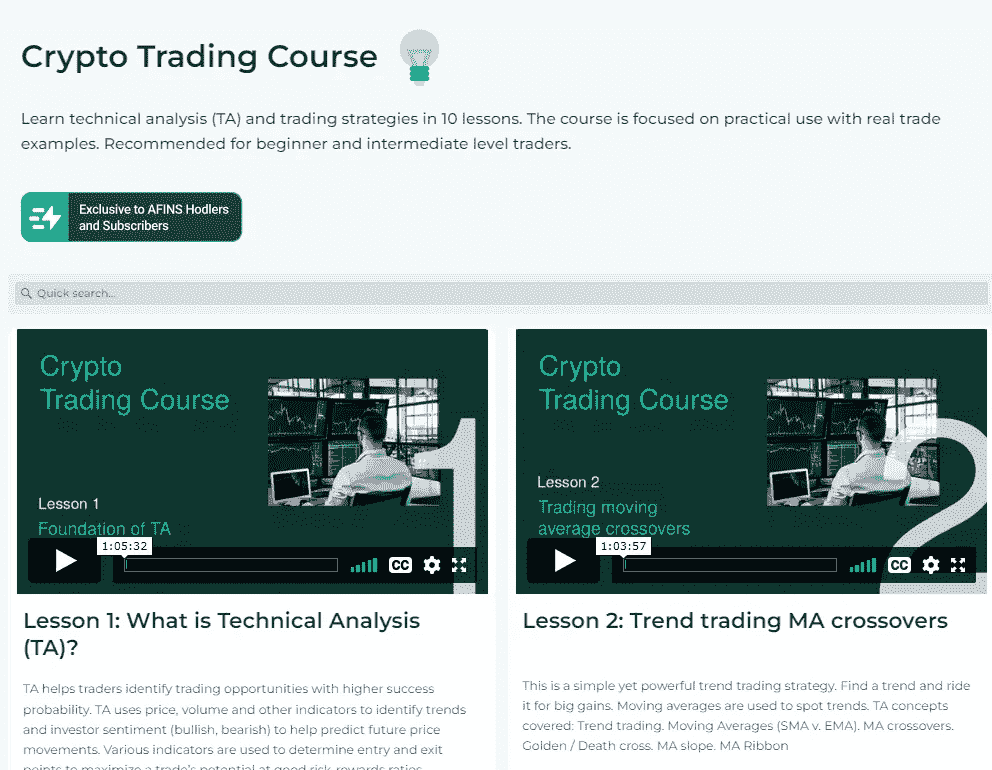

# altFINS 推出新的教育——与 Richard 一起学习交易密码

> 原文：<https://medium.com/coinmonks/altfins-launched-new-education-learn-trading-crypto-with-richard-17a2a5f728fb?source=collection_archive---------35----------------------->

# 加密交易视频

**跟** [**理查德**](https://www.linkedin.com/in/richard-fetyko-6765b63/) 学习交易密码，CEO &创始人[奥特莱斯。观看他在 altFINS 平台上的交易设置、技术分析和交易执行。](https://altfins.com/)

理查德在华尔街工作了 14 年，先是在詹尼·蒙哥马利·斯科特等投资银行担任涵盖互联网和科技行业的股票研究分析师，然后在一家名为 Twin Capital 的家族公司担任了 6 年的投资组合经理。在华尔街工作期间，费泰科被视为顶级分析师之一。

他将与 altFINS 用户分享他的投资和交易经验。他们可以跟踪他的交易，学习如何阅读加密图表，做技术分析，研究链上数据并执行交易。

altFINS 用户可以获得灵感，复制交易，学习如何在 altFINS.com 找到交易思路

Source: [altFINS](https://altfins.com/education)

我们建议初学加密的交易者先从 altFINS **加密交易课程**开始。

# 密码交易课程

**10 节课学习技术分析(TA)和交易策略。**本课程侧重于实际应用，包含真实的贸易案例。推荐给初级和中级交易者。

Source: [altFINS](https://altfins.com/education)

我们为新交易者开设了一门课程，介绍技术分析的基本概念，并演示如何充分利用我们强大的平台来揭示成功的交易概念和策略。

这实际上就是 altFINS 平台。这是一个寻找潜在成功的加密交易机会的工具。

下面是 altFINS 加密货币交易课程的概述:

1.  **TA 的基础。**
2.  策略:**交易均线交叉。**
3.  策略:**在上升(下降)趋势中回调。**
4.  策略:**势头&上升趋势。**
5.  策略:**支撑位超卖(阻力位超买)。**
6.  策略:**交易区间。**
7.  策略:**交易关键水平(突破和进场)。**
8.  策略:**交易图表形态。**
9.  风险管理。
10.  **保证金账户交易&卖空。**

把你的时间投入到 altFINS 教育中。了解更多关于 altFINS.com 的信息。

> 交易新手？试试[加密交易机器人](/coinmonks/crypto-trading-bot-c2ffce8acb2a)或者[复制交易](/coinmonks/top-10-crypto-copy-trading-platforms-for-beginners-d0c37c7d698c)