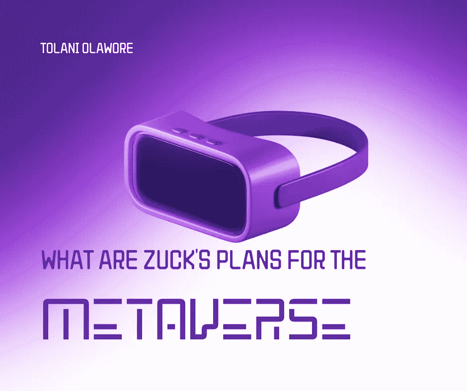

# 扎克对元宇宙有什么计划？

> 原文：<https://medium.com/coinmonks/although-living-in-a-headset-and-experiencing-life-through-the-metaverse-may-seem-like-a-distant-5043ab20d66c?source=collection_archive---------27----------------------->

虽然戴着耳机生活并通过元宇宙体验生活似乎是一个遥远的可能性，但马克·扎克伯格认为这将在几年内成为现实。

仅在一年内，马克·扎克伯格的 Meta 就在元宇宙研究上投资了超过 100 亿美元。他花了一大笔钱在什么上，他希望通过创造虚拟世界来实现什么？

如果元宇宙真的成形了，那也不会在一夜之间发生，也不会在很多年后完全实现。但 Meta 的首席执行官坚信这将会发生，并断言它不会是一家公司独立开发的任何东西。尽管 Meta 正在开发元宇宙技术，但据他所说，它实际上是在创造支持元宇宙的“基础技术”。如果要实现元宇宙，将需要更多的企业而不仅仅是 Meta 来支持它。像 Roblox 这样的游戏开发商和 Nvidia 这样的芯片制造商被扎克伯格命名为重要参与者。

Meta(脸书的母公司)提出的虚拟世界仍在开发中。人工智能是它的主要组成部分，这种技术将使一切都发挥作用。Meta 的首席执行官马克·扎克伯格(Mark Zuckerberg)最近举行了一次演示，展示了他的团队正在进行的一些人工智能相关项目，在他看来，这些项目对于“沉浸式互联网”的成功至关重要。他们都有一个共同点就是声音。

开发一种全新的数字助理是该公司在确保人们能够穿越这个新的增强世界时将面临的困难之一。我们将在元宇宙体验到大量的视觉信号，我们可以通过虚拟现实护目镜访问这些信号。为了防止信息过载，加强机器(元宇宙)和人类(化身)之间的交流将是至关重要的。

此外，扎克伯格展示了 BuilderBot，这是一个语音激活的机器人，使用户能够在演讲中使用语音命令改变他们的虚拟环境。扎克伯格的头像指示“在那里放一片海”，一个虚拟的海洋立刻出现了。

这家科技公司希望覆盖 15 亿人，即世界人口的 20%，他们不懂英语、西班牙语或汉语普通话，传统翻译系统无法为他们提供良好的服务。我们还看到了 Quest 的生产和发布，这款虚拟现实护目镜是通往元宇宙的门户。

如果扎克伯格如愿以偿，元宇宙的崛起将直接损害电视行业。他声称，最终个人将能够在智能眼镜内观看他们喜欢的电视节目和电影，而不是在屏幕上。

在一封信中，扎克伯格表示，该公司即将推出的社交网络将“更加身临其境”。他解释说，存在感将是元宇宙的特点。“在元宇宙，你几乎可以做任何你能想象到的事情，包括会见朋友和亲戚、工作、学习、娱乐、购物和创作，以及全新的体验，这些体验与我们现在对手机或电脑的看法并不相符。”

> 交易新手？试试[加密交易机器人](/coinmonks/crypto-trading-bot-c2ffce8acb2a)或者[复制交易](/coinmonks/top-10-crypto-copy-trading-platforms-for-beginners-d0c37c7d698c)