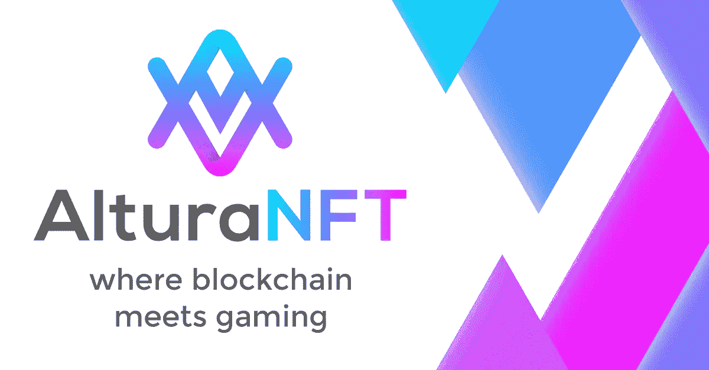

# altura——游戏开发者的 Web3 平台

> 原文：<https://medium.com/coinmonks/altura-the-web3-platform-for-game-developers-92a4d6a55651?source=collection_archive---------16----------------------->

Altura helps developers integrating their game into the Web3 ecosystem

将你的视频游戏从 Web2 带到 Web3 是困难的，需要大量的 Web3 知识和全新的基础设施。 **Altura** 通过提供这种基础设施解决了这个问题，它使 Web2 游戏公司向 Web3 的过渡变得非常容易。

**在本文中，我们将介绍:**

> ***1。什么是 Altura？***
> 
> ***2。阿尔图拉的目标***