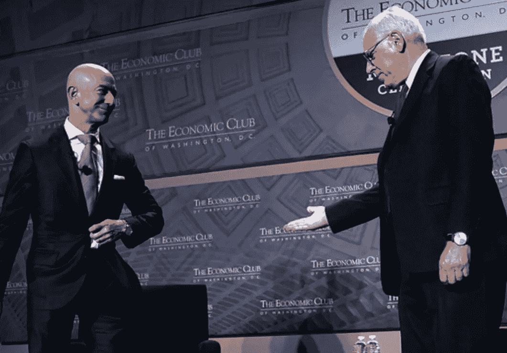

# 亚马逊——凯雷集团 2600 亿美元的错误

> 原文：<https://medium.com/coinmonks/amazon-the-carlyle-groups-260-billion-mistake-a8bdd28e294?source=collection_archive---------3----------------------->

## 遗漏和过早销售的错误

Image by [Alex Wong](https://www.zimbio.com/photos/David+Rubenstein/Jeff+Bezos/so6oMA6ztzv/Jeff+Bezos+Speaks+Economic+Club+Washington) from [Zibio.com](https://www.zimbio.com/photos/David+Rubenstein/Jeff+Bezos/so6oMA6ztzv/Jeff+Bezos+Speaks+Economic+Club+Washington)

avid Rubenstein 是私募股权公司凯雷集团的联合创始人和联合主席，也是几个公民和文化机构的主席，还是探索“成功领导力”的热门播客 David Rubenstein Show 的主持人。