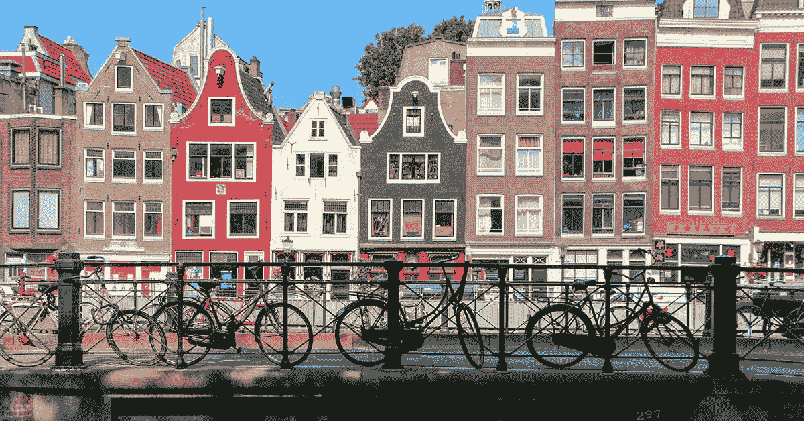
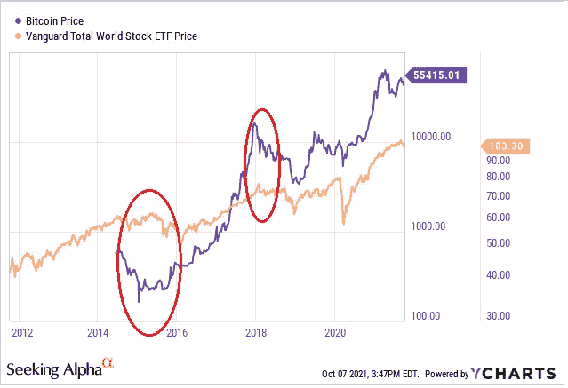
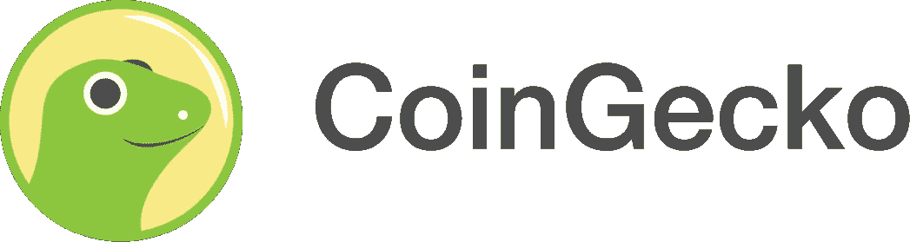
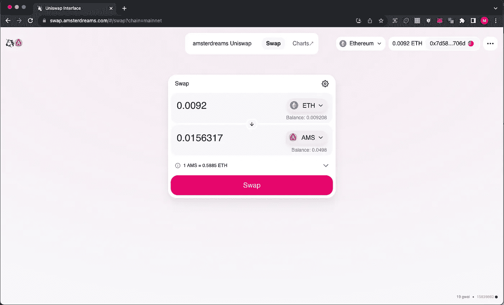

# amsterdreams——区块链创业日记

> 原文：<https://medium.com/coinmonks/amsterdreams-diary-of-a-blockchain-startup-53ac66c28c39?source=collection_archive---------22----------------------->

**TL；博士**——六个月前，创业公司 ehm……开始致力于通过区块链提供房屋。这篇长文讲述了这个项目的一些情况，但主要是我们在创办这家公司时遇到的情况。如果你想创建自己的(科技)创业公司，希望能鼓舞人心，否则至少要有娱乐性:这可不是他们在 MBA 教材中所说的创办公司的方式！😇

# 代表团

[*amsterdreams*](https://amsterdreams.com) 是一家位于区块链的精益房地产初创公司，旨在解决当今世界的两个问题。

第一，现在很多人很难拥有自己的房子，尤其是第一套房子。许多群体，即使他们有钱支付每月抵押贷款，也无法获得抵押贷款。银行非常保守，有一个很长的标准清单(而且越来越长，越来越不直观)。你是…外国人吗？我们不会让你买房子。企业家？当你显示三年的利润时再回来。个体经营还是临时合同？没有。一个年轻人有了第一份工作，却没有自己的资本？抱歉。

Amsterdam, Netherlands is a wonderful place to live. Accomodation is expensive though and getting a mortgage can be a challenge if you don’t tick all the (bank’s desired) boxes. [picture by [Gaurav Jain on Unsplash](https://unsplash.com/photos/2K2SR19RLg8)]

租房是一个可行的选择，但也存在挑战。尤其是现在利息在上涨，越来越少的人能成功申请到抵押贷款，所以自从疫情的外国人回来后，已经非常火爆的租赁市场变得更加火爆。此外，在私营部门也有一些奇怪的现象:除了他们的财务报价，潜在的租房者也经常被要求提交一份简历——推销自己！歧视从来没有被明确提及，但是根据简历来选择人不正是这样吗？

最后，对许多人来说，最大的问题是每月支付的租金不见了。这是 Spotify 的模式:你每月付费，但你永远不会拥有任何东西。更别说你拥有一栋睡觉时还在升值的房子。

第二，提供在不成为房地产大亨的情况下投资房地产的可能性。不管你住在世界的哪个角落，也不管你是租房还是买房，决定把你可能有的积蓄投资到哪里都是一个挑战。显而易见的选择包括储蓄账户、股票市场和比特币等加密货币。

即使在后 Covid 时代通胀飙升、乌克兰战争导致欧洲能源价格飙升之前，这三个选择都不理想。多年来，储蓄账户的利率接近于零，所以没有增长——现在随着高通胀，情况变得更糟。加密货币可能非常有利可图，但由于大多数替代硬币纯粹是由供需驱动的，因此它们也非常不稳定。这就是为什么我认识的大多数人都把他们的一些积蓄投资在加密上，但不要太多。你不会想一天十次检查你的手机，看看你的存款是否损失了 30%的价值！股票市场也是如此:如果你知道自己在做什么，并且跟踪公司、它们的成功和问题、竞争对手的动向、市场趋势等等，那么你会非常成功。但是如果你只是把钱放在那里等待，你可能会面临短期的损失。

Correlation between Bitcoin and a world average stock price from 2012 to October 2021\. While there is a correlation between the securities, the swings in cryptocurrency can be much bigger and much more sudden than with stocks that are backed by companies taking part in the economy. This makes investing in crypto still ‘scary’ for many people. Source: [Seeking Alpha](https://seekingalpha.com/article/4459110-correlation-between-bitcoin-and-stock-markets-suggests-new-correction-coming).

# 两个问题的一个解决方案

我不会用那个可怕的，残酷的比喻来比喻鸟和石头。但是在 amsterdreams，我们想:我们能不能用一个问题解决另一个问题？如果有一种方法可以把很多小额的钱聚集在一起，然后用它来买房子，会怎么样？然后，我们可以让那些无法或不想获得抵押贷款的人获得这些房屋，这样一来，把钱投在 T2 的投资者和住在这些房屋里的人都可以从房地产市场的增长中受益。

如果有某种形式的技术能够以透明和安全的方式进行管理，而不依赖于必须托管所有资金的中央实体，那该多好啊…

你猜对了:很快，我们就有了区块链技术。准确地说，是以太坊区块链，智能合约将使我们能够定义一个令牌来反映一块房地产和代表任何特定房屋的 NFT 等对象。

[T5【清幽】T6](https://amsterdreams.com)横空出世。

# 怎么开始的

更正最后一句话:阿姆斯特丹梦想的*想法*诞生了。现在真正的工作开始了。将 amsterdreams 合并为荷兰 b . v——一个类似于美国有限责任公司的法律实体——非常简单快捷。然后，当然，我们必须做一些法律研究，看看哪些法律会影响我们的运营，以及——非常重要的是 amsterdreams 的活动如何不会被归类为银行等金融机构。当人们想买房时，我们给他们提供了去银行以外的另一种选择，我们最不想做的事情就是成为银行！甚至不是因为杰出的中本聪的无政府主义理由:我们不讨厌银行，也不想让它们过时。如果有的话，我们希望为银行不想要的客户提供解决方案。但我们不想成为一家银行，因为巨大的管理费用，a)令人厌烦，b)最终将由我们的客户支付。

任何优秀的营销人员都知道，任何成功的价值主张都始于验证。在英语中，这意味着我们需要确保人们喜欢这个想法，并会接受它——字面上的意思。因此，我们利用 [Pollfish](https://www.pollfish.com) 的优质服务进行了市场调查。我们不仅得到了许多积极的回应，还得到了一些关于人们所关心的问题的非常有价值的信息。稍后会详细介绍。

An invaluable step in any startup is testing the market to make sure what the company will provide is actually recognized and needed. The fact that you think it’s a good idea says nothing about a broader customer segment. [photo by [Aramudi on Unsplash](https://unsplash.com/photos/SELXIJwN24s)]

接下来，我们必须同时开始 IT 和营销。我们需要公司的数字基础设施，包括网站，当然还有区块链的合同。网站在传播信息方面至关重要。我们在脸书广告和付费谷歌搜索上花了相当多的种子资金。人们需要知道阿姆斯特丹梦的存在！与此同时，我们整个夏天都在为 9 月 1 日推出我们的 token 而努力。

我不想进一步宣传 amsterdreams，也不想喋喋不休地谈论它的工作原理和好处。这是一篇关于区块链创业公司的文章。如果你对此感兴趣，欢迎来到 amsterdreams.com 的。

# 抗体

正如历史上的任何创新一样，我们的创新也不可避免地遇到一些不相信的人。我称之为社会的抗体，它会试图用诸如“那将永远不会起作用”这样有充分依据的说法来扼杀任何新事物。这是意料之中的事，但有些反应非常有趣，即使当时令人困惑和沮丧。

Any innovation is subject to change. People probably said to Oliver and Wilbur Wright: that will never fly (ha ha). [By John T. Daniels — File:Wright_first_flight.tif, Public Domain, [https://commons.wikimedia.org/w/index.php?curid=75148383](https://commons.wikimedia.org/w/index.php?curid=75148383)]

以开立银行账户的简单过程为例。非常有用，如果你想支付你的网站运行的服务器，对不对？如今，如果没有信用卡，很难经营一家企业——或者这会导致不专业的、可能不被认可的做法，比如用个人账户和信用卡支付费用，然后将它们计入公司账户。

一家主要的荷兰银行在他们的网站上做了一个我们喜欢的广告:在线申请你的商业账户，两天内得到回复！我们天真地认为，这意味着在我们完成 KYC 流程后，创建账户需要两天时间。我们发现，在一些荷兰银行因通过可疑的离岸业务为洗钱提供便利而被处以数百万欧元的罚款后，他们的内部流程如此堵塞和缓慢，以至于银行的员工会在我们与他们的电话中大声抱怨！就像把抵押贷款给外国人:amsterdreams，你在做什么？房地产？哦，亲爱的…

最后，程序花了两个月而不是两天，我们的请求被拒绝。(那时我们已经在另一家银行获得了一个账户)。然而，请求被拒绝的原因很有趣。在这两个月里，银行的律师已经确认了我们自己的评估，即我们不是金融机构(感谢银行，免费的法律咨询！)而且 amsterdreams 的“先租后拥有”的概念实际上是对荷兰房地产市场的一个很好的补充。

拒绝的最后一个原因是我们使用了区块链技术。光是这个词就已经竖起了一面红旗。我记得我问过我在银行的客户经理:“那么……如果我告诉你，我们将在我的硬盘上使用 Excel 表来管理代币和房屋所有权，这远没有那么安全，也非常容易被黑客攻击，那么你会批准吗？”

她咯咯地笑着说:“基本上，是的。”

其他一些至今仍让我们有些受伤的否认来自 CoinGecko 和 Etherscan.io 平台。区块链的经济就是去中心化:没有任何一个实体或看门人必须“批准”或“允许”你做什么。就拿上面银行账户的比喻来说:获得一个银行账户需要两个月的艰苦过程，但我可以通过在 Mac 上安装 MetaMask，在五分钟内建立一个新的以太坊“账户”。

CoinGecko refused to list the new AMS token because the trading volume was too low. We wanted to get it on the platform to increase trading volume. 🐔/🥚

事实证明，与集中的实体合作是有价值的。例如，流行的分散式 exchange Uniswap 从 CoinGecko 获得了许多令牌定义。如果没有它，用户必须将智能合同地址复制粘贴到用户界面中——不太友好，而且很容易出错。因为我们想为人们提供用以太和 ERC20 代币交换 amsterdreams 的可能性(我们后来称之为代币)，所以我们想尽可能让使用变得简单。

CoinGecko 拒绝了我们。两次。最主要的原因似乎是我们的 Uniswap 流动性池中“交易量不足”。嗯，是的，我们知道……这是登上 CoinGecko 名单的全部意义。我们问什么才算是合理的交易量……？没有回答。

Etherscan.io 有一个功能，您可以在其中添加一些关于令牌智能合约的元信息。我们对此并没有特别强烈的感觉，但主要认为这将有助于动摇 CoinGecko。你猜对了——请求被拒绝。“你的社交媒体上有一种负面情绪”，以太扫描说。我们很惊讶(现在也是)。我们实际上认为我们的社交媒体是愉快和乐观的。我们问他们是什么意思，但是……没有回答。

利用 Uniswap 的开放源码特性，我们能够在 swap.amsterdreams.com 创建我们自己版本的用户界面。它使用与 Uniswap 相同的底层智能合约，但 AMS 令牌是默认列出的，并且(我们情不自禁地)在上面放上了我们的徽标。

The amsterdreams fork of Uniswap at [swap.amsterdreams.com](https://swap.amsterdreams.com). It uses the exact same Uniswap smart contracts under the hood, but the user interface is a bit simpler and lists AMS by default.

这就是我们如何发现，有点令人失望，抗体甚至存在于区块链世界，尽管它充满理想主义和强硬言论。我们知道我们最终会到达那里。对我来说，我也知道有一些带有代币的骗局和小把戏。但作为一个理想主义的、眼界开阔的初创企业家，令人恼火的是，运营这些网站的人甚至不让我解释我们在做什么，为什么他们会对此感到兴奋，并回答我的问题，即我如何才能让他们相信我们不是一个骗局。

不管怎样，创业路上的小问题。两年后，我们会对此一笑置之。从现在开始。

# (否)风险资本

我们在创办公司的早期就做出了决定。一个我们知道会让生活变得更艰难的决定，尤其是在一开始:不寻求任何外部资本，更不用说风险资本了。启动资金有很多方式可以让一切变得更容易。除了启动资金这一显而易见的事实之外，投资者的支持可以被视为良好的公关:如果投资者喜欢它，如果它通过了他们的审查，那么它肯定是一笔好投资。当然，企业家精神的历史充满了背景良好的企业仍然失败的例子，但它仍然说明了一些问题。

有一个叫 Crypto Casey 的视频博客/播客最近展示了一个非常好的清单，她用这个清单来决定是否投资一个项目。amsterdreams 在她的许多标准上得分很高，但其中之一是看该项目的财务支持者。抱歉，amsterdreams 没有。除了一些用于 IT 和营销的种子资金，正如我前面所描述的，所有的钱都来自——而且必须来自——通过购买代币进行投资的人。

We decided not to involve banks or venture capital in amsterdreams to maintain our ‘for the people, by the people’ philosophy. Photo by [Miquel Parera](https://unsplash.com/@miquel_parera_mila?utm_source=medium&utm_medium=referral) on [Unsplash](https://unsplash.com?utm_source=medium&utm_medium=referral)

那么，我听到你问，为什么我们没有选择容易的道路？实际上有两个原因。第一，风险资本想要控制。例如，他们可能坚持认为我们提供非常昂贵的公寓以获得最大回报，但这对于许多我们愿意服务的客户来说是不可能实现的。或者可能有一个退出的计划:被更大的公司收购或者——异端邪说！—一家银行。合并和收购没有错，但是(依我们的愚见)现在考虑这个还为时过早。

其次，启动 amsterdreams 的原因之一是，如今的房地产市场(在阿姆斯特丹，但可能在大多数其他高需求地区也是如此)存在的一个问题是市场中的巨额资金的力量。

想一想:为什么阿姆斯特丹的房产价值如此之高？需求大，供给少。为什么没有供应？因为没人卖。为什么没人卖？因为拥有房产(每年升值 10-20 %)更有利可图，除此之外，还能收取租金！一套 2021 年价值 50 万欧元的公寓在 2022 年价值 58 万欧元，每月租金可能达到 2000 欧元左右。这相当于每月 9 千欧元的收益，接近原始价值的 2%。明年还会如此。那么为什么要卖呢？

amsterdreams 希望提供一种替代方案。但是要做到这一点，我们必须从零开始。购买我们第一批资产组合的每一欧元都必须来自象征性销售，要么是我们网站上类似零售的文字销售，要么是 Uniswap 上的掉期交易。钱肯定在市场上:每天的比特币交易量通常超过 300 亿美元，而以太大约是这个数字的一半。amsterdreams“只”需要几百万英镑就可以开始在阿姆斯特丹市提供房产。但是从零到一百万还很远。

# 怎么样了

开始了😊

老实说，我们在 9 月 1 日推出 AMS 代币的那一刻，当然就梦想着它会飞出去。也许我们的网站会因为巨大的兴趣而关闭。一周后，我们需要铸造额外的代币…

那没有发生。本着完全公开的精神，第一天我们卖了…绝对没有。第一批交易开始运行花了一天半的时间。从那以后，已经有几十个客户加入了。当然，你可以通过查看[0x 571 b 265d 8 f 61 CD 71 e 6 ce 54569 da E6 ADB B1 C5 ebb 9](https://etherscan.io/token/0x571b265d8f61cd71e6ce54569dae6adbb1c5ebb9)的 amsterdreams token 智能合约来验证我这里所说的一切。如果您这样做，您还会发现售出的代币总数(一个 AMS 代币大约花费 1，000 欧元)加起来还不算多。

我们一直在收集见解，看看我们如何才能加快速度。我们发现的第一件事是，访问 amsterdreams.com 的人对出租房屋的前景非常感兴趣，但投资部分呢？让别人去处理吧！这当然不是它的工作方式:如果每个人都持观望态度，资金将不会流入，使 amsterdreams 购买，然后提供房屋。

我们可以改进的第二个领域是，我们的谷歌和社交媒体广告可能没有到达正确的人群。使用(不可或缺！)谷歌分析工具，我们可以看到，每周有几千人访问 amsterdreams.com，但其中很大一部分人不会再回来了。换句话说:他们听说了 amsterdreams，看到了一个广告，但随后他们决定“哦，这不适合我”。我们正在努力提高我们在 Pollfish 调查中发现的人的百分比。(补充说明:脸书/梅塔对与住房有关的广告进行了限制，这使得更难做好定向广告。)

最后，我们注意到以太坊区块链使用的技术——meta mask 钱包、密码短语、uni swap——对许多用户来说非常陌生。这对于密码爱好者来说是微不足道的，但我们还没有真正瞄准他们。但是，我们(再一次深思熟虑，如果困难的话)决定不保管——即你购买的 AMS 代币存放在你的钱包里，而不是我们的钱包里——需要“正常”的人设置什么，老实说，有点怪技术。

I made a video to help people set up their non-custodian wallet. For non-crypto users, tools like Metamask and concepts like wallet addresses and keys are a hurdle.

我们认为精明的密码观察者无论如何都会找到我们。但也许当他们这样做时，他们不会看到传统的 DeFi 项目使用其他密码，而不是实体房屋作为抵押品。他们不会找到白皮书或不和谐频道，而是一个有动画的光鲜的 T2 网站，甚至——又是异端——一个购买代币的 T4 电子商务网店。

# 我们将何去何从

这一段可以称为结论，但现在还没有。创业公司 amsterdreams 已经成立了六个月，还有一个月就开始营业了。据我们所知，我们是第一家在区块链以太坊提供代币资助的真实房屋和公寓的区块链企业。

我们还有很长的路要走，但我们已经起步，并跨过了最初的几个坎。我希望你觉得这篇科技创业第一个月的小日记鼓舞人心，内容丰富。也许它会触发你开始自己的生活——在这一点上，又多了一分理想主义。如果你想复制阿姆斯特丹的梦想，在另一个城市，甚至就在我们旁边的阿姆斯特丹，请联系我们。我们没有为我们的想法或技术申请专利，我们甚至会帮助你开始。对我们来说，这是关于解决我们从本文开始的两个现实世界的问题，而不是关于市场份额。

**马腾·特尔·莫尔斯**是 amsterdreams B.V.
的创始人兼首席执行官，在荷兰阿姆斯特丹商会
注册[amsterdreams.com](https://amsterdreams.com)

> 交易新手？试试[加密交易机器人](/coinmonks/crypto-trading-bot-c2ffce8acb2a)或者[复制交易](/coinmonks/top-10-crypto-copy-trading-platforms-for-beginners-d0c37c7d698c)