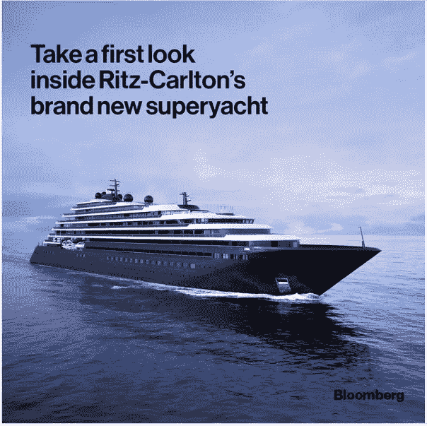

# 演员、人工智能和令人惊叹的便利设施

> 原文：<https://medium.com/coinmonks/an-actor-artificial-intelligence-amazing-amenities-9dce7dd57e1e?source=collection_archive---------57----------------------->

By [Dr. Holly Eimer](https://medium.com/u/e25f399c6d84?source=post_page-----9dce7dd57e1e--------------------------------) for [Message in a Bottle Newsletter by Lazy 8ight YC](https://medium.com/u/6dcb932fb22b?source=post_page-----9dce7dd57e1e--------------------------------)

**当前市场& NFTs**

周五上午，所有顶级加密货币都上涨，Ripple (XRPUSD)涨幅最高，飙升 3.00%，至 50 美分。达到 1330 美元，以太坊(ETHUSD)上涨 2.82%。Uniswap UNIUSD 上涨 2.21%，至 6.34 美元，以太坊 ETHUSD 上涨 2.82%，至 1，330.81 美元。比特币 BTCUSD，+0.65%和 Polkadot DOTUSD，+0.37%的价格分别上涨 1.58%和 1.23%，达到 19688.52 美元和 6.21 美元。Dogecoin DOGEUSD 和 Litecoin LTCUSD 的价格分别上涨 0.89%，至 6 美分和 51.97 美元。

据合作的 NFT 公司 Orange Comet 称，安东尼·霍普金斯的首次 NFT 收藏——包括基于他著名的好莱坞表演的艺术品——在不到 7 分钟内销售一空。他在电影《沉默的羔羊》(Silence of the Lambs)和电视剧《西部世界》(Westworld)中扮演的角色为他赢得了奥斯卡奖，这些作品包括 1000 多件独特的艺术作品。根据该项目的营销，这些名为“永恒”、“小丑”和“情人”的作品，概念化地“诠释了安东尼·霍普金斯爵士在职业生涯中扮演的巨大角色原型”。除了有机会获得一件数字艺术作品，购买者还将有机会获得一些现实世界的好处，如与霍普金斯的私人早午餐，个人签名的艺术作品，以及霍普金斯解释各种原型意义的音频摘录。

总部位于欧洲的数字资产管理平台 CoinShares 周四推出了一个实验性的人工智能(AI)机器人，它可能能够帮助交易者评估一些不可替代的令牌(NFT)的公平价格。用户可以在最受欢迎的 NFT 市场 OpenSea 上收到实验项目 CoinSharesNFTAI 所认为的公平价格，该项目收集了几个数据集，用于不断变化的 NFT 顶级收藏。您必须复制感兴趣的特定 NFT 的 OpenSea URL，并通过 tweet 将其发送给机器人，以便与之通信。然后，机器人将回复一个粗略的估计。

Doodle #8859 最后一次出售是在 2021 年 10 月 18 日，售价为 4.5 ETH，当时约为 16，800 美元，CoinDesk 使用它与机器人进行通信。该机器人声称，NFT 的价值已经下降到 9.61 ETH，或约 12，234 美元。根据 CoinShares 的说法，该机器人每周使用一种算法计算一次“最新鲜的收藏品”的价格。这包括引人注目的倡议，如 CryptoPunks、Bored Ape Yacht Club、Clonex、Moonbirds、Doodles、志那都红豆，以及 10 月 10 日至 16 日这一周的其他 44 个倡议。截至周四，bot 没有将任何 NFT 项目归类为“永久藏品”，尽管它最终将拥有它报告定价的永久藏品。

该公司周四在推特上写道:给非功能性食物定价并不简单。市场上有数百万个这样的项目，从知名项目 Bored Ape Yacht Club 到不太知名的艺术家，都没有交易历史；它们的价值不稳定。据说，该机器人使用的从“数千条 NFT 交易记录”中创建价格指数的技术是基于 hedonic 模型。它的数据集中在以太坊 NFT 上，并使用 Opensea 的官方 API 下载某些 NFT 收藏品的属性和以前的销售情况。

**聚光灯:OpenSea**

分散市场 OpenSea 使购买、销售和交易非功能性交易成为可能。作为大多数数字商品的平台，包括游戏项目、音乐、域名等，OpenSea 曾被称为“密码猫的易贝”它是首批建立的 NFT 市场之一，由程序员 Devin Finzer 和 Alex Atallah 在 2017 年创建，现在是世界上最大的市场。数以百万计的 NFT 可供购买，它拥有超过一百万的注册用户。得益于 OpenSea 清晰友好的用户界面，NFT 的新来者可以很容易地进入市场，铸造 NFT，并从事交易。该网站使您能够从数百万个分类的非功能性数字产品中购买数字资产。

此外，您可以包括您自己制作的或从其他来源(如区块链游戏)获得的 NFT。对于每一次二次销售，创作者有资格获得高达 10%的版税。尽管 OpenSea 从未有平台被攻破，但其 Discord 频道在 2022 年 5 月被欺诈链接淹没。据《财富》杂志报道，一个骗子试图通过使用一个链接将观众带到一个钓鱼网站来宣传一个伪造的 NFT。总的来说，对于初学者和创作者来说，OpenSea 是一个值得尊敬的市场。它很出名，很大，并为苹果和安卓智能手机提供免费的移动应用程序。基于以太坊区块链，用户拥有市场内的所有资产，而不是平台。以太网(ETH)和许多其他受支持的加密货币可用于购买 NFT。

**豪华待客**

新丽思卡尔顿游艇系列的第一艘船 Evrima 号拥有四个游泳池、一个室外水疗中心和相应的豪华套房，可容纳 298 名乘客，正准备离开巴塞罗那前往法国尼斯。近三年后，游客现在可以体验米其林三星级厨师设计的美食、豪华休息区和度假式住宿，有两层阁楼和个人户外“露台”。

丽思卡尔顿游艇系列的船上设施经过精心设计，旨在教育、活跃和刺激。船上的生活方式轻松随意，有一种自由灵活的感觉，很像超级游艇慢节奏的生活方式。玻璃墙自然地流向大海，时尚而舒适的家具，创造了欣赏自然环境的空间。此外，由于人均超过 89 平方英尺的非凡空间比例，这里还有豪华度假村的便利设施，如相当多的水上运动。晚上，您可以在客厅欣赏鸡尾酒和现场音乐，还可以在观景廊欣赏深夜舞蹈。甚至可能有一个当地的名人在船上。

**Lazy 8ight 游艇俱乐部**

Lazy 8ight 游艇俱乐部(L8YC)正在将 Web0(真实世界)实用程序集成到 Web3 空间中。除了 Web0 中的私人豪华活动和独一无二的可穿越大型游艇 NFTs，L8YC 还通过其独家酒店合作伙伴关系提供前所未有的游艇服务和独特体验。L8YC 经验丰富的内部销售团队协助满足游艇销售需求，无论是购买第一艘游艇，还是更新换代。L8YC 专家指导客户的每一步，Lazy 8ight 经验丰富的船长还提供一对一的定制咨询，包括虚拟和面对面咨询。NFT 和豪华酒店公司为船主提供各种各样的帮助，如机舱 101、导航、船坞咨询和海上安全。L8YC 会员可以在 L8YC 的一艘游艇上享受一日游，起价仅为 300 美元。拥有全天和半天两种选择，持有者可以享受 500 多艘全天包租的游艇，无论是在美国还是在国际上。L8YC 的内部包机经纪人团队帮助规划完美的包机，无论是在米克诺斯岛过夜游览，还是去阿拉斯加旅行一周。Lazy 8ight 设计一切，从路线和活动，下至船只本身，同时协商最佳价格。

此外，Lazy 8ight 还提供私人厨师服务。他们的餐饮合作伙伴，草药厨师，策划了令人难忘的高端之夜，选择 CBD & THC 注入，以改善多菜餐。Chris Sayegh 和他的团队为活动提供豪华餐饮，提供鱼子酱站、生海鲜吧、豪华自助餐、顶级牛肉切肉站、国王三文鱼片等选项。L8YC 现在也很高兴通过他们的合作伙伴 Security & Consulting 以及他们由经验丰富的军事特种作战人员、前执法人员和情报界退休人员组成的团队来提供活动安保。Lazy 8ight 的安全合作伙伴利用广泛的培训来确保活动的安全，同时为全球的知名客户、贵宾、精选企业和组织提供最高质量的近身保护、监控和应对措施计划。

请务必访问位于[http://L8yachtclub.com](http://L8yachtclub.com)的 Lazy 8ight 游艇俱乐部网站，咨询铸造和豪华酒店服务，或者访问社交媒体上的 Discord、Twitter、Medium 和 Instagram 页面，了解最新的 L8YC 新闻。

> 交易新手？试试[密码交易机器人](/coinmonks/crypto-trading-bot-c2ffce8acb2a)或者[复制交易](/coinmonks/top-10-crypto-copy-trading-platforms-for-beginners-d0c37c7d698c)