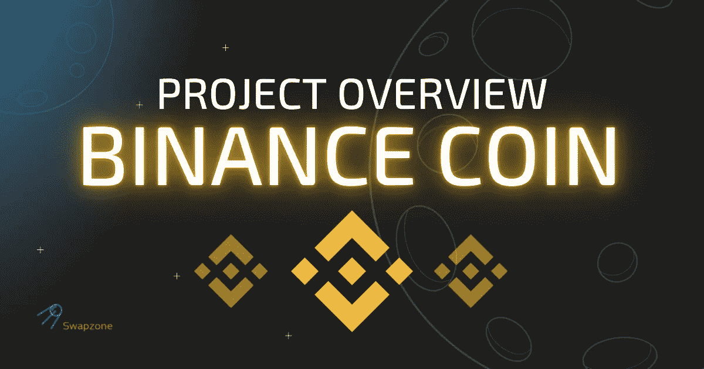
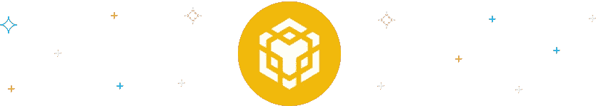
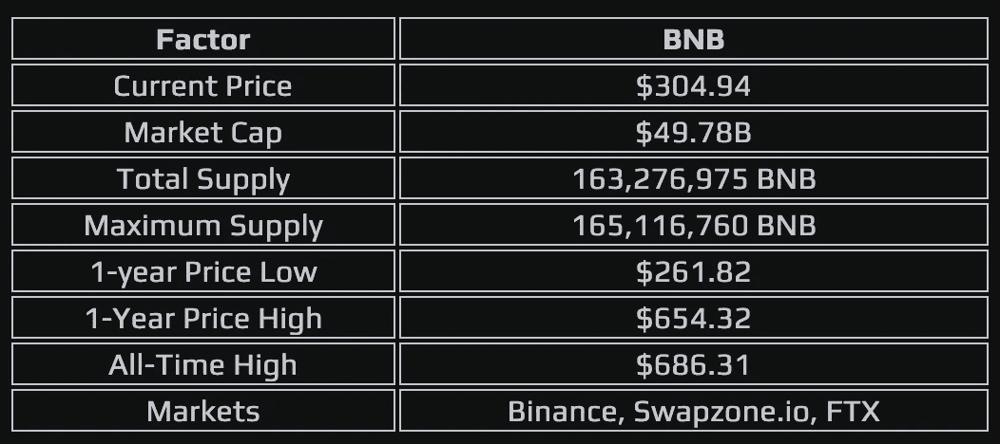

# 一个值得相信的替代硬币？币安硬币(BNB)概述

> 原文：<https://medium.com/coinmonks/an-altcoin-to-believe-in-binance-coin-bnb-overview-fa7437f19f78?source=collection_archive---------26----------------------->

币安是一个基于区块链技术的分散式网络生态系统。截至 2022 年第二季度，该交易所是全球最大的加密货币交易所，日交易量为 76 亿美元。

BNB 是该交易所的加密货币，用户在该交易所使用它支付交易费用时可以获得折扣。你可以交易或交换其他数字资产，如以太坊、莱特币、比特币等。

# 什么是币安硬币(BNB)？

币安硬币是为币安链和币安智能链(BSC)生态系统提供动力的数字货币。它有广泛的使用案例和应用，尤其是随着在 BSC 上启动的项目数量的增加。

币安交易所的用户可以使用代币进行交易并支付交易费用。截至发稿时，它是全球市值排名第五的加密货币。

# BNB 历史

2017 年 7 月，赵昌鹏与联合创始人、现任首席营销官何毅一起创建了币安币。在转移到币安智能链之前，硬币最初在以太坊的 ERC-20 标准上运行。

BNB 的发展可以分为三个市场周期——第一、第二和第三个市场周期。

*   第一个市场周期

币安硬币的第一个市场周期可以追溯到 2017 年 11 月 17 日，当时它以 0.50 美元的低价开始。然而，BNB 只用了 67 天就达到了每枚代币 25 美元多一点的单价。

*   第二个市场周期

遵循牛市趋势，BNB 于 2019 年 6 月 22 日触及 39.59 美元的历史最高值。距离前一天将近 200 天，这个受欢迎的令牌在加密市场上大幅上涨了 861%。

*   第三个市场周期

我们目前已经真正进入了 BNB 的第三个市场周期，截至发稿时，这枚硬币价值 304.94 美元，市值为 497.8 亿美元

# BNB 令牌配置文件

BNB 无疑是加密货币市场的领导者之一。以下是代币简介的亮点，解释了与 BNB 相关的重要数字。

# BNB 赞成和反对

BNB 是一个令人印象深刻的加密货币项目，为持有者、投资者和交易者提供了多种好处。然而，像其他加密项目一样，它也有可以改进的地方。以下是它的利弊。

## 赞成的意见

*   它的费用很低，交易也很快
*   硬币有一个特殊的烧毁政策，有助于保持其稀缺性和价值
*   专家认为它是用例的一个很好的实用工具
*   用户可以享受收费折扣

## 骗局

*   代币的发展直接取决于币安交易所的声誉
*   没有稳定性的保证，因为硬币只有 4 年的市场经验
*   密码专家担心，从长远来看，中国监管机构可能会对硬币产生不利影响。

# 币安硬币(BNB)是如何工作的？

如前所述，币安开始作为以太坊区块链上的 ERC-20 代币，随后推出了自己的区块链。这枚硬币可以在全球几个顶级密码交易所交易。

作为 BSC 网络上的本地令牌，Pankcake Swap 等领先的分散式交换机的用户使用它来支付网络费用。对于大多数项目来说，称它为实用程序令牌是公平的，它可以用于许多功能。

# 币安硬币的使用案例(BNB)

除了区块链功能，BNB 还有许多日常使用案例，包括以下内容:

*   预订旅行安排:当客户预订机票和酒店时，一些特定的网站目前接受 BNB。
*   **信用卡支付:**在 Crypto.com 这样的平台上，你可以使用 BNB 作为加密货币信用卡账单的一种支付方式。
*   **娱乐休闲:**是支付彩票、购买数码礼品、杂项娱乐费用的手段。
*   **转账贷款:**在一些平台上作为贷款的抵押品，支付账单，或者给亲人寄钱，也很方便。
*   **处理支付:**金融商户提供 BNB 作为支付手段，使支付方式更加灵活。
*   **交易:**在交易其他加密货币时也很有用，虽然它依赖于加密交易所。
*   **投资手段:**部分网络投资平台允许投资者将 BNB 资金委托给 ETF、股票等。
*   **币安交易所交易费:**交易所接受用户用 BNB 支付的交易费，用户获得折扣。

# 币安硬币(BNB)燃烧

自 2017 年以来的每个季度，币安都将五分之一的收入/利润用于购买和焚烧国库中的硬币。

该交易所将每个季度继续燃烧代币，直到完成回购和燃烧 1 亿单位或最初最大供应量的一半。

# BNB 代币表演

在过去的一年里，币安硬币可以说是最大和最有信誉的加密货币之一，使其成为加密投资者青睐的硬币之一。

从上面的图表来看，硬币的价值在过去的 12 个月中经历了多事之秋，从 316.33 美元开始，达到了一年来的最高价 654.32 美元和最低价 261.82 美元。

这表明了一个事实，即 BNB 在短期内非常不稳定。尽管预测和技术分析师表示，投资 BNB 可能有利可图，但短期投资风险很大。

# BNB 持有者的币安奖金

该资产的持有者可以获得币安生态系统提供的多项奖励，包括

*   有机会获得交易所 VIP 计划的资格，以节省更多资金。
*   4%的佣金奖金通过一个介绍计划。
*   节省 25%的保证金和现货交易费用。
*   节省 10%的未来交易费用
*   参与首次交换产品，购买并赢取奖励
*   申请加密货币贷款
*   在 BNB 金库下注时赢取奖励

# BNB 批评与法律问题

数字资产项目面临许多批评和法律问题，BNB 也不例外。在它的挑战中，波动性和去中心化是最大的挑战。下面我们重点介绍一些。

# 波动性

与大多数加密货币一样，BNB 是一个不稳定的项目。无论它在牛市反弹中投入多少，BNB 都可能损失超过 30%的资本，这就是投资者认为它有风险的原因。

# 美国的币安问题

币安最近一直在新闻中被美国执法机构调查。

司法部和美国国税局正在调查币安控股有限公司，怀疑人们利用该平台逃税和洗钱。该公司正与这些机构合作。

# 非法使用

BNB 和其他主要加密的最大问题之一是，犯罪分子通常使用它们在暗网上进行非法和不正当的活动。这些活动包括购买毒品、赃物、武器等非法物品。

# 你应该买 BNB 吗？

如果你对投资加密货币感兴趣，对于愿意持有代币的长期投资者来说，BNB 是一个不错的起点。

但是，如果你追求的是短期投资，只是看看头皮，要知道它和其他加密资产具有很高的波动性，你可能会在几小时或几天内失去你的投资。

# 如何购买币安硬币(BNB): 3 步算法

兑换币安硬币可能是个好主意，尤其是当你能以最好的汇率兑换加密货币的时候。

在 Swapzone 上，您可以通过列出的各种即时加密货币兑换提供商轻松兑换 BNB，查看这些受支持的兑换商、他们的报价以及他们选择的汇率。

1.  转到 [swapzone.io](https://swapzone.io/) 。
2.  在发送部分选择币安硬币(BNBBSC)。
3.  输入您希望交换的金额。
4.  选择“加密”进入“获取到”部分。
5.  查看可用的优惠及其提供商。
6.  选择一个出价以继续。
7.  输入您的钱包地址以接收加密。
8.  将您的币安硬币存款发送到生成的地址。
9.  评价您的 exchange 提供商。

# 摘要

由于市场上有大量加密货币，这可能很难跟上。然而，BNB 是自创建以来取得令人印象深刻的增长数字的象征之一。

它有一个强大的社区，并得到币安交易所的支持。也就是说，如果你想涉足加密投资领域，这个指南应该能帮助你更好地理解这个项目。

# 流行成对转换币安硬币

[BNBBSC 到 BTC](https://swapzone.io/exchange/bnbbsc/btc)[BNB](https://swapzone.io/exchange/bnbbsc/eth)
BSC 到 ETH
[BNBBSC 到 LTC](https://swapzone.io/exchange/bnbbsc/ltc)
[BNBBSC 到 BNB](https://swapzone.io/exchange/bnbbsc/bnb)
[BNBBSC 到 BCH](https://swapzone.io/exchange/bnbbsc/bch)
[BNBBSC 到 USDT](https://swapzone.io/exchange/bnbbsc/usdt)
[BNBBSC 到 THETA](https://swapzone.io/exchange/bnbbsc/theta)
[BNBBSC 到 XMR](https://swapzone.io/exchange/bnbbsc/xmr)
[BNBBSC](https://swapzone.io/exchange/bnbbsc/trx)

> 交易新手？尝试[加密交易机器人](/coinmonks/crypto-trading-bot-c2ffce8acb2a)或[复制交易](/coinmonks/top-10-crypto-copy-trading-platforms-for-beginners-d0c37c7d698c)