# Android 中使用 Keras 和 Tensorflow 的图像分类应用程序

> 原文：<https://medium.com/coinmonks/an-image-classification-app-in-android-using-keras-and-tensorflow-17177a546dd7?source=collection_archive---------9----------------------->


图像分类是根据特定的规则对图像进行分类和标记的过程。它可以有益于卫星图像中的物体识别、刹车灯检测、交通控制系统等。

要使用 Tensorflow lite 插件为 Android 创建图像分类应用程序，请点击以下链接。

[](https://codemaker2016.medium.com/image-classification-app-in-android-using-custom-tflite-model-7cf9ee9c0a53) [## Android 中使用自定义 TFLite 模型的图像分类应用程序

### 科技在我们的日常生活中起着至关重要的作用。人工智能和机器学习是两个关键因素…

codemaker2016.medium.com](https://codemaker2016.medium.com/image-classification-app-in-android-using-custom-tflite-model-7cf9ee9c0a53) 

这些应用程序对于使用轻量级 tflite 模型执行影像分类非常有用。当模型尺寸增加时，边缘设备需要更多的处理。TFLite 安卓包只支持 tflite 机型。边缘设备可能不是创建/训练/运行大型模型的好选择。为了克服这个限制，使用基于 Flask 服务器的模型部署。

在本次会议中，我们将创建一个 Keras 模型，并将其部署在 Flask 服务器上。我们可以使用 flask APIs 来访问 android 应用程序中的模型。此外，我们将在 Heroku 云上托管 flask 服务器。

# 入门指南

在本次会议中，我们将创建一个 android 应用程序，从输入图像中对手写数字进行分类。为了减少数据收集和清理的工作量，我们将在应用程序中使用 MNIST 数据集。

我们将本教程分为三个部分，

1.  [Keras 图像分类模型的创建和部署](#2b10)
2.  [创建一个用于图像分类的 android 应用](#9bd7)
3.  [Heroku 上的 Flask 服务器部署](#8a68)

# 第 1 部分:Keras 图像分类模型的创建和部署

在本节中，我们将使用 Keras 创建一个多层感知器(MLP)模型，该模型在 [MNIST 数据集](https://www.tensorflow.org/api_docs/python/tf/keras/datasets/mnist)上进行训练。

## 目录

*   [安装依赖项](#a02a)
*   [准备 MNIST 数据集](#b04b)
*   [建立 MLP 模型](#0049)
*   [列车 MLP 型号](#b2c3)
*   [保存 MLP 模型](#0b04)
*   [使用保存的模型进行预测](#5157)
*   [创建一个用于图像分类的 Flask API](#3495)

## 安装依赖项

建议将依赖项安装在[虚拟环境](https://docs.python.org/3/tutorial/venv.html)上，而不是全局安装。

*   使用以下命令创建一个虚拟环境

```
python -m venv venv
```

*   切换到 Windows 中的虚拟环境

```
venv\Scripts\activate
```

*   使用以下命令安装依赖项，

```
pip install tensorflow flask imageio
```

## 准备 MNIST 数据集

MNIST 数据集是用于数字 0 到 9 的手写数字识别数据集。它有 70，000 张图像，60，000 张用于训练，10，000 张用于测试。每一张图像都是 28×28 的灰度图像。数据集的样本如下所示。


使用以下代码将 mnist 数据集导入到项目中，

```
from tensorflow import keras
from tensorflow.keras import datasets
from tensorflow.keras import models, layers, optimizers
import numpy
batch_size = 128
num_classes = 10
epochs = 20
# the data, split between train and test sets
(x_train, y_train), (x_test, y_test) = datasets.mnist.load_data()
print(x_train.shape) # (60000, 28, 28)
print(y_train.shape) # (60000,)
print(x_test.shape)  # (10000, 28, 28)
print(y_test.shape)  # (10000,)
```

Keras 模块允许我们自动下载某些数据集。我们可以使用`keras.datasets`从 [Keras](https://keras.io/) 模块下载数据集。将`keras.datasets.mnist`导入到对 mnist 数据集执行各种操作的代码中。使用`load_data()`函数加载项目中的数据集。该函数返回一个包含 2 个元素的元组，如下所示:

*   `(x_train, y_train)` —训练输入&标签。
*   `(x_test, y_test)` —测试输入&标签。

我们可以使用数组的`shape`元素来确定数据集的大小。训练输入数组(`x_train`)的形状是(60000，28，28)，这意味着有 60000 个样本，每个样本图像的大小是 28×28。

我们将建立一个 MLP 模型，它接受一个向量而不是一个数组作为输入。我们需要将每个数组转换成一个向量。可以使用`reshape()`功能完成。使用下面的代码改变输入数组的形状。

```
x_train = x_train.reshape(60000, 784) # (60000, 28 * 28)
x_test = x_test.reshape(10000, 784)   # (10000, 28 * 28)
```

图像的数据类型是 uint8，其中每个像素的范围从 0 到 255。重新缩放有助于降低反向传播阶段的梯度。

```
x_train = x_train.astype(**'float32'**) / 255
x_test = x_test.astype(**'float32'**) / 255
```

根据训练和测试标签的形状，为每个样本分配一个值。在 MNIST 数据集中有 10 个类，其中每个样本必须被分配一个长度为 10 的二进制向量。元素的索引对应于类标签。

例如，如果样本具有分类标签 2，则创建 10 个元素的向量，其中除了索引 2 处的元素是 1 之外，所有元素都是 0，

```
[0, 0, 1, 0, 0, 0, 0, 0, 0, 0]
```

要进行转换，使用`keras.utils.to_categorical()`功能。

```
y_train = keras.utils.to_categorical(y_train, num_classes) # (60000, 10)
y_test = keras.utils.to_categorical(y_test, num_classes) # (10000, 10)
```

下面给出了数据准备的完整代码，

```
from tensorflow import keras
from tensorflow.keras import datasets
import numpy
batch_size = 128
num_classes = 10
epochs = 20# the data, split between train and test sets
(x_train, y_train), (x_test, y_test) = datasets.mnist.load_data()
print(x_train.shape) # (60000, 28, 28)
print(y_train.shape) # (60000,)
print(x_test.shape) # (10000, 28, 28)
print(y_test.shape) # (10000,)
x_train = x_train.reshape(60000, 784)
x_test = x_test.reshape(10000, 784)
x_train = x_train.astype('float32') / 255
x_test = x_test.astype('float32') / 255
y_train = keras.utils.to_categorical(y_train, num_classes) # (60000, 10)
y_test = keras.utils.to_categorical(y_test, num_classes) # (10000, 10)
```

## 建立 MLP 模式

使用`keras.models.Sequential()`函数将 MLP 模型声明为序列模型。

```
from tensorflow.keras import models, layers, optimizers
import numpy
...
model = models.Sequential()
model.add(layers.Dense(512, activation='relu', input_shape=(784,)))
model.add(layers.Dropout(0.2))
model.add(layers.Dense(512, activation='relu'))
model.add(layers.Dropout(0.2))
model.add(layers.Dense(num_classes, activation='softmax'))
```

顺序模型包含 3 个密集层和 2 个下降层。第一密集层接受包含 512 个神经元的形状 784 的矢量图像。最后一个密集层使用 10 个神经元的 softmax 函数，返回每一类的概率。

建立模型后，使用`model.summary()`功能打印模型摘要。它列出了层，输出形状和参数。

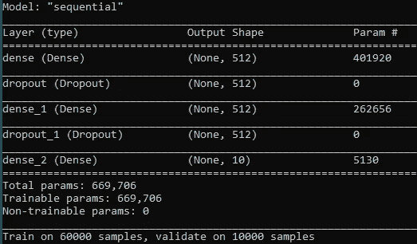

`Param`列给出了该层的参数总数，作为输入数(784)和该层中神经元数(512)的乘积，得到 784 * 512 = 401，408。一些神经元往往会有偏差，因此将额外的 512 个参数添加到总数中，得到 401，920 个参数。

使用`compile()`函数定义用于训练模型的损失函数、优化器和指标。设置损失函数为`categorical_crossentropy`，优化器为[均方根传播](https://towardsdatascience.com/understanding-rmsprop-faster-neural-network-learning-62e116fcf29a) ( `RMSprop`)，度量为分类`accuracy`。

```
from tensorflow.keras import optimizers
model.compile(loss='categorical_crossentropy',
              optimizer=keras.optimizers.RMSprop(),
              metrics=['accuracy'])
```

## 训练 MLP 模型

使用下面给出的`fit()`功能训练模型。

```
batch_size = 128
epochs = 20
history = model.fit(x_train, y_train,
                    batch_size=batch_size,
                    epochs=epochs,
                    verbose=1,
                    validation_data=(x_test, y_test))
```

它接受训练输入(`x_train`)、训练标签(`y_train`)、批量(128)和时期数(20)。将`verbose=1`添加到输入中，以便在模型训练时打印消息和验证数据。

`evaluate()`函数用于根据验证数据评估模型，如下所示。

```
score = model.evaluate(x_test, y_test, verbose=0)
print(**'Test accuracy:'**, score[1]) # prints 98.41%
```

## 保存模型

使用`model.save()`功能保存模型以备将来参考。

```
model.save(**"**model.h5**"**)
```

下面给出了准备数据、构建、训练和保存模型的完整代码。

```
from tensorflow import keras
from tensorflow.keras import datasets
from tensorflow.keras import models, layers, optimizers
import numpy
batch_size = 128
num_classes = 10
epochs = 20 
# the data, split between train and test sets
(x_train, y_train), (x_test, y_test) = datasets.mnist.load_data()
print(x_train.shape) # (60000, 28, 28)
print(y_train.shape) # (60000,)
print(x_test.shape) # (10000, 28, 28)
print(y_test.shape) # (10000,)
x_train = x_train.reshape(60000, 784)
x_test = x_test.reshape(10000, 784)
x_train = x_train.astype('float32') / 255
x_test = x_test.astype('float32') / 255
y_train = keras.utils.to_categorical(y_train, num_classes) # (60000, 10)
y_test = keras.utils.to_categorical(y_test, num_classes) # (10000, 10)model = models.Sequential()
model.add(layers.Dense(512, activation='relu', input_shape=(784,)))
model.add(layers.Dropout(0.2))
model.add(layers.Dense(512, activation='relu'))
model.add(layers.Dropout(0.2))
model.add(layers.Dense(num_classes, activation='softmax'))
model.summary()
model.compile(loss='categorical_crossentropy',
              optimizer=optimizers.RMSprop(),
              metrics=['accuracy'])history = model.fit(x_train, y_train,
                    batch_size=batch_size,
                    epochs=epochs,
                    verbose=1,
                    validation_data=(x_test, y_test))
score = model.evaluate(x_test, y_test, verbose=0)
print('Test loss:', score[0])
print('Test accuracy:', score[1])
model.save("model.h5")
loaded_model = keras.models.load_model('model.h5')
predicted_label = loaded_model.predict_classes(numpy.array([x_test[0, :]]))[0]
print(predicted_label)
```

> **注意:如果你正在运行本教程提供的 git repo 中的代码，那么尝试使用** `**pip install -r requirements.txt**` **命令从** `**requirements.txt**` **文件中安装依赖项。**

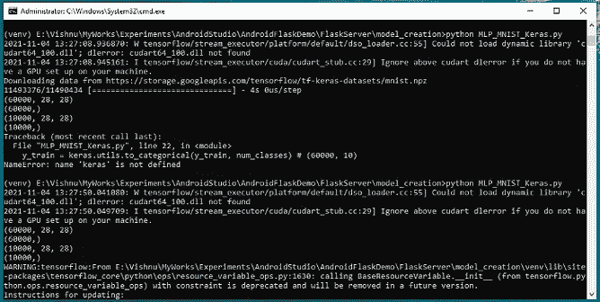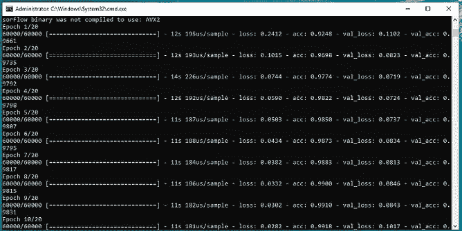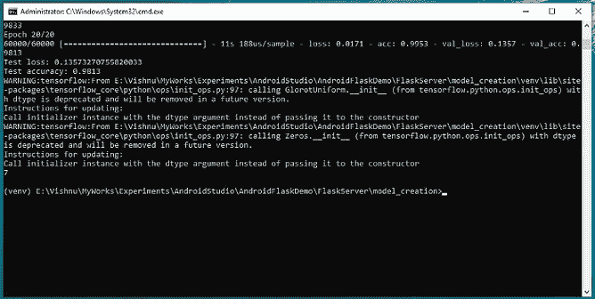

## 使用保存的模型进行预测

使用`keras.models.load_model()`函数加载模型，并使用`predict_classes()`函数预测类。

```
loaded_model = keras.models.load_model(**'model.h5'**)
predicted_label = loaded_model.predict_classes(numpy.array([x_test[0, :]]))[0]
print(predicted_label)
```

## 为图像分类创建 Flask API

[Flask](https://flask.palletsprojects.com/en/2.2.x/) 是一个用 Python 编写的轻量级 web 框架。

创建一个名为`server.py`的文件，并向其中添加以下代码，以便在访问服务器时返回`“Hello World”`文本。

```
app = flask.Flask(__name__)
[@app](http://twitter.com/app).route('/', methods = ['GET', 'POST'])
def welcome():
    return "Hello World"
app.run(host="0.0.0.0", port=5000, debug=True)
```

`app.route()` decorator 函数将一个 URL 与一个回调函数相关联。在这个例子中，这个函数被命名为`welcome()`，当用户点击默认路径(“/”)时，它返回`“Hello World”`文本。我们将主机设置为`“0.0.0.0”`，端口设置为`5000`。

让我们试着创建一条路线`“/predict”`来根据输入图像预测班级。为此，创建一个名为`server.py`的文件，并向其中添加以下代码。

```
import flask
import werkzeug
from tensorflow.keras import models
import numpy
import imageio
import os
app = flask.Flask(__name__)
[@app](http://twitter.com/app).route('/', methods = ['GET', 'POST'])
def welcome():
    return "Hello World"
[@app](http://twitter.com/app).route('/predict/', methods = ['GET', 'POST'])
def handle_request():
    imagefile = flask.request.files['image0']
    filename = werkzeug.utils.secure_filename(imagefile.filename)
    print("\nReceived image File name : " + imagefile.filename)
    imagefile.save(filename)

    img = imageio.imread(filename, pilmode="L")
    if img.shape != (28, 28):
        return "Image size mismatch " + str(img.shape) + ". \nOnly (28, 28) is acceptable."
    img = img.reshape(784)
    loaded_model = models.load_model('model.h5')
    predicted_label = numpy.argmax(loaded_model.predict(numpy.array([img]))[0], axis=-1)
    print(predicted_label)
    return str(predicted_label)
app.run(host="0.0.0.0", port=os.environ.get('PORT', 5000), debug=True)
```

**让我们来理解代码，**

*   `imageio.imread`将图像读取为灰度并将其重塑为(28，28)。
*   使用`models.load_model(‘model.h5’)`加载预训练模型
*   使用`loaded_model.predict()`函数通过 Keras 预训练模型预测分类标签，并以字符串形式返回分类标签。

通过从`FlaskServer/app`文件夹运行以下命令来启动服务器。

```
python server.py
```

> **注意:如果你正在运行本教程提供的 git repo 中的代码，那么尝试使用** `**pip install -r requirements.txt**` **命令从** `**requirements.txt**` **文件中安装依赖项。**

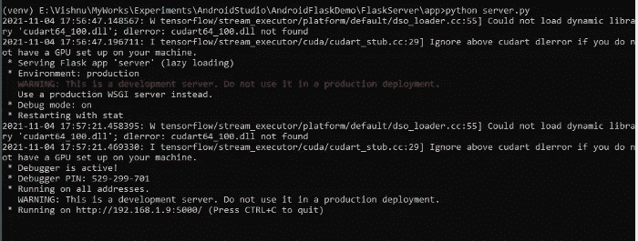

# 第 2 部分:为图像分类创建一个 android 应用程序

现在，我们可以创建一个客户端 android 应用程序，将图像上传到我们在上一步中创建的 flask 服务器。该应用程序有一个选项，从画廊选择图像。所选图像被转换成字节数组，并发送给 Flask 服务器。我们可以使用 [OkHttp](https://square.github.io/okhttp/) 来处理 HTTP 请求和响应。

## 目录

*   [创建应用](#ce94)
*   [设计布局](#08a5)
*   [与 flask 服务器通信](#8e02)

## 创建应用程序

打开 android studio，点击`New project`按钮，提供必要的信息。

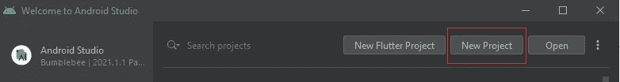

## 设计布局

使用编辑文本、按钮、图像视图和文本视图定义基本布局。它包含 3 个按钮-捕捉图像，选择图像和预测类和编辑文本-用于输入服务器的网址(IP 地址和端口)。

将以下代码添加到`activity_main.xml`以定义布局。

```
<?xml version="1.0" encoding="utf-8"?>
<LinearLayout xmlns:android="[http://schemas.android.com/apk/res/android](http://schemas.android.com/apk/res/android)"
    xmlns:app="[http://schemas.android.com/apk/res-auto](http://schemas.android.com/apk/res-auto)"
    android:layout_width="match_parent"
    android:layout_height="match_parent"
    android:orientation="vertical"
    android:padding="20dp">    
    <Button
        android:id="@+id/btnCapture"
        android:layout_width="match_parent"
        android:layout_height="wrap_content"
        android:onClick="captureImage"
        android:text="Capture Image"
        android:textStyle="bold" />
    <Button
        android:layout_width="match_parent"
        android:layout_height="wrap_content"
        android:text="Select Image"
        android:onClick="selectImage"
        android:textStyle="bold"/>    
    <ImageView
        android:id="@+id/imageView"
        android:layout_width="200dp"
        android:layout_height="200dp"
        android:layout_gravity="center"
        android:layout_margin="10dp"
        app:srcCompat="[@android](http://twitter.com/android):drawable/ic_menu_report_image">    
    </ImageView>
    <TextView
        android:layout_width="match_parent"
        android:layout_height="wrap_content"
        android:text="No Image Selected."
        android:id="@+id/imgName"
        android:textAlignment="center"
        android:textStyle="bold"
        android:textColor="#807E76"/>    
    <LinearLayout
        android:layout_width="match_parent"
        android:layout_height="wrap_content"
        android:orientation="horizontal"
        android:layout_gravity="center"
        android:padding="10dp">
        <TextView
            android:layout_weight="1"
            android:layout_width="wrap_content"
            android:layout_height="match_parent"
            android:text="Server URL"
            android:textStyle="bold"
            android:textColor="#807E76"
            android:gravity="center_vertical"/>
        <EditText
            android:layout_weight="4"
            android:layout_width="wrap_content"
            android:layout_height="match_parent"
            android:id="@+id/edtServerURL"
            android:text="[http://192.168.1.9:5000](http://192.168.1.9:5000/)"
            android:singleLine="true"
            android:textStyle="bold"/>
    </LinearLayout>    
    <Button
        android:layout_width="match_parent"
        android:layout_height="wrap_content"
        android:onClick="connectServer"
        android:text="Predict Class"
        android:textStyle="bold" />    
    <TextView
        android:layout_width="match_parent"
        android:layout_height="wrap_content"
        android:text=""
        android:id="@+id/responseText"
        android:textAlignment="center"
        android:textStyle="bold"
        android:layout_marginTop="10dp"/>
</LinearLayout>
```

最终的布局如下所示，

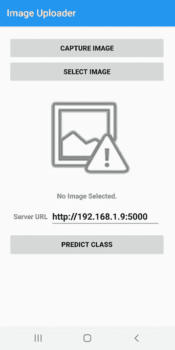

## 与 flask 服务器通信

*   将下面一行添加到应用程序`build.gradle`的依赖项部分，并同步您的项目。

```
implementation 'com.squareup.okhttp3:okhttp:3.4.1'
```

*   将以下代码添加到`AndroidManifest.xml`文件中，以请求应用程序中的摄像头、互联网和存储权限。

```
<uses-permission android:name="android.permission.CAMERA" />
<uses-permission android:name="android.permission.INTERNET"/>
<uses-permission android:name="android.permission.READ_EXTERNAL_STORAGE" />
<uses-permission android:name="android.permission.WRITE_EXTERNAL_STORAGE" />
<application 
    ...
    android:usesCleartextTraffic="true"
    android:requestLegacyExternalStorage="true">
```

*   请求活动初始化的权限。

```
ActivityCompat.requestPermissions(MainActivity.this, new String[]{Manifest.permission.CAMERA}, 2);
ActivityCompat.requestPermissions(MainActivity.this, new String[]{Manifest.permission.READ_EXTERNAL_STORAGE}, 1);
```

*   在`MainActivity.java`中创建一个`captureImage`方法，从摄像机中捕捉一个图像。为捕获的图像创建一个 URI，并将其分配给 imageView。创建图像的 byteArray，并将其添加到`OkHttp`请求体中。

```
public void captureImage(View v) {
    if (checkSelfPermission(Manifest.permission.CAMERA) != PackageManager.PERMISSION_GRANTED) {
        requestPermissions(new String[]{Manifest.permission.CAMERA}, MY_CAMERA_PERMISSION_CODE);
    }
    else {
        Intent cameraIntent = new Intent(android.provider.MediaStore.ACTION_IMAGE_CAPTURE);
        startActivityForResult(cameraIntent, CAMERA_REQUEST);
    }
}
```

*   创建一个方法，`selectImage`来浏览图库中的图片。创建所选图像的 URI，并将其分配给`imageView`。创建图像的`byteArray`,并将其添加到`OkHttp`请求体中。

```
public void selectImage(View v) {
    Intent intent = new Intent();
    intent.setType("image/*");
    intent.setAction(Intent.ACTION_GET_CONTENT);
    startActivityForResult(Intent.createChooser(intent, "Select Picture"), SELECT_IMAGES);
}
```

*   创建一个方法，`getImageUri`从位图图像数据中获取图像路径。

```
public Uri getImageUri(Context inContext, Bitmap inImage) {
    ByteArrayOutputStream bytes = new ByteArrayOutputStream();
    inImage.compress(Bitmap.CompressFormat.JPEG, 100, bytes);
    String path = MediaStore.Images.Media.insertImage(inContext.getContentResolver(), inImage, "Title", null);
    return Uri.parse(path);
}
```

*   创建一个方法，`getFileName`从 Uri 中获取文件名。

```
public String getFileName(Uri uri) {
    String result = null;
    if (uri.getScheme().equals("content")) {
        Cursor cursor = getContentResolver().query(uri, null, null, null, null);
        try {
            if (cursor != null && cursor.moveToFirst()) {
                result = cursor.getString(cursor.getColumnIndex(OpenableColumns.DISPLAY_NAME));
            }
        } finally {
            cursor.close();
        }
    }
    if (result == null) {
        result = uri.getPath();
        int cut = result.lastIndexOf('/');
        if (cut != -1) {
            result = result.substring(cut + 1);
        }
    }
    return result;
}
```

*   创建一个接受`postUrl`和`postBody`的方法`postRequest`。该方法将图像发送到服务器，并在应用程序中接收响应。在`responseText`上设置结果。
*   请求是使用`Request.Builder`类创建的。该类负责将目标 URL 映射到请求正文。`url()`方法接受 URL,`post()`方法接受请求体。最后，使用`build()`方法构建请求。
*   使用名为`newCall()`的方法通过`OkHttpClient`的实例发送请求。根据呼叫的状态，有两种回调方法:
*   `onFailure()`:当请求由于取消、连接问题或超时而无法执行时调用。
*   `onResponse()`:远程服务器成功返回 HTTP 响应时调用。

```
void postRequest(String postUrl, RequestBody postBody) {
        OkHttpClient client = new OkHttpClient();
        Request request = new Request.Builder()
                .url(postUrl)
                .post(postBody)
                .build();client.newCall(request).enqueue(new Callback() {
            [@Override](http://twitter.com/Override)
            public void onFailure(Call call, IOException e) {
                call.cancel();
                Log.d("FAIL", e.getMessage());runOnUiThread(new Runnable() {
                    [@Override](http://twitter.com/Override)
                    public void run() {
                        TextView responseText = findViewById(R.id.responseText);
                        responseText.setText("Failed to Connect to Server. Please Try Again.");
                    }
                });
            }[@Override](http://twitter.com/Override)
            public void onResponse(Call call, final Response response) throws IOException {
                runOnUiThread(new Runnable() {
                    [@Override](http://twitter.com/Override)
                    public void run() {
                        TextView responseText = findViewById(R.id.responseText);
                        try {
                            String[] res = response.toString().split(",");
                            if(res[1].trim().equals("code=200"))
                                responseText.setText("Server's Response\n" + response.body().string());
                            else
                                responseText.setText("Oops! Something went wrong. \nPlease try again.");
                        } catch (IOException e) {
                            e.printStackTrace();
                        }
                    }
                });
            }
        });
}
```

*   创建一个方法，`connectServer`从文件系统获取图像信息，并向服务器发送请求。

```
public void connectServer(View v) {
        TextView responseText = findViewById(R.id.responseText);
        if (imagesSelected == false) { // This means no image is selected and thus nothing to upload.
            responseText.setText("No Image Selected to Upload. \nSelect Image and Try Again.");
            return;
        }
        responseText.setText("Sending the Files. Please Wait ..."); EditText edtServerURL = findViewById(R.id.edtServerURL);
        String postUrl = edtServerURL.getText().toString() + "/predict/"; MultipartBody.Builder multipartBodyBuilder = new         MultipartBody.Builder().setType(MultipartBody.FORM); for (int i = 0; i < selectedImagesPaths.size(); i++) {
            byte[] byteArray = null;
            try {
                InputStream inputStream = getContentResolver().openInputStream(selectedImagesPaths.get(i));
                ByteArrayOutputStream byteBuffer = new ByteArrayOutputStream();
                int bufferSize = 1024;
                byte[] buffer = new byte[bufferSize]; int len = 0;
                while ((len = inputStream.read(buffer)) != -1) {
                    byteBuffer.write(buffer, 0, len);
                }
                byteArray = byteBuffer.toByteArray(); }catch(Exception e) {
                responseText.setText("Please Make Sure the Selected File is an Image.");
                return;
            }
            multipartBodyBuilder.addFormDataPart("image" + i, "input_img.jpg", RequestBody.create(MediaType.parse("image/*jpg"), byteArray));
        } RequestBody postBodyImage = multipartBodyBuilder.build();//        RequestBody postBodyImage = new MultipartBody.Builder()
//                .setType(MultipartBody.FORM)
//                .addFormDataPart("image", "androidFlask.jpg",      RequestBody.create(MediaType.parse("image/*jpg"), byteArray))
//                .build(); postRequest(postUrl, postBodyImage);
    }
```

*   MainActivity 的完整代码如下所示，

```
package com.vsoft.androidflaskdemo.app;
public class MainActivity extends AppCompatActivity {
    final int SELECT_IMAGES = 1;
    final int CAMERA_REQUEST = 2;
    final int MY_CAMERA_PERMISSION_CODE = 100;
    ArrayList<Uri> selectedImagesPaths; // Paths of the image(s) selected by the user.
    boolean imagesSelected = false; // Whether the user selected at least an image or not.
    [@Override](http://twitter.com/Override)
    protected void onCreate(Bundle savedInstanceState) {
        super.onCreate(savedInstanceState);
        ActivityCompat.requestPermissions(MainActivity.this, new String[]{Manifest.permission.INTERNET}, 2);
        ActivityCompat.requestPermissions(MainActivity.this, new String[]{Manifest.permission.READ_EXTERNAL_STORAGE}, 1);
        setContentView(R.layout.activity_main);
    }
    [@Override](http://twitter.com/Override)
    public void onRequestPermissionsResult(int requestCode, String permissions[], int[] grantResults) {
        super.onRequestPermissionsResult(requestCode, permissions, grantResults);
        switch (requestCode) {
            case 1: {
                if (grantResults.length > 0 && grantResults[0] == PackageManager.PERMISSION_GRANTED) {
//                    Toast.makeText(getApplicationContext(), "Access to Storage Permission Granted.", Toast.LENGTH_SHORT).show();
                } else {
//                    Toast.makeText(getApplicationContext(), "Access to Storage Permission Denied.", Toast.LENGTH_SHORT).show();
                }
                return;
            }
            case 2: {
                if (grantResults[0] == PackageManager.PERMISSION_GRANTED) {
//                    Toast.makeText(this, "Camera Permission Granted.", Toast.LENGTH_LONG).show();
                }
                else {
                    Toast.makeText(this, "camera permission denied", Toast.LENGTH_LONG).show();
                }
                return;
            }
        }
    }
    public void connectServer(View v) {
        TextView responseText = findViewById(R.id.responseText);
        if (imagesSelected == false) { // This means no image is selected and thus nothing to upload.
            responseText.setText("No Image Selected to Upload. \nSelect Image and Try Again.");
            return;
        }
        responseText.setText("Sending the Files. Please Wait ...");
        EditText edtServerURL = findViewById(R.id.edtServerURL);
        String postUrl = edtServerURL.getText().toString() + "/predict/";
        MultipartBody.Builder multipartBodyBuilder = new MultipartBody.Builder().setType(MultipartBody.FORM);
        for (int i = 0; i < selectedImagesPaths.size(); i++) {
            byte[] byteArray = null;
            try {
                InputStream inputStream = getContentResolver().openInputStream(selectedImagesPaths.get(i));
                ByteArrayOutputStream byteBuffer = new ByteArrayOutputStream();
                int bufferSize = 1024;
                byte[] buffer = new byte[bufferSize];int len = 0;
                while ((len = inputStream.read(buffer)) != -1) {
                    byteBuffer.write(buffer, 0, len);
                }
                byteArray = byteBuffer.toByteArray();}catch(Exception e) {
                responseText.setText("Please Make Sure the Selected File is an Image.");
                return;
            }
            multipartBodyBuilder.addFormDataPart("image" + i, "input_img.jpg", RequestBody.create(MediaType.parse("image/*jpg"), byteArray));
        }
        RequestBody postBodyImage = multipartBodyBuilder.build();
//      RequestBody postBodyImage = new MultipartBody.Builder()
//                .setType(MultipartBody.FORM)
//                .addFormDataPart("image", "androidFlask.jpg",   RequestBody.create(MediaType.parse("image/*jpg"), byteArray))
//                .build();postRequest(postUrl, postBodyImage);
    }
    void postRequest(String postUrl, RequestBody postBody) {OkHttpClient client = new OkHttpClient();Request request = new Request.Builder()
                .url(postUrl)
                .post(postBody)
                .build();client.newCall(request).enqueue(new Callback() {
            [@Override](http://twitter.com/Override)
            public void onFailure(Call call, IOException e) {
                call.cancel();
                Log.d("FAIL", e.getMessage());runOnUiThread(new Runnable() {
                    [@Override](http://twitter.com/Override)
                    public void run() {
                        TextView responseText = findViewById(R.id.responseText);
                        responseText.setText("Failed to Connect to Server. Please Try Again.");
                    }
                });
            }
            [@Override](http://twitter.com/Override)
            public void onResponse(Call call, final Response response) throws IOException {
                runOnUiThread(new Runnable() {
                    [@Override](http://twitter.com/Override)
                    public void run() {
                        TextView responseText = findViewById(R.id.responseText);
                        try {
                            String[] res = response.toString().split(",");
                            if(res[1].trim().equals("code=200"))
                                responseText.setText("Server's Response\n" + response.body().string());
                            else
                                responseText.setText("Oops! Something went wrong. \nPlease try again.");
                        } catch (IOException e) {
                            e.printStackTrace();
                        }
                    }
                });
            }
        });
    }
    public void captureImage(View v) {
        if (checkSelfPermission(Manifest.permission.CAMERA) != PackageManager.PERMISSION_GRANTED) {
            requestPermissions(new String[]{Manifest.permission.CAMERA}, MY_CAMERA_PERMISSION_CODE);
        }
        else {
            Intent cameraIntent = new Intent(android.provider.MediaStore.ACTION_IMAGE_CAPTURE);
            startActivityForResult(cameraIntent, CAMERA_REQUEST);
        }
    }
    public void selectImage(View v) {
        Intent intent = new Intent();
        intent.setType("image/*");
        intent.setAction(Intent.ACTION_GET_CONTENT);
        startActivityForResult(Intent.createChooser(intent, "Select Picture"), SELECT_IMAGES);
    }
    [@Override](http://twitter.com/Override)
    protected void onActivityResult(int requestCode, int resultCode, Intent data) {
        super.onActivityResult(requestCode, resultCode, data);
        try {
            if (requestCode == SELECT_IMAGES && resultCode == RESULT_OK && data != null) {
                selectedImagesPaths = new ArrayList<>();
                TextView imgName = findViewById(R.id.imgName);
                ImageView imgView = findViewById(R.id.imageView);
                if (data.getData() != null) {
                    Uri uri = data.getData();
                    Log.d("ImageDetails", "URI : " + uri);
                    selectedImagesPaths.add(uri);
                    imagesSelected = true;
                    imgName.setText(getFileName(selectedImagesPaths.get(0)));
                    imgView.setImageURI(selectedImagesPaths.get(0));
                }
            } else if (requestCode == CAMERA_REQUEST && resultCode == RESULT_OK && data != null) {
                selectedImagesPaths = new ArrayList<>();
                TextView imgName = findViewById(R.id.imgName);
                ImageView imgView = findViewById(R.id.imageView);
                if (data.getExtras().get("data") != null) {
                    Bitmap photo = (Bitmap) data.getExtras().get("data");
                    Uri uri = getImageUri(getApplicationContext(), photo);
                    Log.d("ImageDetails", "URI : " + uri);
                    selectedImagesPaths.add(uri);
                    imagesSelected = true;
                    imgName.setText(getFileName(selectedImagesPaths.get(0)));
                    imgView.setImageURI(selectedImagesPaths.get(0));
                }
            } else {
                Toast.makeText(this, "You haven't Picked any Image.", Toast.LENGTH_LONG).show();
            }
        } catch (Exception e) {
            Toast.makeText(this, "Something Went Wrong.", Toast.LENGTH_LONG).show();
            e.printStackTrace();
        }
    }
    public Uri getImageUri(Context inContext, Bitmap inImage) {
        ByteArrayOutputStream bytes = new ByteArrayOutputStream();
        inImage.compress(Bitmap.CompressFormat.JPEG, 100, bytes);
        String path = MediaStore.Images.Media.insertImage(inContext.getContentResolver(), inImage, "Title", null);
        return Uri.parse(path);
    }
    public String getFileName(Uri uri) {
        String result = null;
        if (uri.getScheme().equals("content")) {
            Cursor cursor = getContentResolver().query(uri, null, null, null, null);
            try {
                if (cursor != null && cursor.moveToFirst()) {
                    result = cursor.getString(cursor.getColumnIndex(OpenableColumns.DISPLAY_NAME));
                }
            } finally {
                cursor.close();
            }
        }
        if (result == null) {
            result = uri.getPath();
            int cut = result.lastIndexOf('/');
            if (cut != -1) {
                result = result.substring(cut + 1);
            }
        }
        return result;
    }
}
```

## 测试应用程序

将您的设备连接到机器。点击播放按钮运行应用程序。

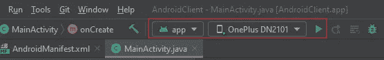

您可以使用本地机器 flask 服务器地址(如果手机和机器都连接到同一个网络)或远程地址([https://androidflaskdemo.herokuapp.com/](https://androidflaskdemo.herokuapp.com/))作为服务器 URL。

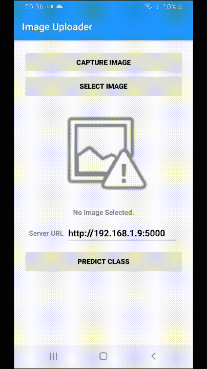

# 第 3 部分:Heroku 上的 Flask 服务器部署

Heroku 是一个基于容器的云平台即服务(PaaS ),用于在 web 上部署应用程序。由于其简单的设置和预算友好的定价，近年来受到了关注。

如果您还没有 Heroku 帐户，请创建一个。登录您的帐户，点击`Create new app`按钮创建一个项目。可以选择任意 app 名称(如:`androidflaskdemo`)。

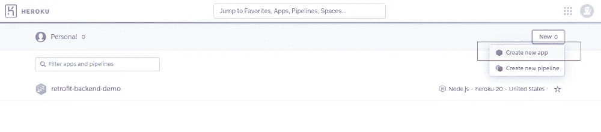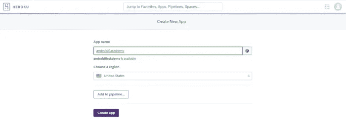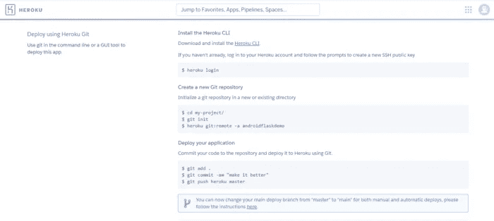

**尽管 Heroku 提供了在 Heroku 中部署应用程序的说明，但**您必须在项目中包含一些必要的配置文件，以识别平台、构建工具等。

**flask 应用程序部署需要项目根文件夹中的三个文件。**

1.  **过程文件**
2.  **requirements.txt**
3.  **runtime.txt**

*   在项目根文件夹中打开终端，运行以下命令创建`Procfile`和`runtime.txt`文件。

```
$ echo web: python server.py runserver 0.0.0.0:$PORT > Procfile
$ echo python-3.7.10 > runtime.txt
```

*   从虚拟环境中使用`pip freeze`创建`requirements.txt`文件。

```
$ pip freeze > requirements.txt
```

现在，我们可以进入部署流程了。

*   下载 Heroku CLI 并安装到您的机器上。

[](https://devcenter.heroku.com/articles/heroku-cli) [## Heroku CLI

### Heroku 命令行界面(CLI)允许您直接从终端创建和管理 Heroku 应用程序。这是一个…

devcenter.heroku.com](https://devcenter.heroku.com/articles/heroku-cli) 

*   通过执行以下命令，在终端中登录 Heroku 帐户:

```
$ heroku login
```

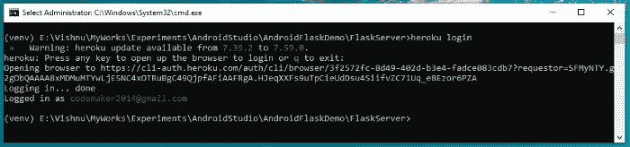

*   执行 Heroku 网站的 deploy 选项卡中提供的命令。

```
$ git init
$ heroku git:remote -a androidflaskdemo
$ git add .
$ git commit -am "make it better"
$ git push heroku master
```

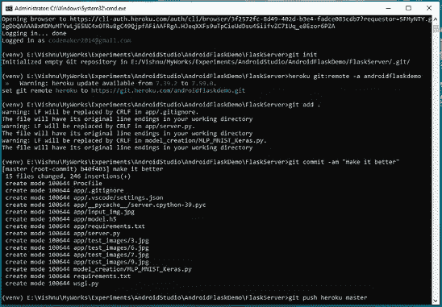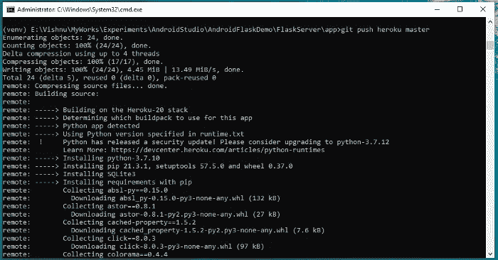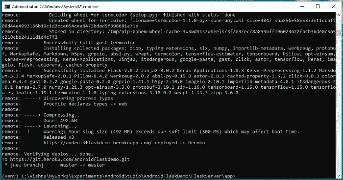

我们已经成功地在 Heroku 上部署了我们的 Flask 服务器。你可以使用本地的 flask 服务器或[https://androidflaskdemo.herokuapp.com/](https://androidflaskdemo.herokuapp.com/)链接在移动应用程序中运行分类。

感谢阅读这篇文章。

感谢 Gowri M Bhatt 审阅内容。

如果你喜欢这篇文章，请点击拍手按钮👏并且分享出来帮别人找！

这篇文章也可以在 Dev 上找到。

本教程的完整源代码可以在这里找到，

[](https://github.com/codemaker2015/android-flask-demo) [## GitHub-codemaker 2015/Android-Flask-Demo:Android Flask Demo

### 安卓烧瓶演示。通过在 GitHub 上创建帐户，为 codemaker 2015/Android-flask-demo 开发做出贡献。

github.com](https://github.com/codemaker2015/android-flask-demo) 

> 交易新手？试试[加密交易机器人](/coinmonks/crypto-trading-bot-c2ffce8acb2a)或者[复制交易](/coinmonks/top-10-crypto-copy-trading-platforms-for-beginners-d0c37c7d698c)