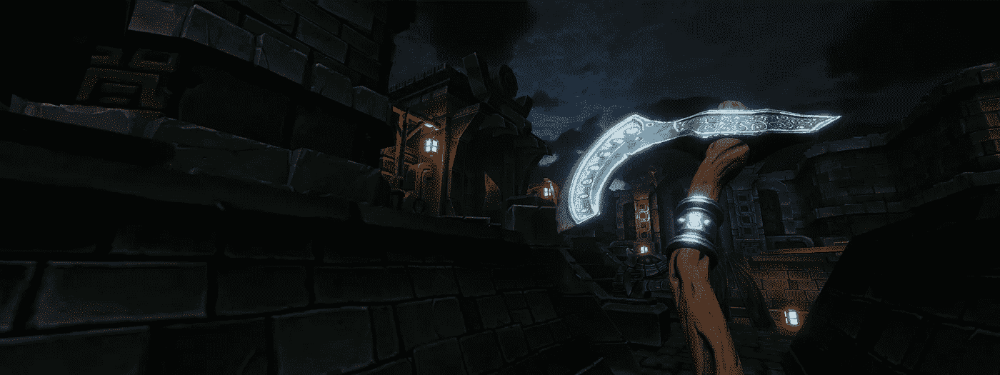
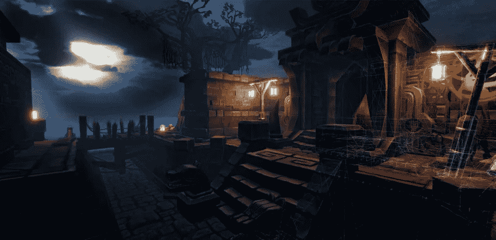
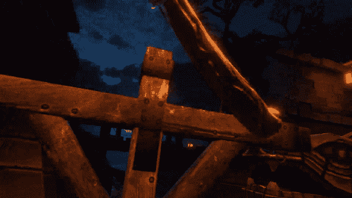
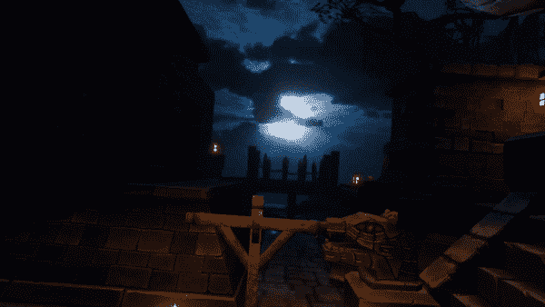
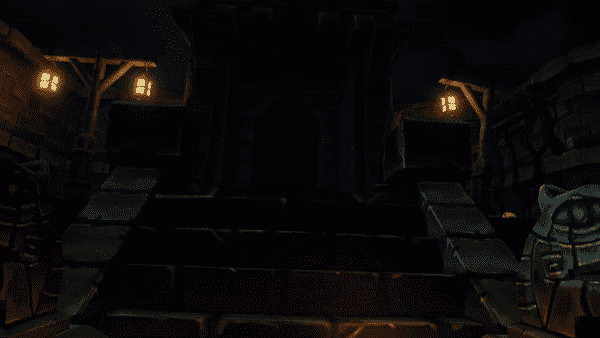

# 同位素商店的第一款游戏轻子虚拟现实初探

> 原文：<https://medium.com/coinmonks/an-initial-look-into-leptons-vr-the-first-game-on-the-isotopic-store-5920149917?source=collection_archive---------45----------------------->

**Leptons VR** ，一款 VR 奇幻沙盒多人 PVP 游戏，以快节奏的战略战斗场景中的**近战**、**远程**、**魔法战斗**为特色。在 Leptons VR 中，玩家可以通过 **NFT** 装备和皮肤的组合来完全定制他们的角色和武器。轻子 VR 中的技能和能力也是 **NFTs** ，所有物品都是平衡的，以保持游戏性**技能为主。**

轻子将是第一个在同位素商店上推出的游戏，在我们的 token 于 2023 年首次推出 Dex 后几天就推出了。

那么轻子到底是什么？你对我们的第一场比赛有什么期待？

# 游戏模式

Leptons 将主要以多玩家对战的形式出现:

*   **团队死亡竞赛**
*   **自由竞争**

在**团队死亡之战**中，玩家将被分成两队。为了得分，每队都必须杀死对方的队员。玩家将能够使用他们的**武器和能力**来对抗敌人，并保护自己的队伍。

然而，在免费游戏中，战斗是不同的。玩家必须时刻警惕来自四面八方的攻击，因为敌人会在地图上到处滋生，每个人都只能靠自己。

Pre-made Testing environment

# 游戏机制

玩家将能够使用各种基本方法来攻击对方，这些方法的战略组合和组合将允许独特的战斗风格。

## 近战格斗

玩家可以携带的主要武器包括中世纪风格的近战武器，包括但不限于:

*   **轴**
*   **宝剑**
*   **Maces**
*   **匕首**
*   **护盾**

这些武器可以在近距离战斗中使用，直接接近敌人并向他们挥舞。

Melee striking mechanics demo

## **远程格斗**

另一种主要使用的武器是中世纪的远程武器。
这些武器将包括:

*   **弓**
*   **弩**
*   **长矛**(也可以用于近战战斗)

虽然这些理论上对拥有近战武器的玩家有很大的潜力，但它们将会以**而不是**的方式发展，为它们的用户提供不公平的优势。取而代之的是，**玩家将能够在游戏中快速轻松地切换近战和远程武器。**

同样值得注意的是，游戏中一个重要的机制将是投掷武器的能力，这意味着所有近战武器在投掷时都能造成远距离伤害。

Throwing mechanics demo

## 魔法战斗

目前正在开发中，游戏中最独特的机制将来自于魔法能力的使用。这些将提供一个非凡的多人战斗，这将使整个游戏体验更加…混乱！

Telekinesis ability demo

能够造成巨大的伤害，但是每个法术都有自己的缺点，法术将是游戏中学习曲线的主要来源。

**心灵遥控是**轻子的第一个能力，但更多的会随之而来。我们的开发团队正在努力创造更多独特的机制，使轻子成为一流的虚拟现实多人游戏体验。

敬请关注我们发布的更多更新，包括对轻子 VR 开发的见解！

来自[的 Alex K .写的文章同位素](https://isotopic.io/)

[**同位素**](https://isotopic.io) **是一个区块链支持的软件分发服务，托管整合了 NFTs 和加密货币的游戏和应用。**

> 交易新手？在[最佳加密交易](/coinmonks/crypto-exchange-dd2f9d6f3769)上尝试[加密交易机器人](/coinmonks/crypto-trading-bot-c2ffce8acb2a)或[复制交易](/coinmonks/top-10-crypto-copy-trading-platforms-for-beginners-d0c37c7d698c)