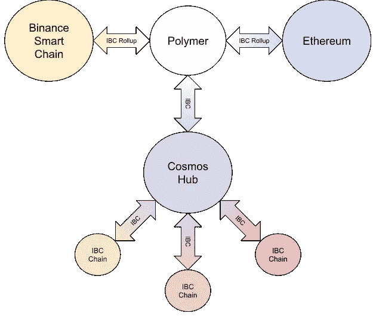

# 桥梁，IBC，宇宙和聚合物介绍

> 原文：<https://medium.com/coinmonks/an-intro-to-bridging-ibc-cosmos-and-polymer-b02cdff33621?source=collection_archive---------25----------------------->

欢迎阅读构建对桥接解决方案的总体理解系列的第一篇文章，特别是来自聚合物实验室的聚合物给 T2 宇宙生态系统带来了什么。

在本帖中，我们将重点从标题中解开每个大牌的含义。我们的目标是尽可能少的技术细节，让大多数读者容易理解。至少第一季，以后某个时候会更深入。:)

# 什么是桥？

当你想过河的时候，你可以用一座桥。在区块链术语中，网桥是一种能够传输消息(令牌、数据等)的解决方案。)区块链之间无法互相交流。

现在有很多桥接技术，而且还会有很多。这是一个活跃的研究领域，也是一个伟大创新的领域。怀着创造一个终极连接全区块链的圣杯…

> ***一桥把他们都连起来，一桥找到他们，******一桥把他们都带来，并在钱包里拥有他们……***

# 什么是 IBC？

[区块链间通信协议(IBC)](https://ibcprotocol.org/) 是一种能够在任意状态机之间传输任意数据的协议。换句话说，它描述了如何构造一条消息，从一个区块链发送出去，并在另一个区块链上接收。在现实生活中，我们可以将 IBC 比作快递公司的服务条款。我们知道如何处理包裹，送到哪里，以及何时和如何送到。这种监管方式正是 IBC 带给区块链的。

有规章固然好，但它的实施才是真正有价值的，这让我们想到了来自 [Cosmos](https://cosmos.network/) 的标准 IBC 实现及其来自 [Polymer](https://www.polymerlabs.org/) 的最新扩展。

# 什么是宇宙？

Cosmos 项目是一个围绕实施 IBC 标准构建的解决方案生态系统，目标是创建区块链互联网。主权、分权的区块链将自由交换资产和数据。除其他外，宇宙项目的核心贡献是[宇宙 SDK](https://v1.cosmos.network/sdk) ，这是一个构建兼容 IBC 的区块链的框架，以及[宇宙枢纽](https://cosmos.network/features)，宇宙的经济中心，所有其他区块链可以使用 IBC 标准连接到该中心，从共享经济中受益，并形成区块链的互联网。

用我们与航运公司的比较来看，Cosmos 将是一个大型的快递公司集团，拥有最大、联系最紧密的分拣设施和配送中心。使得所有运输公司能够在它们之间自由交换包裹。

# 什么是聚合物？

[聚合物实验室](https://www.polymerlabs.org/)是宇宙生态系统中的新成员，致力于解决标准 IBC 规范中的一个基本问题。IBC 协议只适用于 IBC 支持的区块链。这意味着许多成熟的区块链项目，如以太坊或币安智能链，将无法从与 IBC 支持的链的互操作性中受益。

这就是 Polymer 试图通过对 IBC 协议进行扩展来解决的问题，该协议被称为 IBC 汇总。该聚合物将集成许多与 IBC 不兼容的区块链，使用它们对 IBC 协议的扩展，并实现跨链通信，无论是在与 IBC 不兼容的协议之间，还是在与 IBC 到 IBC 不兼容的链之间。

A high level overview of the Polymer ecosystem.

回到我们的包裹运输类比，我们可以将 Polymer 视为另一家快递公司，它有助于在快递公司集团(Cosmos)和国家邮政局(Ethereum)之间传递包裹。

我们希望我们能够展示 IBC、宇宙和聚合物的核心思想。现在，你可以更好地理解这些项目在区块链世界的突破。在接下来的文章中，我们将逐步深入到更多的细节，以更好地理解 IBC、宇宙和聚合物的内部运作。

> 交易新手？尝试[加密交易机器人](/coinmonks/crypto-trading-bot-c2ffce8acb2a)或[复制交易](/coinmonks/top-10-crypto-copy-trading-platforms-for-beginners-d0c37c7d698c)