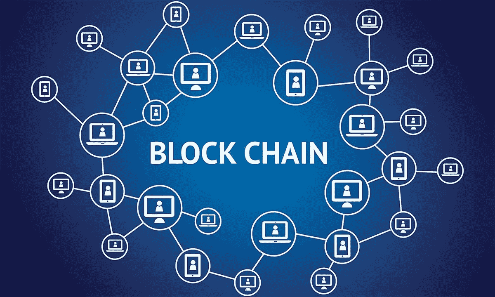

# 区块链技术简介

> 原文：<https://medium.com/coinmonks/an-introduction-to-blockchain-technology-54d42775bc9f?source=collection_archive---------34----------------------->

# 一.导言:

区块链技术是一种去中心化的分布式账本，允许安全透明地记录交易。它于 20 世纪 90 年代末首次推出，但在 2009 年获得了广泛的认可，当时它被用作加密货币比特币的底层技术。

在其核心，区块链是一个包含数据和唯一代码的块链，称为“哈希”，用于区分链中的其他块。每个块还包含对链中前一个块的引用，从而在所有块之间创建一个链接，并确保它们不会被更改。

区块链的分散性意味着它不受单一实体的控制，而是依靠一个计算机网络来验证和记录交易。这种分散的结构使其能够防止篡改，并提高交易记录的安全性和透明度。

> 交易新手？在[最佳密码交易所](/coinmonks/crypto-exchange-dd2f9d6f3769)上尝试[密码交易机器人](/coinmonks/crypto-trading-bot-c2ffce8acb2a)或[复制交易](/coinmonks/top-10-crypto-copy-trading-platforms-for-beginners-d0c37c7d698c)

Blockchain Technology

自成立以来，区块链技术已应用于各种行业，并有可能彻底改变我们开展业务和转移价值的方式。在本帖中，我们将进一步了解区块链的工作原理及其各种应用和优势。

# 二。区块链如何工作:

如导言中所述，区块链技术是分散的，这意味着它不是由单一实体控制的。相反，它依靠计算机网络或“节点”来验证和记录交易。

区块链中的每个块都包含一组事务和一个唯一的代码，称为“哈希”，用于将它与链中的其他块区分开来。哈希是使用加密函数生成的，该函数将块中的数据作为输入，并产生固定大小的输出。散列作为块的数字指纹，使得在不改变散列的情况下几乎不可能改变块中的数据。

除了散列之外，每个块还包含对链中前一个块的引用。这将在所有块之间创建一个链接，并确保它们不会被更改。如果有人试图篡改某个块，该块的哈希将会改变，这也会改变链中所有后续块的哈希。这使得网络很容易检测到任何改变区块链中数据的企图。

向链中添加新块的过程被称为“挖掘”矿工负责核实交易并将其添加到区块链中。为了做到这一点，他们必须解决一个复杂的数学问题，称为“工作证明”，这需要大量的计算能力。一旦矿工成功解决了工作证明，他们就可以将区块添加到链中，并获得加密货币形式的奖励。

工作证明共识机制用于确保区块链保持安全，并且事务得到适当的验证。这也有助于阻止恶意行为者试图操纵区块链，要求他们投入大量资源，以便向该链添加新的区块。

总体而言，区块链的分散性质，结合区块链结构和工作证明共识机制，使其成为记录交易的安全和透明平台。

# 三。区块链的应用:

由于其去中心化和安全的性质，区块链技术有可能彻底改变广泛的行业。以下几个例子说明了区块链在各个行业的应用:

1.  金融:区块链正被用于促进安全透明的金融交易。例如，它被用来创建分散的金融平台，允许用户进行点对点支付，而不需要银行等中介。
2.  供应链管理:区块链可用于跟踪供应链中货物的移动，提供更大的可见性和透明度。这有助于降低欺诈风险，提高供应链的效率。
3.  医疗保健:区块链正被用于创建安全透明的医疗保健记录，医生和患者等授权方可以访问这些记录。它还可用于促进不同组织之间医疗保健数据的安全交换。

这些只是区块链在各种行业中应用的几个例子。在未来，我们很可能会看到这项技术更多的创造性应用。区块链的一些潜在未来用途包括:

1.  身份验证:区块链可用于创建安全和分散的身份验证系统，这在各种情况下都很有用，如在线投票和访问控制。
2.  智能合同:区块链可以用来创建自动执行的合同，在满足特定条件时自动执行。这在很多行业都很有用，比如房地产和保险。
3.  去中心化自治组织(Dao):区块链可以用来创建去中心化组织，由智能合同而不是传统的管理结构来运行。这可以提高决策过程的效率和透明度。

总的来说，区块链的潜在应用是巨大而多样的，我们只是刚刚开始触及可能的表面。

# 四。区块链的优势:

区块链技术具有许多优势，使其成为各种行业的一种有吸引力的解决方案。以下是区块链的一些主要优势:

1.  安全:区块链的主要优势之一是它的安全性。因为链中的每个数据块都包含一个唯一的哈希和对前一个数据块的引用，所以几乎不可能在不被检测到的情况下更改区块链中的数据。这使得它成为记录交易和存储数据的安全平台。
2.  透明度:区块链的另一个优势是它的透明度。区块链上记录的所有交易对网络上的每个人都是可见的，这使得验证数据的真实性变得容易。这在各种情况下都很有用，例如供应链管理，在这种情况下，清楚地记录货物的移动是很重要的。
3.  效率:区块链有可能通过减少对中介(如银行或第三方物流提供商)的需求来提高各种行业的效率。通过使用区块链，有可能创建允许点对点交易的分散平台，这可以加速交换价值的过程。
4.  成本节约:除了提高效率，区块链还可以通过减少对中介的需求和实现某些流程的自动化来节约成本。例如，使用智能合同可以减少昂贵的法律费用，在供应链管理中使用区块链可以减少跟踪和调节交易的成本。

总体而言，区块链的安全性、透明性、效率和成本节约优势使其成为各种行业极具吸引力的解决方案。

# 动词 （verb 的缩写）区块链的挑战和局限:

虽然区块链技术有许多优势，但它也有许多挑战和限制，需要加以解决，以充分发挥其潜力。以下是区块链面临的一些主要挑战和局限性:

1.  可伸缩性:区块链的主要挑战之一是它的可伸缩性。随着越来越多的人使用网络，需要处理的交易数量增加，这可能导致交易速度变慢，费用增加。这个问题有很多潜在的解决方案，比如使用链外交易和分片，但是要完全解决这个问题还需要更多的研究和开发。
2.  能源消耗:区块链的另一个挑战是与工作验证共识机制相关的能源消耗。为了向链中添加新的块，矿工必须解决复杂的数学问题，这需要大量的计算能力。这种能源消耗引起了人们对区块链环境影响的关注，目前正在研究能源消耗较少的替代共识机制。
3.  监管和法律挑战:区块链技术仍然相对较新，有许多监管和法律挑战需要解决。例如，在如何对加密货币交易征税方面缺乏明确的指导，而且有人担心区块链被用于洗钱等非法活动。随着技术的发展，监管者和立法者继续应对这些挑战将非常重要。

总体而言，虽然区块链有潜力革新各种行业，但仍有重大挑战和限制需要解决，以充分发挥其潜力。

# 不及物动词结论:

在这篇文章中，我们介绍了区块链技术，并讨论了它的工作原理、各种应用及其优势。我们还强调了区块链的一些挑战和局限性，例如可扩展性问题以及监管和法律挑战。

总的来说，很明显，区块链有潜力通过提供一个安全透明的平台来记录交易和存储数据，从而彻底改变各种行业。虽然仍有挑战需要解决，但我们很可能会在未来几年看到区块链技术的持续增长和采用。

在未来，我们可能会看到区块链更具创造性的应用，比如分散自治组织(Dao)和智能合同。看看这些发展如何塑造区块链的未来，以及它如何应用于各种行业，将是一件有趣的事情。

谢谢你走到这一步。有兴趣的可以在 [LinkedIn](https://www.linkedin.com/in/hazemmancy/) 、 [Twitter](https://twitter.com/HazemMancy) 、[脸书](https://www.facebook.com/HazeMancy/)关注我！