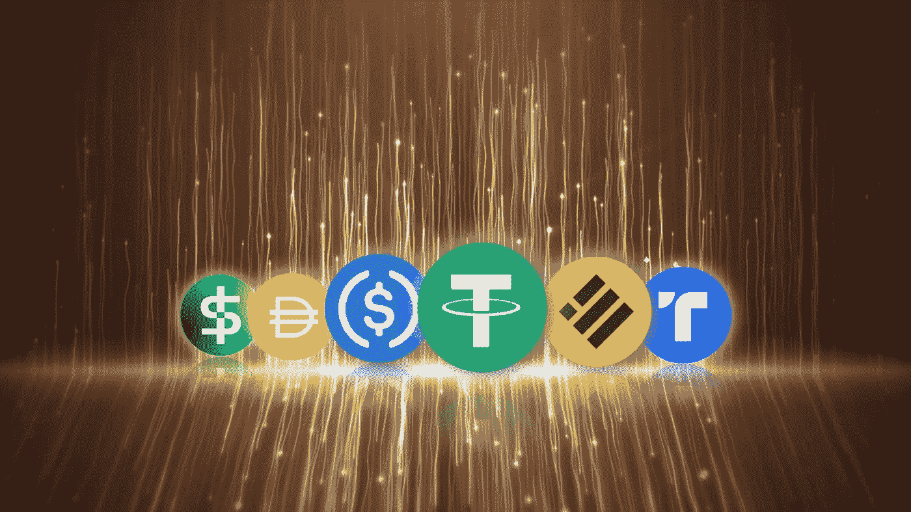

# 稳定硬币介绍:它们如何工作以及为什么重要

> 原文：<https://medium.com/coinmonks/an-introduction-to-stablecoins-how-they-work-and-why-they-matter-6a254a5bc97b?source=collection_archive---------37----------------------->

Photo by [CoinWire Japan](https://unsplash.com/@coinwire?utm_source=unsplash&utm_medium=referral&utm_content=creditCopyText) on [Unsplash](https://unsplash.com/photos/iNOavZh6dQ8?utm_source=unsplash&utm_medium=referral&utm_content=creditCopyText)

如果你是一个密码爱好者，你可能最近经常听到“稳定币”这个词。但是稳定密码到底是什么，为什么它们在密码界如此重要？

简而言之，稳定货币是一种加密货币，旨在保持相对于特定资产或货币的稳定价值。这种稳定性通常是通过将稳定硬币的价值与基础资产挂钩来实现的，如法定货币(如美元)或商品(如黄金)。

那你为什么想要一个稳定的硬币呢？好吧，让我们面对现实吧——密码市场可能相当不稳定。价格可能会在一天到另一天之间大幅波动，这使得很难将加密用作价值存储或交易媒介。Stablecoins 通过提供比特币和以太坊等传统加密货币的稳定替代品来解决这一问题。

## **稳定的类型**

创建 stablecoins 有几种不同的模型，每种模型都有自己的优缺点。以下是最常见的三种:

1.  抵押稳定币:抵押稳定币由基础资产支持，如法定货币或商品，作为储备以维持稳定币的价值。例如，泰索(USDT)是一种受欢迎的稳定货币，它与美元挂钩，并由银行账户中的等值美元支持。如果稳定硬币的价值低于基础资产的价值，就会增加额外的抵押品来使其恢复平衡。
2.  **算法稳定代码**:算法稳定代码使用复杂的算法和协议来维护它们的值。这些稳定债券不依赖于基础资产的稳定性，而是使用智能合约和其他机制的组合来调整其供求，以保持稳定的价值。算法稳定币的一个例子是 Basis(以前称为 Basecoin)，它使用一个供需冲击系统来保持其价值稳定。
3.  **铸币税风格的稳定货币**:铸币税风格的稳定货币是通过一个叫做“铸币税份额”的过程产生的，这个过程包括发行新的稳定货币以换取更大数量的基础资产。然后，新资产的价值与基础资产的价值挂钩，形成稳定的价格。铸币税式稳定硬币的一个例子是碳，它使用抵押和算法机制的组合来维持其价值。

## **哪款最好？**

特定用例的最佳稳定硬币模型取决于许多因素，包括期望的分散化水平、基础资产的稳定性和发行者的可信度。

抵押稳定债券通常被认为是最安全和可靠的，因为它们由可以审计和核实的基础资产支持。然而，如果基础资产的价值大幅下降，它们可能容易受到市场波动的影响。

算法稳定的内容是高度分散的，并且依赖于复杂的协议来维持它们的价值，这使得它们不太透明并且更难审计。然而，如果算法设计良好，它们可以提供高度的价格稳定性。

铸币税式的稳定货币是一种较新的模式，具有提供稳定性和分散化的潜力。然而，它们尚未被广泛采用，其长期可行性仍不确定。

## 分散

重要的是要保持稳定的信贷尽可能分散，以确保它们不会遭受困扰传统金融系统的相同类型的集中化风险。分散化有助于确保稳定的加密货币不受审查，不受任何单一实体的影响，这有助于促进加密货币市场的信任和稳定。

通过接受去中心化，stablecoins 有可能成为全球金融体系的重要组成部分，在数字时代提供稳定安全的价值存储和转移方式。因此，无论你是经验丰富的加密老手还是数字货币领域的新手，stablecoins 都绝对值得关注。谁知道呢——它们可能是释放加密作为全球金融系统的全部潜力的关键。

## 底线

Stablecoins 为加密货币市场的价格波动问题提供了独特的解决方案。通过将加密货币的价值与基础资产或货币联系起来，stablecoins 提供了一种稳定的价值存储和交换媒介，可以在各种不同的环境中使用。选择使用哪种稳定硬币模式将取决于用户的具体需要和要求，包括期望的分散化程度、基础资产的稳定性和发行者的可信度。因此，下次你听到有人谈论 stablecoins 时，你就有了加入谈话所需的所有知识。

> 从顶级交易者那里复制交易机器人。免费试用。