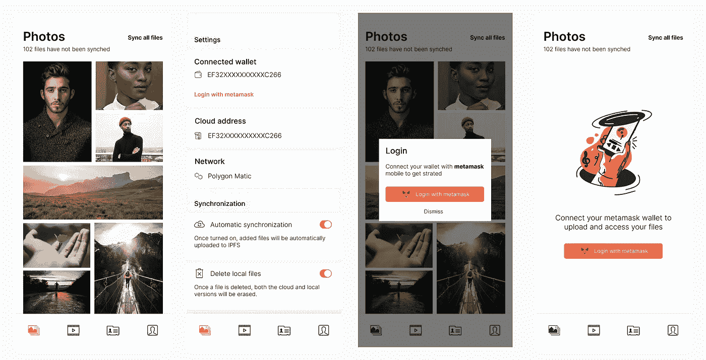

# 基于 react-native 和 solidity 构建的开源 web3 云存储

> 原文：<https://medium.com/coinmonks/an-open-source-web3-cloud-storage-built-with-react-native-and-solidity-185153f0ba9c?source=collection_archive---------3----------------------->

将私有媒体(如照片、视频、联系人和文件)从移动设备云存储到集中存储，一直是跨设备存储和同步文件的最可靠方式。然而，这种服务是通过提供商收取订阅费来维持的，以保持您的文件在集中存储中的可用性和安全性。

随着 web3 技术的兴起和分散存储的推广，一个类似的系统可以被设想为在区块链上自我托管，几乎不需要每月订阅，并且不存在被拒绝访问您自己的数据的风险。

作为我学习和构建 web3 应用程序之旅的一部分，我决定应对这个挑战，开发一个有点类似苹果 iCloud 的应用程序，名为 Decloud。

*Android 移动应用在* [*Google Play*](https://play.google.com/store/apps/details?id=com.decloud.app) ，*上可用，但你必须安装类似 Metamask 或类似的移动钱包应用，并在 Ropsten 上安装一些 ETH 才能进行测试。*

## 去云生态系统

Decloud 是一个开源项目，旨在通过将文件上传到 IPFS 并将记录保存在私人智能合同中来提供分散的云存储。

该项目由三个主要组件组成，**智能合约**、**移动应用**、和 **IPFS** 。

## 取消智能合同的云

智能合约的目的是通过提供创建和删除具有相应文件和类型的数据的方法来托管上传到 IPFS 的文件的元数据。

**云契约**负责托管和创建私有云契约，并且可以作为主要入口点公开调用。

**地址云契约**属于发起者，附属于他的钱包，只有拥有者才能调用，用于创建和删除文件。

**own able contract**是用上述合同管理所有权的基本合同，给予所有者将其合同转移到新地址的可能性。

对于实施，请查看[合同库](https://github.com/gracelungu/decloud-smart-contracts)，不要犹豫提出问题或做出贡献。

## de cloud react-原生移动应用

移动应用程序是用 expo 构建的，并且严重依赖于 [Walletconnect](https://walletconnect.com/) 库来连接智能合同并与之对话。

移动应用程序可以连接到各种钱包应用程序，如 Metamask 或 Trustwallet，以便在与智能合同对话时签署交易。

要开始，用户必须连接他的钱包并创建一个用于存储元数据的私有云。在用户已经将文件上传到 IPFS 之后，可以实现私人合同的创建，这是通过点击上传按钮，然后将上传的元数据同步到私人合同来完成的。

要投稿并查看实现，请查看[移动应用库](https://github.com/gracelungu/decloud-mobile-expo)。

## **IPFS 云**

使用 Pinata 将文件上传到 IPFS，用户需要创建一个帐户，并使用提供的令牌上传文件。移动应用程序中提供了一个设置页面，用户可以选择使用默认的 pinata 帐户(在这种情况下不是私有的)，或者使用 Pinata 提供的令牌。

## **下一步是什么？**

这是项目的高级概述、概念介绍和初始实现。接下来，我将发表一系列文章，深入探讨每个组件的概念和实现。

请随意投稿、提出问题和发表评论。😁

> 交易新手？尝试[加密交易机器人](/coinmonks/crypto-trading-bot-c2ffce8acb2a)或[复制交易](/coinmonks/top-10-crypto-copy-trading-platforms-for-beginners-d0c37c7d698c)